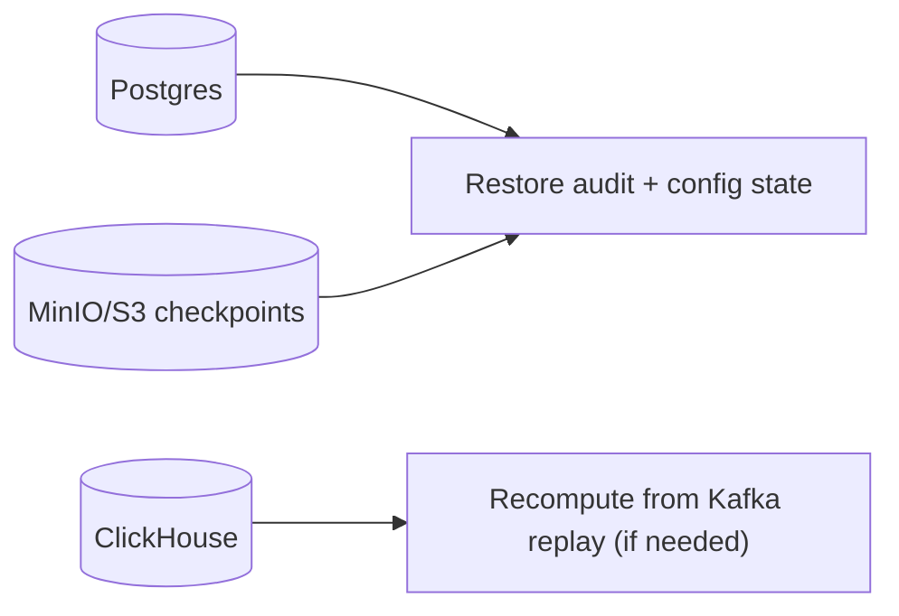

# Disaster Recovery and Backups

## Purpose
Define disaster recovery (DR) requirements and backup/restore expectations for Torghut’s stateful components:
- Postgres (trading/audit),
- ClickHouse (derived signals),
- Flink checkpoints/savepoints (state),
with pragmatic RTO/RPO guidance.

## Non-goals
- Guaranteeing DR across multiple regions in v1.
- Building an enterprise backup platform in this repo.

## Terminology
- **RPO:** Recovery point objective (max acceptable data loss).
- **RTO:** Recovery time objective (time to restore service).

## What must be recoverable (v1)

### Postgres (critical)
- Most critical persistent state for auditability.
- CNPG cluster: `argocd/applications/torghut/postgres-cluster.yaml`

### Flink checkpoints/savepoints (important)
- Enables faster restore after failures.
- Config references in `argocd/applications/torghut/ta/flinkdeployment.yaml`.

### ClickHouse (derived)
- Can often be recomputed from Kafka within retention window; however, recompute may be slow.

## DR strategy (recommended v1)
- **Postgres:** automated backups + tested restore.
- **Flink:** periodic savepoints before upgrades; ensure checkpoint bucket is durable.
- **ClickHouse:** treat as derived; focus on preventing data loss through disk guardrails and keeper health.

## Failure modes and recovery
| Failure | Symptoms | Recovery path |
| --- | --- | --- |
| Postgres loss | trading/audit unavailable | restore from CNPG backups; disable trading until restored |
| ClickHouse loss | no signals, UI empty | restore CH if backups exist; otherwise replay TA within retention |
| Checkpoint bucket loss | slow/unsafe Flink restarts | stateless restart + replay; reestablish checkpoint durability |

## Security considerations
- Backups must be encrypted and access-controlled.
- Do not store backup credentials in Git; manage via Secrets.

## Decisions (ADRs)
### ADR-44-1: Postgres is the DR priority; ClickHouse is replayable
- **Decision:** Prioritize Postgres backups and restore testing; treat ClickHouse as replayable within retention.
- **Rationale:** Audit is non-negotiable; TA signals can be recomputed.
- **Consequences:** Recompute time must be bounded and operationally rehearsed.

