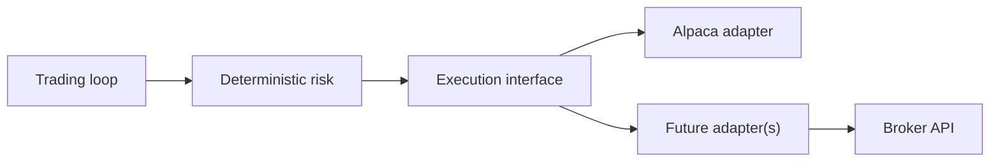

# Multi-Venue and Broker Abstraction

## Purpose
Define an extension-friendly design for adding additional brokers/venues while maintaining the v1 safety invariants:
- deterministic risk gates remain final,
- paper-first defaults,
- auditability across venues.

## Non-goals
- Implementing a second broker in v1.
- Venue-specific microstructure modeling or smart order routing.

## Terminology
- **Venue:** Market/broker/exchange destination for orders.
- **Adapter:** Abstraction layer that normalizes broker APIs (orders, positions, executions).
- **Capability matrix:** Feature support differences across brokers.

## Design sketch (vNext)

## Required invariants (carry forward from v1)
- Idempotency keys remain stable; per-venue idempotency mapping must be defined.
- Reconciliation remains broker-authoritative.
- Kill switches remain centralized (disable trading globally or per venue).

## Configuration approach
- Per-venue configuration should be explicit and audited:
  - `TRADING_VENUE=alpaca` (future)
  - separate credentials per venue in Secrets

## Failure modes and recovery
| Failure | Symptoms | Recovery |
| --- | --- | --- |
| Adapter mismatch | order rejected or mis-specified | disable trading; fix mapping; add conformance tests |
| Venue outage | executions fail | fallback to paper; circuit-break venue; alert |

## Security considerations
- Separate credentials and scopes per venue.
- Avoid “unified super-key” credentials.

## Decisions (ADRs)
### ADR-45-1: Adapters are explicit and audited
- **Decision:** Each venue uses an explicit adapter with a documented capability matrix.
- **Rationale:** Prevents hidden behavior changes when adding venues.
- **Consequences:** More code, but safer operations.

