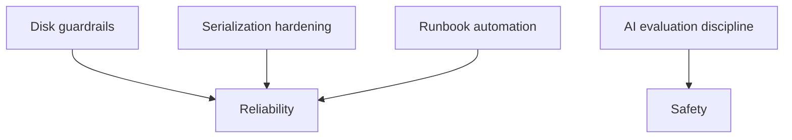

# Current State and Gap Analysis (2026-02-08)

## Purpose
Capture the “as deployed” Torghut state as of **2026-02-08**, highlight known gaps vs the v1 design goals, and provide
a prioritized backlog that an engineer can safely implement.

## Non-goals
- A complete project plan with dates.
- Replacing issues/roadmap management.

## Terminology
- **Gap:** Missing control or capability needed for reliability/safety/operability.
- **Mitigation:** Near-term step to reduce risk without major redesign.

## Current deployed state (source of truth)
The deployed manifests live under `argocd/applications/torghut/**`:
- `torghut-ws` Deployment (single replica; readiness `/readyz`): `argocd/applications/torghut/ws/deployment.yaml`
- `torghut-ta` FlinkDeployment (ClickHouse JDBC sink, S3 checkpoints): `argocd/applications/torghut/ta/flinkdeployment.yaml`
- ClickHouse (2 replicas, 20Gi PVC each, Keeper-backed): `argocd/applications/torghut/clickhouse/clickhouse-cluster.yaml`
- Postgres (CNPG, 5Gi PVC): `argocd/applications/torghut/postgres-cluster.yaml`
- Trading service (Knative, maxScale=1, paper-by-default + live gate): `argocd/applications/torghut/knative-service.yaml`
- Strategy catalog configmap mounted into service: `argocd/applications/torghut/strategy-configmap.yaml`

## Operational incidents observed (facts)
Documented in existing ops notes:
- TA job failed due to ClickHouse issues and JDBC write failures: `docs/torghut/ops-2026-01-01-ta-recovery.md`
- `torghut-ws` readiness stuck 503 while liveness OK during Alpaca auth/connection-limit issues: `docs/torghut/ops-2026-01-01-ta-recovery.md`
- ClickHouse volumes can fill; disk pressure can break TA writes (20Gi PVCs) and must be guarded.

## Gap analysis

### Gaps (prioritized)
| Area | Current state | Gap / risk | Suggested next step |
| --- | --- | --- | --- |
| ClickHouse disk guardrails | small PVCs; TTL exists | disk fills → TA job fails | implement explicit disk alerts + “pause TA writes” procedure; consider increasing PVC |
| TA replay workflow | ad-hoc | replay/backfill not fully standardized | codify replay steps with group-id isolation (see `v1/21`) |
| UUID-in-JSON hardening | boundary is mostly correct | regressions can crash Knative revision | add targeted tests around JSON coercion in write paths; ensure `model_dump(mode=\"json\")` everywhere |
| WS readiness diagnostics | readiness 503 is common symptom | unclear root cause without logs | ensure readiness surfaces error class; add dashboards for 401/406 vs Kafka errors |
| AI governance | AI exists but must remain safe | drift/cost risks | enforce shadow-first evaluation; add budget caps; keep adjustments disabled by default |

## “Do next” implementation backlog (safe, incremental)
1) Add explicit operational alerts for ClickHouse free disk and replica readonly.
2) Add a documented “pause TA” toggle/runbook step to prevent retry storms during disk incidents.
3) Add a regression test for UUID-in-JSON persistence paths in `services/torghut/tests/`.
4) Improve forwarder readiness error classification to reduce “503 mystery” incidents.

## Security considerations
- Keep live trading gated; audit any changes to `TRADING_LIVE_ENABLED`.
- Do not store secrets in docs; operational procedures must reference secret *names* only.

## Decisions (ADRs)
### ADR-50-1: Gap analysis is date-stamped and updateable
- **Decision:** This document is time-stamped (`2026-02-08`) and should be replaced/extended by a new dated analysis when the system changes materially.
- **Rationale:** Prevents stale assumptions from lingering.
- **Consequences:** Requires periodic refresh as production evolves.

