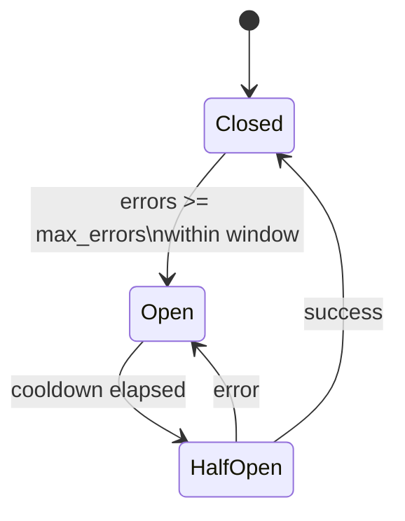

# AI Layer: Circuit Breakers and Fallbacks

## Status

- Version: `v1`
- Last updated: **2026-02-20**
- Source of truth (config): `argocd/applications/torghut/**`
- Implementation status: `Completed (strict)` (verified with code + tests + runtime/config on 2026-02-21)

## Purpose

Define resilience mechanisms that prevent AI provider issues from destabilizing trading, including:

- timeouts,
- circuit breakers,
- deterministic fallback behaviors,
  with safe-by-default semantics for both paper and live modes.

## Non-goals

- Complex multi-provider load balancing in v1.

## Terminology

- **Circuit open:** AI calls are skipped for a cooldown period after repeated errors.
- **Fallback:** Behavior used when AI is unavailable or errors (deterministic-only or veto).

## Current implementation (pointers)

- Circuit breaker: `services/torghut/app/trading/llm/circuit.py`
- Settings: `services/torghut/app/config.py` (`LLM_CIRCUIT_*`, `LLM_FAIL_MODE`)

## Circuit breaker model

## Configuration (selected env vars)

| Env var                        | Purpose                                                              | Safe default  |
| ------------------------------ | -------------------------------------------------------------------- | ------------- |
| `LLM_TIMEOUT_SECONDS`          | request timeout                                                      | `20`          |
| `LLM_CIRCUIT_MAX_ERRORS`       | error threshold                                                      | `3`           |
| `LLM_CIRCUIT_WINDOW_SECONDS`   | sliding window                                                       | `300`         |
| `LLM_CIRCUIT_COOLDOWN_SECONDS` | cooldown                                                             | `600`         |
| `LLM_FAIL_MODE`                | on-error behavior                                                    | `veto`        |
| `LLM_FAIL_MODE_ENFORCEMENT`    | strict vs configured fail-mode posture                               | `strict_veto` |
| `LLM_FAIL_OPEN_LIVE_APPROVED`  | explicit approval gate for any live pass-through effective fail mode | `false`       |

## Fallback policy (v1)

- **Live mode (`TRADING_MODE=live`):** Fail-closed by default. Any configuration that would produce
  `effective_fail_mode=pass_through` in live now requires `LLM_FAIL_OPEN_LIVE_APPROVED=true` at boot.
  Stage-specific rollout semantics are enforced for this check (for example `stage2` always evaluates effective
  fail mode as `pass_through`, so live `stage2` requires explicit approval even when `LLM_FAIL_MODE=veto`).
- **Paper mode (`TRADING_MODE=paper`):** Fallback behavior is controlled by `LLM_FAIL_MODE`:
  - `LLM_FAIL_MODE=veto` (current default in `services/torghut/app/config.py`) fails-closed.
  - `LLM_FAIL_MODE=pass_through` allows deterministic pass-through on AI errors.

Note: Live mode is itself gated by `TRADING_LIVE_ENABLED=true`; this document assumes that is rare and carefully reviewed.
The deployment contract test in `services/torghut/tests/test_live_config_manifest_contract.py` validates Argo live env wiring
against `Settings` validation to fail CI for boot-invalid combinations.
Current deployed paper configuration (2026-02-09) sets `LLM_FAIL_MODE=pass_through` (see `argocd/applications/torghut/knative-service.yaml`).

## Provider fallback chain (v1)

- Primary provider is set by `LLM_PROVIDER`.
- When `LLM_PROVIDER=jangar`, failures trigger the self-hosted fallback (`LLM_SELF_HOSTED_*`) before surfacing an error.
- If all providers fail or time out, the review is treated as an error: the circuit breaker records it and the scheduler applies
  `LLM_FAIL_MODE` (paper) or veto (live).

## Failure modes and recovery

| Failure         | Symptoms      | Detection                            | Recovery                                        |
| --------------- | ------------- | ------------------------------------ | ----------------------------------------------- |
| Provider outage | circuit opens | `/trading/status` shows circuit open | wait cooldown; disable AI; investigate provider |
| Excessive costs | token spikes  | cost counters/estimates              | disable AI; cap tokens; tighten prompts         |

## Policy-resolution observability

- Runtime status exposes `llm.policy_resolution.classification` and `llm.policy_resolution_counters`.
- Runtime metrics export `torghut_trading_llm_policy_resolution_total{classification=...}` with:
  - `classification="compliant"`
  - `classification="intentional_exception"`
  - `classification="violation"`
- Approved fail-open operation should increment only `intentional_exception`; any `violation` increments are page-worthy.

## Security considerations

- Circuit breakers protect against provider-induced DoS and runaway retries.
- In new environments, keep AI disabled by default; in production, prefer shadow-first enablement with bounded policies.

## Decisions (ADRs)

### ADR-38-1: Circuit breaker is mandatory when AI enabled

- **Decision:** AI calls must be guarded by circuit breaker + timeouts.
- **Rationale:** Prevent cascading failures and preserve system stability.
- **Consequences:** AI may be skipped during transient issues; audit must record skips.
