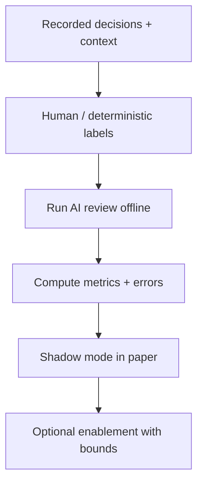

# AI Layer: Evaluation and Benchmarks

## Status
- Version: `v1`
- Last updated: **2026-02-08**
- Source of truth (config): `argocd/applications/torghut/**`

## Purpose
Define how Torghut evaluates the AI advisory layer for:
- correctness (alignment with deterministic policy),
- safety (avoid unsafe approvals/adjustments),
- and operational stability (timeouts, parse errors, cost).

## Non-goals
- Claiming predictive performance guarantees.
- “Leaderboard chasing” without safety alignment.

## Terminology
- **Golden set:** Curated set of decisions with expected labels/verdicts.
- **Shadow evaluation:** Run AI in production but do not impact execution.
- **Drift:** Changes in model behavior over time or across versions.

## Evaluation pipeline (v1)

## Metrics (recommended)
- Parse success rate
- Average latency and p95 latency
- Veto/approve distribution by strategy
- “Unsafe approve” rate (AI approves decisions that deterministic policy would reject)
- Adjustment clamp rate (how often policy guard clamps AI outputs)
- Cost per 1k decisions

## Benchmarks (operator-friendly)
| Benchmark | Target (example) | Why |
| --- | --- | --- |
| parse success | > 99% | schema stability |
| p95 latency | < timeout/2 | avoid backpressure |
| circuit open events | rare | provider stability |

## Promotion checklist (v1)
Before disabling shadow mode or enabling adjustments, set and verify:
- `LLM_EVALUATION_REPORT` (evaluation evidence reference)
- `LLM_EFFECTIVE_CHALLENGE_ID` (independent review reference)
- `LLM_SHADOW_COMPLETED_AT` (timestamp after shadow evaluation)
- `LLM_ALLOWED_MODELS` includes the active `LLM_MODEL`
- `LLM_ADJUSTMENT_APPROVED=true` (only if adjustments are allowed)

## Failure modes and recovery
| Failure | Symptoms | Detection | Recovery |
| --- | --- | --- | --- |
| Increased unsafe approves | risk flags spike | offline evaluation + audit review | disable AI; tighten policy; re-evaluate |
| High cost | token usage grows | billing telemetry | shorten prompts; cap tokens; disable AI |

## Security considerations
- Evaluation datasets must not include secrets or sensitive account identifiers beyond what is needed.
- Avoid storing chain-of-thought; store short rationale only.

## Decisions (ADRs)
### ADR-41-1: Shadow mode is mandatory before impact
- **Decision:** New AI versions run in `LLM_SHADOW_MODE=true` before influencing executions.
- **Rationale:** Real data reveals edge cases and drift.
- **Consequences:** Adds time before AI can affect outcomes.
