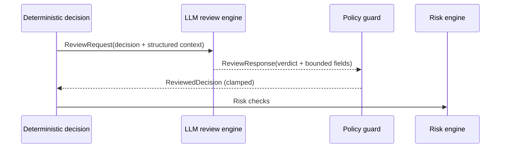

# AI Layer: LLM Review and Policy

## Status
- Version: `v1`
- Last updated: **2026-02-08**
- Source of truth (config): `argocd/applications/torghut/**`

## Purpose
Define the LLM review contract, including:
- what inputs are allowed,
- what outputs are accepted,
- what adjustments are permitted,
- and how policy guardrails are enforced deterministically.

## Non-goals
- Free-form natural language trading suggestions.
- Allowing AI to modify risk settings or strategy definitions at runtime.

## Terminology
- **Verdict:** `approve | veto | adjust`.
- **Adjustment:** Limited set of allowed changes (e.g., qty multiplier within bounds).
- **Policy guard:** Deterministic enforcement of allowed adjustments.

## Current implementation (pointers)
- Review engine: `services/torghut/app/trading/llm/review_engine.py`
- Output schemas: `services/torghut/app/trading/llm/schema.py`
- Policy enforcement: `services/torghut/app/trading/llm/policy.py`
- Settings: `services/torghut/app/config.py`

## LLM review flow

## Input policy (v1)
Allowed inputs must be:
- structured,
- sourced from trusted system components (ClickHouse signals, Postgres positions),
- minimal (avoid dumping raw WS payloads).

Do not include:
- secrets,
- user-provided free text,
- or untrusted “news” feeds without sanitization.

## Output policy (v1)
Outputs are validated against a strict schema and then clamped:
- `verdict`: enum
- `confidence`: float [0,1]
- optional adjustments only if `LLM_ADJUSTMENT_ALLOWED=true`
- qty adjustments bounded by:
  - `LLM_MIN_QTY_MULTIPLIER`
  - `LLM_MAX_QTY_MULTIPLIER`

## Configuration (selected env vars)
| Env var | Purpose | Safe default |
| --- | --- | --- |
| `LLM_ADJUSTMENT_ALLOWED` | allow AI adjustments | `false` |
| `LLM_ADJUSTMENT_APPROVED` | explicit approval for adjustments | `false` |
| `LLM_MIN_QTY_MULTIPLIER` | lower clamp | `0.5` |
| `LLM_MAX_QTY_MULTIPLIER` | upper clamp | `1.25` |
| `LLM_MIN_CONFIDENCE` | confidence gate | `0.5` |
| `LLM_ALLOWED_MODELS` | model inventory allowlist | empty (enforced before impact) |

## Failure modes and recovery
| Failure | Symptoms | Detection | Recovery |
| --- | --- | --- | --- |
| AI suggests unsafe adjustment | qty too high | policy guard clamps; audit shows clamp | treat as model risk; tighten bounds; retrain/evaluate |
| Schema mismatch | parse errors | llm_parse_error counters | revert prompt/schema; keep AI disabled |

## Guardrail notes
- Adjustments require both `LLM_ADJUSTMENT_ALLOWED=true` and `LLM_ADJUSTMENT_APPROVED=true`.
- When `LLM_SHADOW_MODE=false`, model inventory and evaluation evidence are enforced before allowing AI impact.

## Security considerations
- Prompt injection defenses: no untrusted text, strict output schema.
- Overreliance defenses: deterministic risk engine is final authority.

## Decisions (ADRs)
### ADR-37-1: Adjustments are off by default
- **Decision:** `LLM_ADJUSTMENT_ALLOWED=false` unless explicitly enabled.
- **Rationale:** Veto/approve provides value without letting AI change trade sizing.
- **Consequences:** Some potential improvements are unavailable until explicitly reviewed and enabled.
