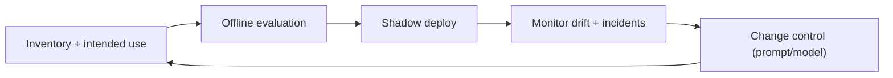

# AI Layer: Model Risk Management (MRM)

## Status
- Version: `v1`
- Last updated: **2026-02-08**
- Source of truth (config): `argocd/applications/torghut/**`

## Purpose
Define a pragmatic model risk management program for Torghut’s AI advisory layer, suitable for an engineering team
operating a safety-critical automated trading system.

## Non-goals
- Full regulatory compliance documentation for a broker-dealer.
- Using AI without an inventory/validation/audit plan.

## Terminology
- **Model inventory:** List of models, versions, providers, and intended uses.
- **Validation:** Evidence the model meets performance and safety requirements for its intended use.
- **Effective challenge:** Structured review by someone other than the author.

## MRM lifecycle (v1)

## Required artifacts (v1)
- Prompt versions (stored in repo) and change log.
  - Example: `services/torghut/app/trading/llm/prompt_templates/system_v1.txt`
- Output schemas and policy bounds.
  - Example: `services/torghut/app/trading/llm/schema.py`, `services/torghut/app/config.py`
- Audit records for each review:
  - `llm_decision_reviews` table (`services/torghut/app/models/entities.py`)

## Guardrail configuration (v1)
These env vars are enforced by the trading service before AI output can influence execution:

| Env var | Purpose | Safe default |
| --- | --- | --- |
| `LLM_ALLOWED_MODELS` | inventory allowlist (comma-separated) | empty (inventory required to disable shadow) |
| `LLM_EVALUATION_REPORT` | evaluation evidence reference (report URL/id) | unset |
| `LLM_EFFECTIVE_CHALLENGE_ID` | independent review reference | unset |
| `LLM_SHADOW_COMPLETED_AT` | timestamp when shadow evaluation completed | unset |
| `LLM_ADJUSTMENT_APPROVED` | explicit approval for adjustments | `false` |

Enforcement behavior:
- If `LLM_SHADOW_MODE=false` and any required evidence is missing, the service forces shadow mode and disables adjustments.
- If the prompt template for `LLM_PROMPT_VERSION` is missing, LLM review is blocked and logged as a guardrail violation.

## Monitoring and incident response
- Track:
  - veto rate vs baseline,
  - parse error rate,
  - circuit breaker activations,
  - cost metrics (tokens).
- Treat spikes as incidents if they affect trading behavior (even paper).

### Guardrails instrumentation (v1)
- LLM guardrails exporter (Prometheus):
  - Config: `argocd/applications/torghut/llm-guardrails-exporter-configmap.yaml`
  - Deployment/Service: `argocd/applications/torghut/llm-guardrails-exporter.yaml`
- Torghut also exposes `GET /metrics` for direct scrape/debug (`torghut_trading_*` counters).
- Key metrics (exporter output):
  - `torghut_llm_veto_total`, `torghut_llm_requests_total` (veto rate)
  - `torghut_llm_parse_error_total` (parse error rate)
  - `torghut_llm_circuit_open_total` (circuit breaker events)
  - `torghut_llm_tokens_prompt_total`, `torghut_llm_tokens_completion_total` (token cost)
  - `torghut_llm_guardrail_block_total` (guardrail blocks)
- Baselines (tunable env vars on exporter):
  - `LLM_VETO_RATE_BASELINE`
  - `LLM_TOKENS_PER_REQUEST_BUDGET`
- Alerts live in `argocd/applications/observability/graf-mimir-rules.yaml` under `torghut-mrm.rules`.

## Security considerations
- Prompt injection and output handling are MRM concerns (see `v1/security-threat-model.md`).
- API keys are high-value secrets; rotate regularly and restrict usage.

## Decisions (ADRs)
### ADR-40-1: No AI changes without evaluation evidence
- **Decision:** Prompt/model changes require documented evaluation (offline + shadow) before affecting execution.
- **Rationale:** Prevents silent regressions.
- **Consequences:** Slower iteration; acceptable for safety.
