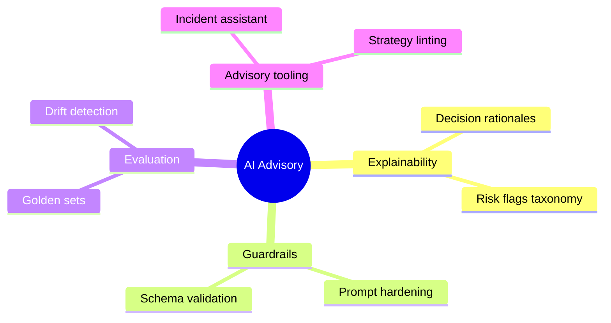

# AI Layer: Novel Capabilities Roadmap (Advisory)

## Status
- Version: `v1`
- Last updated: **2026-02-08**
- Source of truth (config): `argocd/applications/torghut/**`

## Purpose
Outline potential “novel” AI capabilities that can be added while preserving deterministic risk controls and
paper-first defaults.

## Non-goals
- Committing to a timeline.
- Any capability that increases AI agency beyond advisory boundaries.

## Terminology
- **Novel capability:** Added AI functionality beyond basic approve/veto/adjust review.
- **Gated rollout:** Feature flags + evaluation + shadow mode before impact.

## Roadmap themes (v1→v2 ideas)

### Candidate capabilities (all advisory)
- **Strategy linting:** AI checks strategy configs for obvious risk issues (e.g., missing limits).
- **Anomaly explanation:** Explain why a risk gate rejected a decision, referencing deterministic reason codes.
- **Incident assistant:** Summarize telemetry and propose runbook steps (never execute changes).
- **Shadow signal interpretation:** Provide alternative interpretations of TA signals as tags (not actions).

## Guardrails required for any new capability
- Explicit feature flags.
- Deterministic safety gates unaffected.
- Audit logging for AI inputs/outputs.
- Rate limits and budget caps.

## Security considerations
- Avoid ingesting untrusted free text into prompts.
- Treat AI-generated content as untrusted output; validate and sandbox.

## Decisions (ADRs)
### ADR-39-1: Novel AI capabilities must be “advisory tools” first
- **Decision:** Prioritize capabilities that improve human/operator effectiveness without altering executions.
- **Rationale:** Maximizes value while keeping risk low.
- **Consequences:** Slower path to “fully autonomous” behavior; intentional for safety.

