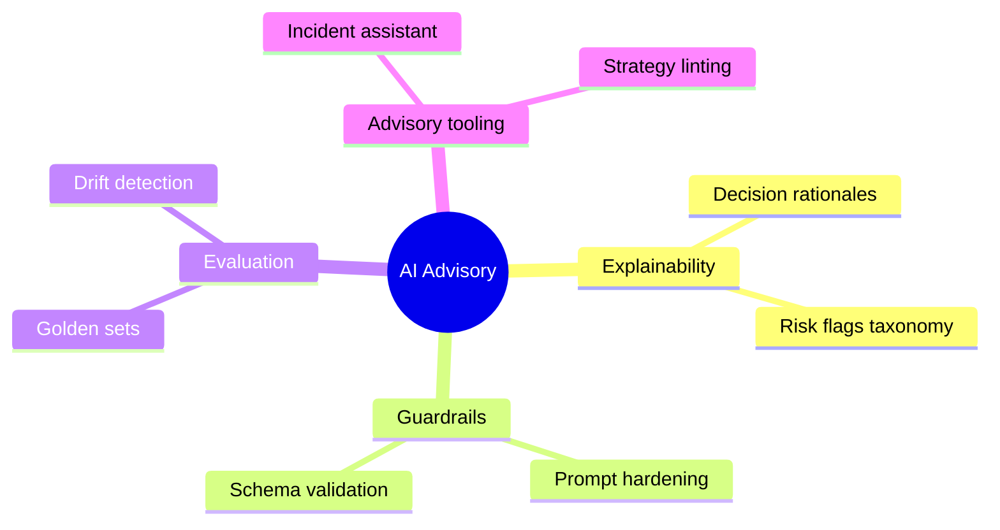

# AI Layer: Novel Capabilities Roadmap (Advisory)

## Status

- Version: `v1`
- Last updated: **2026-02-08**
- Source of truth (config): `argocd/applications/torghut/**`
- Maturity: advisory roadmap (proposal; not a shipped feature set)

## Source Implementation Audit (2026-07-04)

- Source baseline inspected: `6473f3ee7 ci(arc): fit ten lab runners per node (#11877)`.
- Implementation status: Partially implemented/prototyped: LLM review, DSPy scripts, discovery stress modules, and Jangar OpenAI-compatible routes exist; many ML/LOB designs remain research/prototype.
- Matched implementation area: LLM, DSPy, AI review, and model governance.
- Current source evidence:
  - `services/torghut/app/trading/llm`
  - `services/torghut/scripts/run_dspy_workflow.py`
  - `services/torghut/scripts/compile_dspy_program.py`
  - `services/jangar/src/routes/openai/v1/chat/completions.ts`
  - `services/torghut/app/trading/discovery/order_flow_features.py`
- Design drift note: Distinguish production review gates from research/prototype model ideas.

## Purpose

Outline potential “novel” AI capabilities that can be added while preserving deterministic risk controls and
paper-first defaults.

## Non-goals

- Committing to a timeline.
- Any capability that increases AI agency beyond advisory boundaries.

## Terminology

- **Novel capability:** Added AI functionality beyond basic approve/veto/adjust review.
- **Gated rollout:** Feature flags + evaluation + shadow mode before impact.

## Roadmap themes (v1→v2 ideas)

```mermaid
mindmap
  root((AI Advisory))
    Explainability
      Decision rationales
      Risk flags taxonomy
    Guardrails
      Prompt hardening
      Schema validation
    Evaluation
      Golden sets
      Drift detection
    Advisory tooling
      Incident assistant
      Strategy linting
```

### Candidate capabilities (all advisory)

- **Strategy linting:** AI checks strategy configs for obvious risk issues (e.g., missing limits).
- **Anomaly explanation:** Explain why a risk gate rejected a decision, referencing deterministic reason codes.
- **Incident assistant:** Summarize telemetry and propose runbook steps (never execute changes).
- **Shadow signal interpretation:** Provide alternative interpretations of TA signals as tags (not actions).

## Guardrails required for any new capability

- Explicit feature flags.
- Deterministic safety gates unaffected.
- Audit logging for AI inputs/outputs.
- Rate limits and budget caps.

## Security considerations

- Avoid ingesting untrusted free text into prompts.
- Treat AI-generated content as untrusted output; validate and sandbox.

## Decisions (ADRs)

### ADR-39-1: Novel AI capabilities must be “advisory tools” first

- **Decision:** Prioritize capabilities that improve human/operator effectiveness without altering executions.
- **Rationale:** Maximizes value while keeping risk low.
- **Consequences:** Slower path to “fully autonomous” behavior; intentional for safety.
