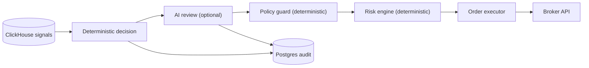

# AI Layer Overview (Advisory + Gated)

## Status
- Version: `v1`
- Last updated: **2026-02-08**
- Source of truth (config): `argocd/applications/torghut/**`

## Purpose
Describe Torghut’s AI layer as a strictly advisory component that:
- reviews deterministic trade decisions,
- can recommend veto/approve/adjust within bounded policies,
- and is always gated by deterministic risk controls.

## Non-goals
- AI as primary decision maker.
- Any design where AI can bypass `TRADING_LIVE_ENABLED` or deterministic risk checks.
- Unbounded retrieval-augmented generation (RAG) from untrusted sources as a dependency for trading.

## Terminology
- **AI advisory:** AI may recommend changes; it does not execute.
- **Policy guard:** Deterministic validator/clamp of AI outputs.
- **Shadow mode:** AI runs and records outcomes, but does not affect execution.

## Current implementation (pointers)
- Settings: `services/torghut/app/config.py` (`LLM_*` fields)
- AI client/review: `services/torghut/app/trading/llm/review_engine.py`
- Circuit breaker: `services/torghut/app/trading/llm/circuit.py`
- Policy/clamping: `services/torghut/app/trading/llm/policy.py`
- Prompt template: `services/torghut/app/trading/llm/prompt_templates/system_v1.txt`
- Stored audit: `services/torghut/app/models/entities.py` (`LLMDecisionReview`)

## Where AI sits in the pipeline

## Safety invariants (v1)
- Code default: `LLM_ENABLED=false` (`services/torghut/app/config.py`).
- As deployed (see `argocd/applications/torghut/knative-service.yaml` as of 2026-02-09): `LLM_ENABLED=true` in **shadow mode**
  (`LLM_SHADOW_MODE=true`) with `LLM_FAIL_MODE=pass_through` while `TRADING_MODE=paper`.
- AI never calls broker APIs.
- AI outputs must parse as strict schema and pass policy guard.
- Deterministic risk engine remains the final gate.
- Live trading still requires explicit flags (`TRADING_MODE=live` + `TRADING_LIVE_ENABLED=true`).

## Configuration (selected env vars)
From `services/torghut/app/config.py`:
| Env var | Purpose | Safe default |
| --- | --- | --- |
| `LLM_ENABLED` | enable AI advisory | `false` |
| `LLM_SHADOW_MODE` | observe only | `false` |
| `LLM_FAIL_MODE` | behavior on AI error | `veto` |
| `LLM_ADJUSTMENT_ALLOWED` | allow adjustments | `false` |
| `LLM_MIN_CONFIDENCE` | confidence gate | `0.5` |
| `LLM_TIMEOUT_SECONDS` | request timeout | `20` |

Operational note:
- In production paper mode, prefer `LLM_SHADOW_MODE=true` and `LLM_FAIL_MODE=pass_through` until the AI layer is validated.
- In live mode, keep `LLM_FAIL_MODE=veto` (fail-closed).

## Failure modes and recovery
| Failure | Symptoms | Detection | Recovery |
| --- | --- | --- | --- |
| AI provider outage | increased AI errors | llm_error counters; circuit opens | auto-fallback to deterministic-only; keep trading safe |
| Bad prompt/schema change | parse failures | llm_parse_error counters | roll back prompt_version; keep AI disabled until validated |

## Security considerations
- AI prompts must not include secrets; treat prompts as data that may be logged/stored.
- Avoid untrusted free-text inputs in prompts (prompt injection risk).
- Store only short rationales; do not store chain-of-thought.

## Decisions (ADRs)
### ADR-36-1: AI advisory is optional and non-authoritative
- **Decision:** AI is optional, advisory-only, and always bounded by deterministic policy.
- **Rationale:** Reduces risk from non-determinism and adversarial input.
- **Consequences:** AI’s “value add” must be measurable without increasing system risk.
