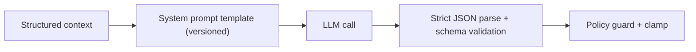

# AI Layer: Prompting and Schemas

## Status
- Version: `v1`
- Last updated: **2026-02-08**
- Source of truth (config): `argocd/applications/torghut/**`

## Purpose
Define the prompt/versioning strategy and strict schema contracts that keep AI advisory safe, deterministic, and
auditable.

## Non-goals
- Storing secrets or private data in prompts.
- Free-form outputs without schema validation.

## Terminology
- **Prompt version:** Version string used to link reviews to a specific prompt template.
- **Schema validation:** Parsing AI outputs into strict typed objects; rejects invalid output.

## Current repo artifacts (pointers)
- Prompt template: `services/torghut/app/trading/llm/prompt_templates/system_v1.txt`
- Schema definitions: `services/torghut/app/trading/llm/schema.py`
- Review engine: `services/torghut/app/trading/llm/review_engine.py`
- Settings: `services/torghut/app/config.py` (`LLM_PROMPT_VERSION`)

## Prompting architecture

## Prompt content guidelines (v1)
- Use only structured context derived from trusted sources (signals, positions, recent decisions).
- Avoid free-text user input.
- Require output strictly as JSON, no extra prose.
- Store short rationales; do not request chain-of-thought.

## Output schemas (v1)
The schema should include:
- `verdict` enum
- `confidence` in [0,1]
- optional adjustments with bounded types
- `risk_flags` taxonomy (bounded list)

## Failure modes and recovery
| Failure | Symptoms | Detection | Recovery |
| --- | --- | --- | --- |
| Prompt drift breaks parse | parse error rate rises | llm_parse_error counters | roll back prompt version; tighten prompt instructions |
| Overly verbose outputs | token costs spike | cost telemetry | enforce max tokens; shorten prompt; reject oversized responses |

## Security considerations
- Treat prompts and outputs as data that may be stored; avoid sensitive disclosure.
- Keep schemas strict to prevent unsafe outputs (OWASP “insecure output handling” class).

## Decisions (ADRs)
### ADR-42-1: Schema-validated JSON is the only accepted output format
- **Decision:** Reject any LLM output not matching the strict schema.
- **Rationale:** Prevents ambiguous interpretation and unsafe actions.
- **Consequences:** Some model responses will be discarded; acceptable for safety.

