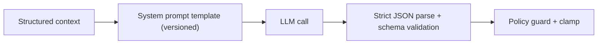

# AI Layer: Prompting and Schemas

## Status

- Version: `v1`
- Last updated: **2026-02-08**
- Source of truth (config): `argocd/applications/torghut/**`

## Source Implementation Audit (2026-07-04)

- Source baseline inspected: `6473f3ee7 ci(arc): fit ten lab runners per node (#11877)`.
- Implementation status: **Implemented for strict request/response schemas and sanitized prompting inputs; runtime prompting is DSPy-artifact based and currently disabled in deployment.** The old `system_v1.txt` template exists, but current review execution uses DSPy adapters/runtime metadata rather than a simple static prompt call.
- Matched implementation area: LLM prompting and schemas.
- Current source evidence:
  - `services/torghut/app/trading/llm/prompt_templates/system_v1.txt`
  - `services/torghut/app/trading/llm/schema.py`
  - `services/torghut/app/trading/llm/review_engine.py`
  - `services/torghut/app/trading/llm/dspy_programs/adapters.py`
  - `services/torghut/app/trading/llm/dspy_programs/runtime.py`
- What is implemented from the design:
  - versioned prompt template file;
  - strict typed request schema;
  - typed response schema with rationale/adjustment/escalation validators;
  - sanitized input allowlist for account, positions, decision params, price snapshots, imbalance, sizing, and HMM regime context;
  - no chain-of-thought requirement in source schemas.
- What changed from the design:
  - current runtime is DSPy artifact/pipeline based, so prompt text is only part of the guardrail/runtime surface;
  - response schema now includes calibrated probabilities, uncertainty, calibration metadata, committee trace, and required deterministic checks;
  - response parsing ignores unknown gateway metadata while request schemas remain strict.
- Remaining gaps / operator caveats:
  - prompt-template edits alone do not activate model behavior;
  - model quality still depends on evaluation artifacts and guardrail thresholds.

## Purpose

Define the prompt/versioning strategy and strict schema contracts that keep AI advisory safe, deterministic, and
auditable.

## Non-goals

- Storing secrets or private data in prompts.
- Free-form outputs without schema validation.

## Terminology

- **Prompt version:** Version string used to link reviews to a specific prompt template.
- **Schema validation:** Parsing AI outputs into strict typed objects; rejects invalid output.

## Current repo artifacts (pointers)

- Prompt template: `services/torghut/app/trading/llm/prompt_templates/system_v1.txt`
- Schema definitions: `services/torghut/app/trading/llm/schema.py`
- Review engine: `services/torghut/app/trading/llm/review_engine.py`
- Settings: `services/torghut/app/config/llm_fields.py` (`LLM_PROMPT_VERSION`)

## Prompting architecture

```mermaid
flowchart LR
  Inputs["Structured context"] --> Template["System prompt template (versioned)"]
  Template --> Call["LLM call"]
  Call --> Parse["Strict JSON parse + schema validation"]
  Parse --> Guard["Policy guard + clamp"]
```

## Prompt content guidelines (v1)

- Use only structured context derived from trusted sources (signals, positions, recent decisions).
- Avoid free-text user input.
- Require output strictly as JSON, no extra prose.
- Store short rationales; do not request chain-of-thought.

## Output schemas (v1)

The schema should include:

- `verdict` enum
- `confidence` in [0,1]
- optional adjustments with bounded types
- `risk_flags` taxonomy (bounded list)

## Failure modes and recovery

| Failure                   | Symptoms               | Detection                | Recovery                                                       |
| ------------------------- | ---------------------- | ------------------------ | -------------------------------------------------------------- |
| Prompt drift breaks parse | parse error rate rises | llm_parse_error counters | roll back prompt version; tighten prompt instructions          |
| Overly verbose outputs    | token costs spike      | cost telemetry           | enforce max tokens; shorten prompt; reject oversized responses |

## Security considerations

- Treat prompts and outputs as data that may be stored; avoid sensitive disclosure.
- Keep schemas strict to prevent unsafe outputs (OWASP “insecure output handling” class).

## Decisions (ADRs)

### ADR-42-1: Schema-validated JSON is the only accepted output format

- **Decision:** Reject any LLM output not matching the strict schema.
- **Rationale:** Prevents ambiguous interpretation and unsafe actions.
- **Consequences:** Some model responses will be discarded; acceptable for safety.
