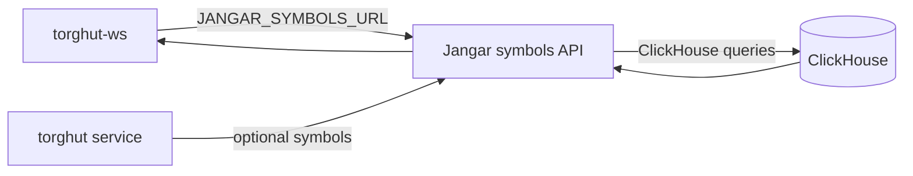

# API Contracts and Jangar Integration

## Status
- Version: `v1`
- Last updated: **2026-02-08**
- Source of truth (config): `argocd/applications/torghut/**`

## Purpose
Document the stable API contracts between:
- Torghut components and Jangar (symbol universe + TA visualization),
- and operator-facing trading endpoints (where applicable),
with concrete repo pointers to implementations.

## Non-goals
- Public external API stability guarantees.
- Full OpenAPI generation (this doc defines the contract shape).

## Terminology
- **Universe API:** Source of symbols to subscribe/trade.
- **TA APIs:** Jangar endpoints that query ClickHouse for visuals.

## Jangar Torghut APIs (current)
Implementation lives in `services/jangar/src/routes/api/torghut/**`:
- `GET /api/torghut/symbols` - list symbols (compact or full)
  - file: `services/jangar/src/routes/api/torghut/symbols.ts`
- `GET /api/torghut/ta/latest?symbol=...`
  - file: `services/jangar/src/routes/api/torghut/ta/latest.ts`
- `GET /api/torghut/ta/bars?symbol=...&from=...&to=...&limit=...`
  - file: `services/jangar/src/routes/api/torghut/ta/bars.ts`
- `GET /api/torghut/ta/signals?symbol=...&from=...&to=...&limit=...`
  - file: `services/jangar/src/routes/api/torghut/ta/signals.ts`

## Integration points

## Configuration pointers
- WS universe URL: `argocd/applications/torghut/ws/configmap.yaml` (`JANGAR_SYMBOLS_URL`)
- Trading service universe URL: `argocd/applications/torghut/knative-service.yaml` (`JANGAR_SYMBOLS_URL`)

## API shapes (high level)
### `GET /api/torghut/symbols`
- Compact response: `{ "symbols": ["NVDA", "MU", ...] }`
- Full response: `{ "items": [{ "symbol": "NVDA", "enabled": true, ...}, ...] }`

### `GET /api/torghut/ta/latest`
- `{ ok: true, symbol, bars: object|null, signals: object|null }`

## Failure modes and recovery
| Failure | Symptoms | Detection | Recovery |
| --- | --- | --- | --- |
| Jangar DB misconfig | visuals show UNKNOWN_TABLE | Jangar errors; ClickHouse DB mismatch | ensure `CH_DATABASE=torghut` (see `docs/torghut/ops-2026-01-01-ta-recovery.md`) |
| ClickHouse unavailable | TA APIs 503/500 | Jangar returns 503/500 | restore ClickHouse; check auth/host; see ClickHouse operational procedures |

## Security considerations
- Keep Jangar TA APIs internal unless explicitly required.
- Universe mutation endpoint (POST) must be access-controlled.

## Decisions (ADRs)
### ADR-49-1: Jangar queries ClickHouse directly for TA visuals
- **Decision:** Jangar retrieves TA bars/signals from ClickHouse, not via Torghut service.
- **Rationale:** Reduces coupling; ClickHouse is already the TA store.
- **Consequences:** ClickHouse availability affects UI; ensure alerts and operational procedures exist.
