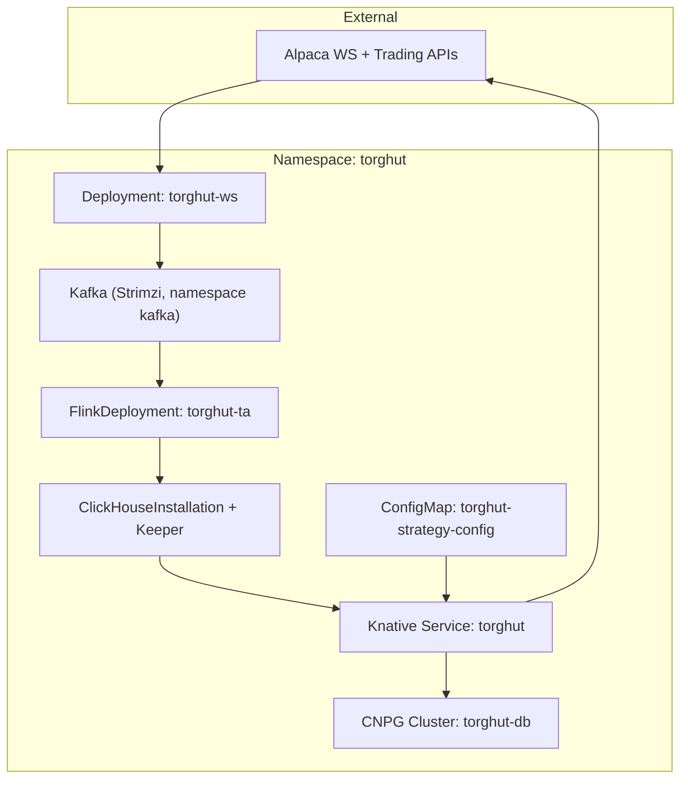
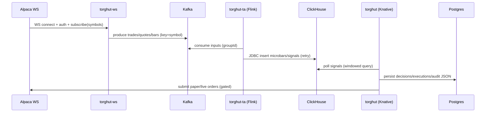

# Architecture and Context

## Status
- Version: `v1`
- Last updated: **2026-02-08**
- Source of truth (config): `argocd/applications/torghut/**`

## Purpose
Describe Torghut’s end-to-end architecture, major boundaries, invariants, and how the design aligns with the current
production manifests under `argocd/applications/torghut/**`.

## Non-goals
- Re-documenting every existing file in `docs/torghut/` (this doc links to them where helpful).
- Designing a brand new event model that is incompatible with the current Kafka envelope (see `docs/torghut/topics-and-schemas.md`).

## Terminology
- **Cluster-local**: Knative service visibility limited to in-cluster callers.
- **Exactly-once**: Flink checkpoint + Kafka transactional producer semantics; note ClickHouse JDBC sink is effectively *at-least-once*.
- **Replay**: Recomputing TA outputs from Kafka history into ClickHouse.

## Context and constraints
### Current deployed shape (source of truth)
- Torghut namespace: `torghut`
- Components:
  - `torghut-ws` (Deployment): `argocd/applications/torghut/ws/deployment.yaml`
  - `torghut-ta` (FlinkDeployment): `argocd/applications/torghut/ta/flinkdeployment.yaml`
  - `torghut` (Knative Service): `argocd/applications/torghut/knative-service.yaml`
  - ClickHouse cluster + Keeper: `argocd/applications/torghut/clickhouse/**`
  - Postgres cluster (CNPG): `argocd/applications/torghut/postgres-cluster.yaml`

### Known operational failure modes (must inform design)
- ClickHouse PVCs can fill (20Gi each). Disk exhaustion breaks inserts; TA job can fail on JDBC writes.
- `torghut-ws` readiness can stick at 503 while liveness is OK.
- Torghut service may crash on JSON serialization of UUID when persisting JSON fields via psycopg.

## Architecture (logical)

## Architecture (deployment)

## Configuration (pointers)
- Kafka topics and schema expectations: `docs/torghut/topics-and-schemas.md`, `docs/torghut/schemas/*.avsc`
- TA ClickHouse DDL: `services/dorvud/technical-analysis-flink/src/main/resources/ta-schema.sql`
- Strategy config mount: `argocd/applications/torghut/knative-service.yaml` + `argocd/applications/torghut/strategy-configmap.yaml`

### Env var contract (high level)
| Component | Key env vars | Where configured |
| --- | --- | --- |
| `torghut-ws` | `ALPACA_*`, `KAFKA_*`, `TOPIC_*`, `JANGAR_SYMBOLS_URL` | `argocd/applications/torghut/ws/configmap.yaml`, `argocd/applications/torghut/ws/deployment.yaml` |
| `torghut-ta` | `TA_*` | `argocd/applications/torghut/ta/configmap.yaml`, `argocd/applications/torghut/ta/flinkdeployment.yaml` |
| `torghut` | `DB_DSN`, `TRADING_*`, `LLM_*`, `TA_CLICKHOUSE_*`, `JANGAR_SYMBOLS_URL` | `argocd/applications/torghut/knative-service.yaml` |

Notes:
- The Knative manifest currently sets both `CLICKHOUSE_*` and `TA_CLICKHOUSE_*`, but the trading dependency checks and
  ClickHouse query path in `services/torghut/app/main.py` use `TA_CLICKHOUSE_URL/USERNAME/PASSWORD` (plus timeout via
  `TA_CLICKHOUSE_CONN_TIMEOUT_SECONDS`, with a legacy alias of `CLICKHOUSE_TIMEOUT_SECONDS`).

## Failure modes (architectural)
### ClickHouse unavailable or out-of-disk
- **Primary symptoms:** TA pipeline stalls/fails; `ta_*` tables stop updating; trading loop sees stale signals.
- **Detection:**
  - Flink job state not `RUNNING` (`kubectl get flinkdeployment -n torghut torghut-ta`).
  - ClickHouse disk alerts / `system.disks` free bytes low.
  - JDBC sink exceptions in Flink logs: `No space left on device`.
- **Recovery:** see `v1/component-clickhouse-capacity-ttl-and-disk-guardrails.md` and `v1/operations-ta-replay-and-recovery.md`.

### torghut-ws readiness stuck 503
- **Symptoms:** `kubectl get pods` shows `READY 0/1`, but `/healthz` is OK.
- **Detection:** `GET /readyz` returns 503; metrics show Kafka publish failures or Alpaca 401/406.
- **Recovery:** see `v1/operations-ws-connection-limit-and-auth.md`.

### torghut service crashloop due to JSON/UUID serialization
- **Symptoms:** Knative revision fails; logs mention JSON serialization failing for UUID.
- **Detection:** Knative revision conditions show `Ready=False`; container logs show stack trace.
- **Recovery:** see `v1/operations-knative-revision-failures.md`.

## Security considerations
- Prefer **cluster-local** service visibility for trading endpoints; only Jangar/internal callers should reach it.
- Secrets are always sourced from Kubernetes Secrets; docs must never include secret payloads (no base64, no `.env` dumps).
- Network boundaries: Kafka is shared infra (namespace `kafka`) and accessed via SASL; torghut workloads must use least-privilege credentials.

## Decisions (ADRs)
### ADR-01-1: Keep Kafka as the canonical streaming bus
- **Decision:** Kafka remains the canonical event transport between ingestion and compute layers.
- **Rationale:** Backpressure, replay, and operational tooling are already in place (Strimzi + scripts).
- **Consequences:** Kafka topic hygiene (retention, partitioning, schema evolution) becomes a primary correctness constraint.
