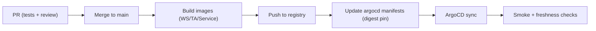

# CI/CD and Release Process

## Status
- Version: `v1`
- Last updated: **2026-02-08**
- Source of truth (config): `argocd/applications/torghut/**`

## Purpose
Describe the build/test/release workflow for Torghut components, aligned with current repo structure and GitOps
deployment via ArgoCD.

## Non-goals
- Replacing organization-wide CI conventions.
- Documenting every CI job in `.github/workflows/` (this doc focuses on Torghut path).

## Terminology
- **Image digest pinning:** Deploying by `@sha256:...` for reproducible rollouts.
- **Promotion:** Moving from dev/stage to prod with identical artifacts.

## Current repo references
- Existing CI/CD notes: `docs/torghut/ci-cd.md`
- GitOps manifests:
  - WS: `argocd/applications/torghut/ws/**`
  - TA: `argocd/applications/torghut/ta/**`
  - Service: `argocd/applications/torghut/knative-service.yaml`

## Release pipeline (recommended v1)

## Component-specific build pointers
### WS forwarder
See `docs/torghut/ci-cd.md` for gradle commands; code lives under `services/dorvud/websockets/`.

### TA Flink job
Code lives under `services/dorvud/technical-analysis-flink/`.

### Torghut trading service
Code lives under `services/torghut/` (Python/FastAPI).

## Release safety requirements
- Paper-by-default must remain true.
- Any change enabling live trading requires explicit review and documented approval.
- Schema changes must follow compatibility rules (see `v1/component-schema-registry-and-evolution.md`).

## Failure modes and recovery
| Failure | Symptoms | Detection | Recovery |
| --- | --- | --- | --- |
| bad image deploy | crashloop | Argo/Knative status; logs | roll back image digest in GitOps |
| schema mismatch | consumer decode errors | logs show decode failures | roll back producer; register schema; use new topic version if needed |

## Security considerations
- Ensure CI does not print secrets.
- Prefer provenance and digest pinning.

## Decisions (ADRs)
### ADR-29-1: Deploy by digest pinning
- **Decision:** GitOps manifests use `image: ...@sha256:...` rather than mutable tags.
- **Rationale:** Makes rollbacks deterministic and prevents “latest” drift.
- **Consequences:** Requires tooling to discover digests and update manifests.

