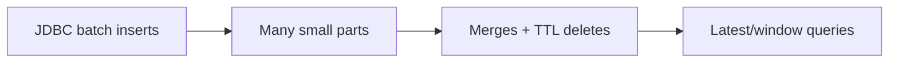

# ClickHouse Performance Tuning (Torghut)

## Status

- Version: `v1`
- Last updated: **2026-02-08**
- Source of truth (config): `argocd/applications/torghut/**`

## Purpose

Provide ClickHouse tuning guidance for Torghut’s query and ingest patterns, emphasizing stability under disk pressure
and fast “latest” queries used by trading/UI.

## Non-goals

- Generic ClickHouse tuning guidance for arbitrary workloads.

## Terminology

- **MergeTree:** Base table engine family.
- **Merges:** Background process compacting parts; critical for TTL enforcement.

## Current deployment constraints (pointers)

- ClickHouse resources and PVC sizing: `argocd/applications/torghut/clickhouse/clickhouse-cluster.yaml`
- TA DDL: `services/dorvud/technical-analysis-flink/src/main/resources/ta-schema.sql`

## Workload characteristics

Key goals:

- Keep merges healthy (CPU + disk free).
- Keep ORDER BY aligned with query filters (`symbol`, `event_ts`, `seq`).

## Tuning guidance (v1)

- Ensure adequate CPU for merges (avoid throttling to the point TTL cannot run).
- Keep disk free headroom (guardrail alerts).
- Avoid high-frequency `FINAL` queries; use only for debugging.
- If “latest per symbol” queries are hot, consider:
  - materialized views or aggregation projections (requires careful design review).

## Failure modes and recovery

| Failure       | Symptoms                       | Detection                   | Recovery                                                |
| ------------- | ------------------------------ | --------------------------- | ------------------------------------------------------- |
| Merge backlog | TTL not reclaiming; disk grows | system parts/merges metrics | increase resources; reduce write rate; add disk         |
| Slow queries  | UI/trading latency spikes      | query latency dashboards    | add indexes/optimize ORDER BY; tune memory; avoid FINAL |

## Security considerations

- Keep ClickHouse internal.
- Restrict admin commands.

## Decisions (ADRs)

### ADR-34-1: Favor operational stability over aggressive optimizations

- **Decision:** Introduce performance features (projections, materialized views) only when proven necessary.
- **Rationale:** Operational simplicity reduces incident risk.
- **Consequences:** Some queries may be slower initially; acceptable for v1.
