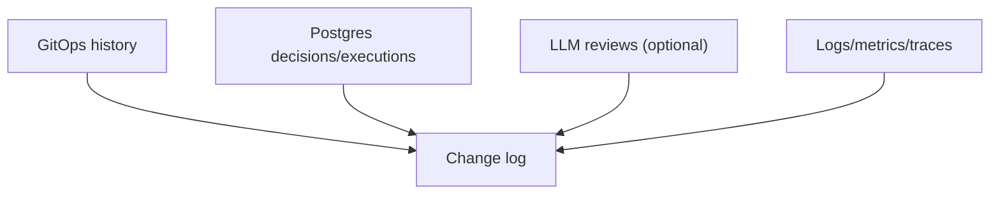

# Compliance and Auditability

## Status

- Version: `v1`
- Last updated: **2026-02-08**
- Source of truth (config): `argocd/applications/torghut/**`

## Purpose

Define the compliance posture and auditability features Torghut must provide in order to:

- understand and reproduce decisions,
- support incident reviews,
- and safely govern AI advisory behavior.

## Non-goals

- Legal advice or formal compliance certification.
- Full customer-facing reporting features.

## Terminology

- **Auditability:** Ability to reconstruct “what happened and why”.
- **Change control:** Controlled process for modifying trading behavior (GitOps + review).

## Audit surfaces (v1)

## Key requirements (v1)

- Deterministic risk reason codes persisted and queryable.
- Unique identifiers for decisions and executions.
- LLM reviews (if enabled) stored with:
  - model id,
  - prompt version,
  - structured input summary,
  - structured output verdict,
  - timestamps.

## Repo pointers

- Audit tables: `services/torghut/app/models/entities.py`
- GitOps manifests: `argocd/applications/torghut/**`
- AI prompt versions: `services/torghut/app/trading/llm/prompt_templates/system_v1.txt`

## Failure modes and recovery

| Failure                    | Symptoms                  | Recovery                                                   |
| -------------------------- | ------------------------- | ---------------------------------------------------------- |
| Missing audit trail        | cannot explain executions | prioritize restoring Postgres; disable trading until fixed |
| Unreviewed behavior change | drift in trading outcomes | require PR review; add alerting on key env flags           |

## Security considerations

- Restrict access to audit tables.
- Ensure audit records do not contain secrets or sensitive identifiers beyond what is required.

## Decisions (ADRs)

### ADR-46-1: GitOps + Postgres form the core audit system

- **Decision:** Treat Git history and Postgres audit tables as the canonical audit sources.
- **Rationale:** Strong, queryable history for both configuration and runtime actions.
- **Consequences:** Requires robust backups and access controls for both systems.
