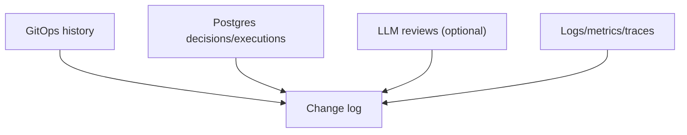

# Compliance and Auditability

## Status

- Version: `v1`
- Last updated: **2026-03-03**
- Source of truth (config): `argocd/applications/torghut/**`

## Source Implementation Audit (2026-07-04)

- Source baseline inspected: `6473f3ee7 ci(arc): fit ten lab runners per node (#11877)`.
- Implementation status: Partially implemented: secrets/RBAC/policies exist in GitOps and code, but compliance/governance designs are broader than current automated enforcement.
- Matched implementation area: Security, secrets, RBAC, audit, governance, and compliance.
- Current source evidence:
  - `argocd/applications/torghut/role.yaml`
  - `argocd/applications/torghut/rolebinding.yaml`
  - `argocd/applications/torghut/sealed-secrets.yaml`
  - `services/torghut/app/trading/autonomy/policy_checks.py`
  - `services/torghut/scripts/run_governance_policy_dry_run.py`
- Design drift note: Governance/compliance designs need tests and GitOps policy wiring before being treated as fully enforced.

## Purpose

Define the compliance posture and auditability features Torghut must provide in order to:

- understand and reproduce decisions,
- support incident reviews,
- and safely govern AI advisory behavior.

## Non-goals

- Legal advice or formal compliance certification.
- Full customer-facing reporting features.

## Terminology

- **Auditability:** Ability to reconstruct “what happened and why”.
- **Change control:** Controlled process for modifying trading behavior (GitOps + review).

## Audit surfaces (v1)

```mermaid
flowchart TD
  Git["GitOps history"] --> Audit["Change log"]
  Trading["Postgres decisions/executions"] --> Audit
  AI["LLM reviews (optional)"] --> Audit
  Obs["Logs/metrics/traces"] --> Audit
```

## Key requirements (v1)

- Deterministic risk reason codes persisted and queryable.
- Unique identifiers for decisions and executions.
- LLM reviews (if enabled) stored with:
  - model id,
  - prompt version,
  - structured input summary,
  - structured output verdict,
  - timestamps.
- Quant control-plane contracts include:
  - `last_autonomy_recommendation_trace_id`,
  - `domain_telemetry_event_total`,
  - `domain_telemetry_dropped_total`,
  - execution correlation/idempotency identifiers for execution rows.

## Repo pointers

- Audit tables: `services/torghut/app/models/entities.py`
- GitOps manifests: `argocd/applications/torghut/**`
- AI prompt versions: `services/torghut/app/trading/llm/prompt_templates/system_v1.txt`

## Failure modes and recovery

| Failure                    | Symptoms                  | Recovery                                                   |
| -------------------------- | ------------------------- | ---------------------------------------------------------- |
| Missing audit trail        | cannot explain executions | prioritize restoring Postgres; disable trading until fixed |
| Unreviewed behavior change | drift in trading outcomes | require PR review; add alerting on key env flags           |

## Security considerations

- Restrict access to audit tables.
- Ensure audit records do not contain secrets or sensitive identifiers beyond what is required.

## Compliance evidence package (Wave 6 closure)

CI-ready model-risk package checks are enforced through `services/torghut/scripts/verify_quant_readiness.py` using:

- `--control-plane-contract` for promotion/rollback/drift telemetry continuity fields.
- `--model-risk-evidence-package` for completeness and freshness checks.
- `--max-model-risk-evidence-age-hours` to bound stale signoff artifacts.

The model-risk evidence package must include:

- promotion trace IDs (`gate_report_trace_id`, `recommendation_trace_id`),
- rollback incident evidence completeness and path,
- drift evidence continuity pass signal + report path,
- runbook emergency-stop rehearsal proof,
- signed legacy-gap disposition mapping path.

## Decisions (ADRs)

### ADR-46-1: GitOps + Postgres form the core audit system

- **Decision:** Treat Git history and Postgres audit tables as the canonical audit sources.
- **Rationale:** Strong, queryable history for both configuration and runtime actions.
- **Consequences:** Requires robust backups and access controls for both systems.
