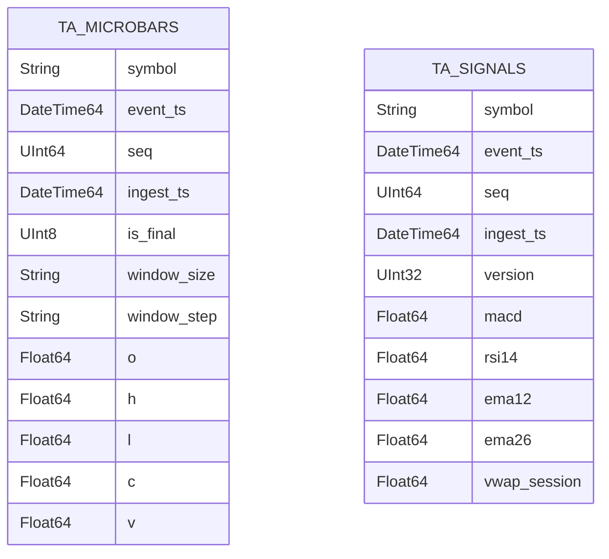

# Component: ClickHouse Schema and Views

## Status

- Version: `v1`
- Last updated: **2026-02-08**
- Source of truth (config): `argocd/applications/torghut/**`

## Purpose

Document the ClickHouse schema used for Torghut TA storage, including table design constraints that support replay,
dedup, and fast query patterns for both trading and visualization.

## Non-goals

- Redesigning ClickHouse to a different engine family (MergeTree-based layout is assumed for v1).
- Documenting every possible materialized view (v1 includes recommended views and query patterns).

## Terminology

- **ReplacingMergeTree:** A MergeTree engine that keeps the “latest” row per sorting key based on a version column.
- **Replicated\*:** Table engines backed by Keeper metadata for multi-replica consistency.
- **TTL:** Automated retention deletion during merges (not instantaneous).

## Current schema source of truth

The schema is created/ensured by the TA job and captured in:

- `services/dorvud/technical-analysis-flink/src/main/resources/ta-schema.sql`

Deployed ClickHouse cluster:

- `argocd/applications/torghut/clickhouse/clickhouse-cluster.yaml`

## Tables (v1)

- `torghut.ta_microbars`
- `torghut.ta_signals`



## Query patterns

### “Latest signal for symbol”

Used by trading and UI lag calculations.

Guidance:

- Query by `symbol` and `max(event_ts)`.
- Keep filters sargable (`symbol = ?` and `event_ts >= now() - interval`).

### “Windowed signals for chart”

Used by Jangar visuals for overlays:

- `WHERE symbol = ? AND event_ts BETWEEN from AND to ORDER BY event_ts ASC`

## Recommended views (v1)

The stored tables are flattened; some consumers prefer a normalized “envelope” view.

Example view definition (operator-managed; **do not** apply blindly without change control):

```sql
CREATE VIEW IF NOT EXISTS torghut.v_ta_signals_envelope AS
SELECT
  symbol,
  event_ts,
  ingest_ts,
  seq,
  window_size,
  window_step,
  -- map flattened columns into a JSON-ish shape if required
  macd,
  macd_signal,
  macd_hist,
  rsi14
FROM torghut.ta_signals;
```

## Failure modes and recovery

| Failure                        | Symptoms                                 | Detection signals                                   | Recovery                                                                                                |
| ------------------------------ | ---------------------------------------- | --------------------------------------------------- | ------------------------------------------------------------------------------------------------------- |
| Keeper metadata loss           | replicas read-only; unknown table errors | `system.replicas` shows readonly; errors in queries | see `v1/operations-clickhouse-replica-and-keeper.md` (`SYSTEM RESTORE REPLICA`)                         |
| Duplicate rows (at-least-once) | spikes in counts per ts                  | query anomalies; dedup metrics                      | rely on `ReplicatedReplacingMergeTree` + `ingest_ts` as version; query with `FINAL` only when necessary |
| Schema drift                   | TA job fails ensuring schema             | Flink logs show DDL errors                          | treat as migration; update `ta-schema.sql` and roll out carefully                                       |

## Security considerations

- ClickHouse user `torghut` should be scoped to the `torghut` database and required tables.
- Avoid granting `DROP` or broad `SYSTEM` privileges to application users.

## Decisions (ADRs)

### ADR-07-1: Flattened columns for hot-path queries

- **Decision:** Store indicator outputs as flattened columns, not nested JSON.
- **Rationale:** Improves query performance and simplifies indexes/ORDER BY.
- **Consequences:** Schema evolution requires explicit DDL; “flexible” ad-hoc fields are discouraged.
