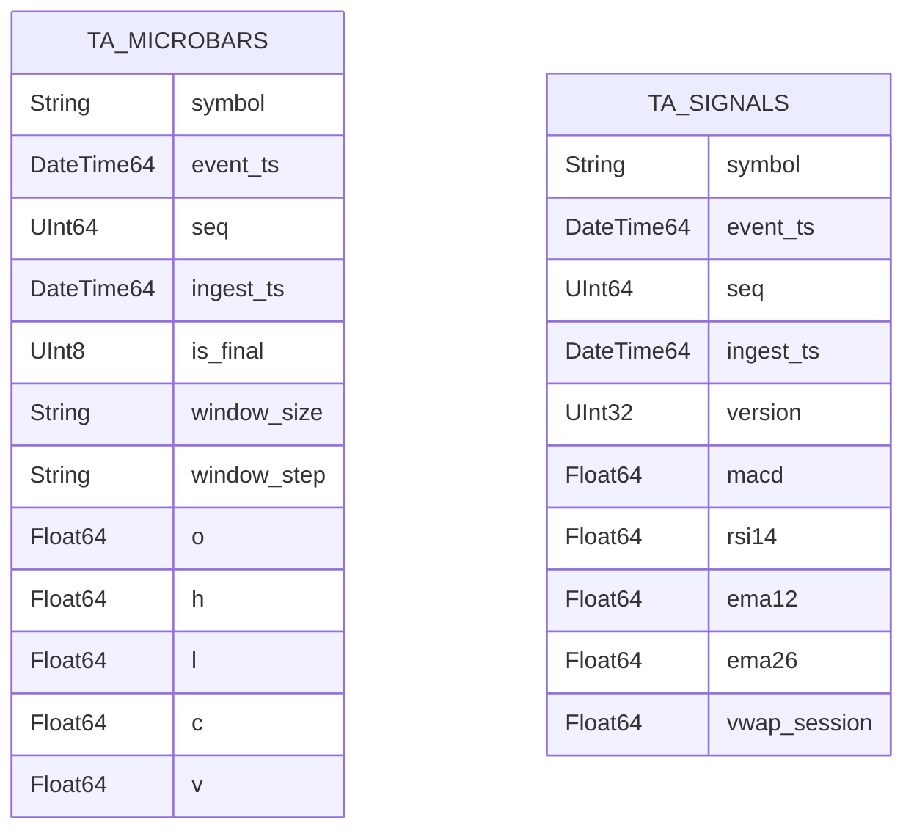

# Component: ClickHouse Schema and Views

## Status

- Version: `v1`
- Last updated: **2026-02-08**
- Source of truth (config): `argocd/applications/torghut/**`

## Source Implementation Audit (2026-07-04)

- Source baseline inspected: `6473f3ee7 ci(arc): fit ten lab runners per node (#11877)`.
- Implementation status: **Implemented and expanded.** The v1 `ta_microbars` / `ta_signals` tables exist in current schema, but the schema has grown to include options contract bars/features/surface features and explicit schema initialization from the Flink TA job.
- Current source evidence:
  - `services/dorvud/technical-analysis-flink/src/main/resources/ta-schema.sql` creates `torghut.ta_microbars` and `torghut.ta_signals` with `ReplicatedReplacingMergeTree`, `ORDER BY (symbol, event_ts, seq)`, and 35-day TTLs.
  - The same schema file now also creates options tables such as `options_contract_bars_1s`, `options_contract_features`, and `options_surface_features` with shorter options TTLs.
  - `services/dorvud/technical-analysis-flink/src/main/kotlin/ai/proompteng/dorvud/ta/flink/FlinkTechnicalAnalysisJob.kt::ensureClickhouseSchema` loads and applies the SQL resource before enabling ClickHouse sinks when `TA_CLICKHOUSE_URL` is set.
  - `argocd/applications/torghut/clickhouse/clickhouse-cluster.yaml` defines a 1-shard/2-replica Altinity ClickHouseInstallation, Keeper-backed replication, 50Gi Rook-Ceph volumes, Prometheus metrics, and bounded system-log TTLs.
  - `argocd/applications/torghut/ta/configmap.yaml` points the TA job at `jdbc:clickhouse://torghut-clickhouse.torghut.svc.cluster.local:8123/torghut` and sets schema-init retry/strictness knobs.
- What is implemented from the design:
  - replicated MergeTree storage for microbars/signals;
  - symbol/event-time/sequence ordering for dedup-friendly reads;
  - TTL-managed storage;
  - ClickHouse schema ensured by deployed TA runtime;
  - ClickHouse cluster desired state in GitOps.
- What changed from the design:
  - `ta-schema.sql` is not just v1 equity TA anymore; it includes options feature tables and schema evolution statements;
  - the table TTLs are concrete in source: 35 days for equity TA and 14 days for options contract feature tables;
  - operational ClickHouse settings now include bounded internal logs and disabled heavy profiler logs in the cluster manifest.
- Remaining gaps / operator caveats:
  - This doc should not claim every materialized view exists. Current source evidence is table DDL plus Flink inserts; any view/query claim must be rechecked in ClickHouse or code.
  - The schema is deployed through TA job schema-init and GitOps, so runtime truth also depends on Flink job health and ClickHouse schema-init success.

## Purpose

Document the ClickHouse schema used for Torghut TA storage, including table design constraints that support replay,
dedup, and fast query patterns for both trading and visualization.

## Non-goals

- Redesigning ClickHouse to a different engine family (MergeTree-based layout is assumed for v1).
- Documenting every possible materialized view (v1 includes recommended views and query patterns).

## Terminology

- **ReplacingMergeTree:** A MergeTree engine that keeps the “latest” row per sorting key based on a version column.
- **Replicated\*:** Table engines backed by Keeper metadata for multi-replica consistency.
- **TTL:** Automated retention deletion during merges (not instantaneous).

## Current schema source of truth

The current schema source is:

- `services/dorvud/technical-analysis-flink/src/main/resources/ta-schema.sql`

The deployed ClickHouse cluster and operational settings are:

- `argocd/applications/torghut/clickhouse/clickhouse-cluster.yaml`
- `argocd/applications/torghut/clickhouse/clickhouse-keeper.yaml`
- `argocd/applications/torghut/ta/configmap.yaml` (`TA_CLICKHOUSE_*`, schema-init retry and strictness settings)
- `services/dorvud/technical-analysis-flink/src/main/kotlin/ai/proompteng/dorvud/ta/flink/FlinkTechnicalAnalysisJob.kt` (`ensureClickhouseSchema`, JDBC sinks)

## Tables (v1)

- `torghut.ta_microbars`
- `torghut.ta_signals`


```mermaid
erDiagram
  TA_MICROBARS {
    String symbol
    DateTime64 event_ts
    UInt64 seq
    DateTime64 ingest_ts
    UInt8 is_final
    String window_size
    String window_step
    Float64 o
    Float64 h
    Float64 l
    Float64 c
    Float64 v
  }
  TA_SIGNALS {
    String symbol
    DateTime64 event_ts
    UInt64 seq
    DateTime64 ingest_ts
    UInt32 version
    Float64 macd
    Float64 rsi14
    Float64 ema12
    Float64 ema26
    Float64 vwap_session
  }
```

## Query patterns

### “Latest signal for symbol”

Used by trading and UI lag calculations.

Guidance:

- Query by `symbol` and `max(event_ts)`.
- Keep filters sargable (`symbol = ?` and `event_ts >= now() - interval`).

### “Windowed signals for chart”

Used by Jangar visuals for overlays:

- `WHERE symbol = ? AND event_ts BETWEEN from AND to ORDER BY event_ts ASC`

## Recommended views (v1)

The stored tables are flattened; some consumers prefer a normalized “envelope” view.

Example view definition (operator-managed; **do not** apply blindly without change control):

```sql
CREATE VIEW IF NOT EXISTS torghut.v_ta_signals_envelope AS
SELECT
  symbol,
  event_ts,
  ingest_ts,
  seq,
  window_size,
  window_step,
  -- map flattened columns into a JSON-ish shape if required
  macd,
  macd_signal,
  macd_hist,
  rsi14
FROM torghut.ta_signals;
```

## Failure modes and recovery

| Failure                        | Symptoms                                 | Detection signals                                   | Recovery                                                                                                |
| ------------------------------ | ---------------------------------------- | --------------------------------------------------- | ------------------------------------------------------------------------------------------------------- |
| Keeper metadata loss           | replicas read-only; unknown table errors | `system.replicas` shows readonly; errors in queries | see `v1/operations-clickhouse-replica-and-keeper.md` (`SYSTEM RESTORE REPLICA`)                         |
| Duplicate rows (at-least-once) | spikes in counts per ts                  | query anomalies; dedup metrics                      | rely on `ReplicatedReplacingMergeTree` + `ingest_ts` as version; query with `FINAL` only when necessary |
| Schema drift                   | TA job fails ensuring schema             | Flink logs show DDL errors                          | treat as migration; update `ta-schema.sql` and roll out carefully                                       |

## Security considerations

- ClickHouse user `torghut` should be scoped to the `torghut` database and required tables.
- Avoid granting `DROP` or broad `SYSTEM` privileges to application users.

## Decisions (ADRs)

### ADR-07-1: Flattened columns for hot-path queries

- **Decision:** Store indicator outputs as flattened columns, not nested JSON.
- **Rationale:** Improves query performance and simplifies indexes/ORDER BY.
- **Consequences:** Schema evolution requires explicit DDL; “flexible” ad-hoc fields are discouraged.
