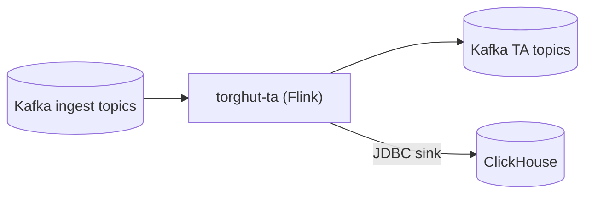

# Component: Flink Technical Analysis (TA) Job

## Status

- Version: `v1`
- Last updated: **2026-02-23**
- Source of truth (config): `argocd/applications/torghut/**`
- Implementation status: `Implemented` (verified with code + tests + runtime/config on 2026-02-21)

## Source Implementation Audit (2026-07-04)

- Source baseline inspected: `6473f3ee7 ci(arc): fit ten lab runners per node (#11877)`.
- Implementation status: **Implemented and expanded.** The Flink TA job exists as a production FlinkDeployment with Kafka sources/sinks, ClickHouse JDBC sinks, schema initialization, optional quote/bars streams, status heartbeat, and quote-freshness logic.
- Current source evidence:
  - `FlinkTechnicalAnalysisJob.kt::main` builds Kafka sources for trades plus optional quotes/bars1m, assigns event-time watermarks, creates microbars, computes TA signals, optionally emits status, writes Kafka sinks, applies ClickHouse sinks, and executes `torghut-technical-analysis-flink`.
  - `FlinkTaConfig.kt` defines current env contract: topics, group/client ids, checkpoint/savepoint dirs, checkpoint interval/timeout/pause, max out-of-order ms, quote stale after ms, parallelism, S3 checkpoint config, delivery guarantee, and ClickHouse sink/schema-init settings.
  - `FlinkTechnicalAnalysisJob.kt::ensureClickhouseSchema` applies `ta-schema.sql` with retry/strictness before ClickHouse sinks are used.
  - `argocd/applications/torghut/ta/flinkdeployment.yaml` sets Flink v2.0, checkpoint dirs, `EXACTLY_ONCE` checkpoint mode, retained external checkpoints, unaligned checkpoints, Prometheus metrics, fixed-delay restarts, and secret-backed Kafka/ClickHouse/S3 credentials.
  - Tests include `ParseEnvelopeFlatMapTest`, `SerializationSchemasTest`, `FlinkTechnicalAnalysisOptionalStreamsTest`, `FlinkTechnicalAnalysisQuoteFreshnessTest`, and `RetryHelperTest`.
- What is implemented from the design:
  - Kafka trades input;
  - optional quotes/bars input;
  - microbar output;
  - signal output;
  - ClickHouse sink with at-least-once/dedup-friendly storage;
  - checkpoint/savepoint configuration;
  - status heartbeat support;
  - schema-init retry path.
- What changed from the design:
  - current `TA_CHECKPOINT_INTERVAL_MS` in GitOps is 60000, not the older 10000 default shown in config source defaults;
  - `TA_GROUP_ID` is a stable live value (`torghut-ta-live`); replay/backfill runs must use a separate temporary group
    and restore this value before production readiness can be claimed;
  - quote freshness is explicit via `TA_QUOTE_STALE_AFTER_MS=15000` and code paths that reject stale quotes for signal computation.
- Remaining gaps / operator caveats:
  - Kafka sinks are still at-least-once; ClickHouse table keys and replacing semantics carry the dedup burden.
  - Exactly-once Flink checkpointing does not make the ClickHouse JDBC sink exactly-once.

## Purpose

Specify the Flink TA job’s runtime contract, configuration, checkpointing semantics, ClickHouse sink behavior, and the
operational model for upgrades and recovery.

## Non-goals

- Implementing new indicators beyond what the current job computes (v1 documents existing behavior).
- Treating ClickHouse JDBC sinks as exactly-once (they are effectively at-least-once and require dedup-friendly storage keys).

## Terminology

- **Checkpoint:** Periodic snapshot enabling state recovery.
- **Savepoint:** Manually-triggered consistent snapshot used for upgrades/migrations.
- **Watermark:** Event-time progress signal; drives windowing correctness.

## Current implementation + manifests (pointers)

- Flink job code: `services/dorvud/technical-analysis-flink/src/main/kotlin/ai/proompteng/dorvud/ta/flink/FlinkTechnicalAnalysisJob.kt`
- Env config: `services/dorvud/technical-analysis-flink/src/main/kotlin/ai/proompteng/dorvud/ta/flink/FlinkTaConfig.kt`
- ClickHouse DDL: `services/dorvud/technical-analysis-flink/src/main/resources/ta-schema.sql`
- FlinkDeployment: `argocd/applications/torghut/ta/flinkdeployment.yaml`
- TA config: `argocd/applications/torghut/ta/configmap.yaml`

## Data flow

## Configuration

### Where configuration lives

- `argocd/applications/torghut/ta/configmap.yaml` sets `TA_*` values.
- `argocd/applications/torghut/ta/flinkdeployment.yaml` wires secrets and Flink-level config.

### Env var table (selected)

| Env var                       | Purpose              | Current / default                                               |
| ----------------------------- | -------------------- | --------------------------------------------------------------- |
| `TA_KAFKA_BOOTSTRAP`          | Brokers              | `kafka-kafka-bootstrap.kafka:9092`                              |
| `TA_TRADES_TOPIC`             | Input                | `torghut.trades.v1`                                             |
| `TA_MICROBARS_TOPIC`          | Output               | `torghut.ta.bars.1s.v1`                                         |
| `TA_SIGNALS_TOPIC`            | Output               | `torghut.ta.signals.v1`                                         |
| `TA_GROUP_ID`                 | Consumer group       | `torghut-ta-live`                                               |
| `TA_AUTO_OFFSET_RESET`        | Replay behavior      | `latest`                                                        |
| `TA_CHECKPOINT_DIR`           | Checkpoints          | `s3a://flink-checkpoints/torghut/technical-analysis`            |
| `TA_SAVEPOINT_DIR`            | Savepoints           | `s3a://flink-checkpoints/torghut/technical-analysis/savepoints` |
| `TA_KAFKA_DELIVERY_GUARANTEE` | Kafka sink semantics | `AT_LEAST_ONCE`                                                 |
| `TA_MAX_OUT_OF_ORDER_MS`      | Watermark tolerance  | `2000`                                                          |
| `TA_CLICKHOUSE_URL`           | JDBC URL             | `jdbc:clickhouse://...:8123/torghut`                            |
| `TA_CLICKHOUSE_BATCH_SIZE`    | Sink batching        | `500`                                                           |
| `TA_CLICKHOUSE_MAX_RETRIES`   | Sink retries         | `3`                                                             |

### FlinkDeployment reliability controls (GitOps)

`argocd/applications/torghut/ta/flinkdeployment.yaml` enforces:

- `execution.checkpointing.mode=EXACTLY_ONCE`
- `execution.checkpointing.externalized-checkpoint-retention=RETAIN_ON_CANCELLATION`
- `job.upgradeMode=last-state` (checkpoint-aware upgrades/restarts by default)
- `TA_KAFKA_DELIVERY_GUARANTEE=AT_LEAST_ONCE` for derived TA topic availability

### Canonical replay/backfill workflow

Operational replay/backfill (including the required unique `TA_GROUP_ID`, trading safety gates, and destructive vs
non-destructive modes) is documented canonically in:

- `argocd/applications/torghut/README.md` (“TA replay workflow (canonical)”)

## Checkpointing and delivery guarantees

The job supports Kafka delivery guarantees (see `FlinkTaConfig.kt`):

- `TA_KAFKA_DELIVERY_GUARANTEE=AT_LEAST_ONCE` (current production default)
- `TA_KAFKA_DELIVERY_GUARANTEE=EXACTLY_ONCE` remains available as an opt-in profile when transactional restore risk is acceptable.
- `TA_KAFKA_TRANSACTION_TIMEOUT_MS` must exceed checkpoint interval and broker settings when the transactional profile is enabled.

As deployed (2026-02-23):

- `argocd/applications/torghut/ta/flinkdeployment.yaml` sets `TA_KAFKA_DELIVERY_GUARANTEE=AT_LEAST_ONCE`.
- Required validation for replay/recovery posture:
  - replay behavior and idempotency/dedup in ClickHouse remain intact (ClickHouse sink remains at-least-once),
  - downstream consumers tolerate duplicate derived-topic records by `(symbol,event_ts,seq)`,
  - if the transactional profile is re-enabled, broker transaction settings and consumer isolation levels are reviewed explicitly.

**Important:** ClickHouse JDBC sink is not transactional in the same way Kafka is; it must be treated as at-least-once.
Storage keys/ORDER BY must allow dedup or “last write wins” semantics.

## ClickHouse sinks and disk-full behavior (known production issue)

When ClickHouse disks fill:

- Inserts will fail (`No space left on device`), Flink sink retries will be exhausted, and the job may enter `FAILED`.

### Detection

- FlinkDeployment `FAILED` / unstable state.
- Flink logs show JDBC exceptions during insert.
- ClickHouse metrics indicate low free space / merges unable to proceed.

### Recovery (high level)

- Free disk space (drop old partitions / ensure TTL merges can run).
- Consider temporarily stopping the job to prevent thrash while remediating disk.
- Restart FlinkDeployment after ClickHouse is healthy.

See also: `v1/component-clickhouse-capacity-ttl-and-disk-guardrails.md` and `docs/torghut/ops-2026-01-01-ta-recovery.md`.

## Failure modes, signals, recovery

| Failure              | Symptoms                       | Detection signals                           | Recovery                                                                       |
| -------------------- | ------------------------------ | ------------------------------------------- | ------------------------------------------------------------------------------ |
| Checkpoint failures  | increasing checkpoint age; lag | Flink metrics; job UI                       | fix S3/MinIO creds/endpoints; restart with last-state/savepoint                |
| Kafka auth failures  | job fails to start/consume     | logs show SASL errors                       | fix KafkaUser secret; restart                                                  |
| ClickHouse disk full | JDBC insert errors; job FAILED | Flink logs; ClickHouse disk alerts          | free disk; restart job                                                         |
| Keeper metadata lost | replicas read-only             | ClickHouse `system.replicas` shows readonly | `SYSTEM RESTORE REPLICA`; see `v1/operations-clickhouse-replica-and-keeper.md` |

## Replay/recovery operational checks (pass/fail)

1. Check FlinkDeployment state and upgrade mode:
   - `kubectl -n torghut get flinkdeployment torghut-ta -o jsonpath='{.spec.job.upgradeMode}{"\n"}{.status.jobManagerDeploymentStatus}{"\n"}{.status.jobStatus.state}{"\n"}'`
   - Pass: `upgradeMode=last-state`, deployment status is stable/ready, job state is `RUNNING`.
   - Fail: `upgradeMode=stateless` during normal operations, job not running, or repeated restart loops.
2. Check checkpoint recency:
   - `kubectl -n torghut port-forward svc/torghut-ta-jobmanager 9249:9249`
   - `curl -fsS http://127.0.0.1:9249/metrics | rg '^flink_jobmanager_job_lastCheckpointCompletedTimestamp|^flink_jobmanager_job_numberOfFailedCheckpoints'`
   - Pass: latest completed checkpoint age is below `2x` checkpoint interval and failed checkpoints are not increasing continuously.
   - Fail: completed checkpoint timestamp stalls for >10 minutes or failed checkpoints keep increasing.
3. Check externalized state storage paths:
   - `kubectl -n torghut get flinkdeployment torghut-ta -o jsonpath='{.spec.flinkConfiguration.state\.checkpoints\.dir}{"\n"}{.spec.flinkConfiguration.state\.savepoints\.dir}{"\n"}{.spec.flinkConfiguration.execution\.checkpointing\.externalized-checkpoint-retention}{"\n"}'`
   - Pass: checkpoint/savepoint dirs point to durable object storage and retention is `RETAIN_ON_CANCELLATION`.
   - Fail: missing directories, local-only paths, or retention disabled.

## Security considerations

- Flink job secrets (Kafka password, S3 keys, ClickHouse password) must be Kubernetes Secrets only.
- Avoid logging sensitive connection strings or query parameter values.
- Use least-privilege KafkaUser; ClickHouse user `torghut` should be scoped to required DB/tables.

## Decisions (ADRs)

### ADR-05-1: Treat ClickHouse sinks as at-least-once

- **Decision:** Use ClickHouse sink with retries and “replacing” storage semantics to tolerate duplicates.
- **Rationale:** JDBC sink is not transactional; operational simplicity matters.
- **Consequences:** Queries must handle potential duplicates; schema and ORDER BY must encode dedup keys.
