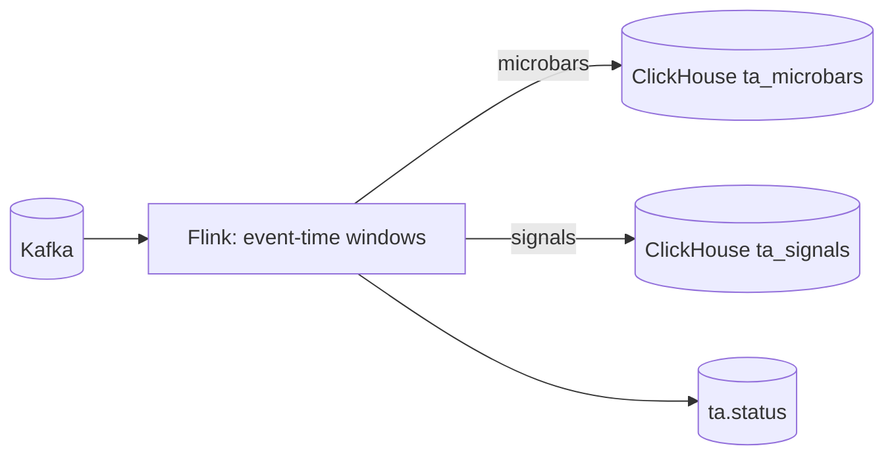

# Component: Flink Watermarks and Latency

## Status
- Version: `v1`
- Last updated: **2026-02-08**
- Source of truth (config): `argocd/applications/torghut/**`

## Purpose
Explain Torghut TA’s event-time model (watermarks), out-of-order tolerance, and the operational tradeoffs between low
latency and correctness, with concrete configuration pointers.

## Non-goals
- Replacing Flink’s internal documentation or tuning every operator in the DAG.
- Guaranteeing sub-millisecond end-to-end latency (this system targets *stable, explainable* low latency).

## Terminology
- **Event time:** Time the market event occurred (`event_ts`).
- **Ingest time:** Time the forwarder observed/published the event (`ingest_ts`).
- **Watermark:** Flink’s estimate of “all events up to time T have arrived.”
- **Allowed lateness / out-of-orderness:** How far behind the watermark events may arrive and still be processed.
- **Lag:** (now - last_event_ts) or (now - watermark), used as an SLO indicator.

## Design overview
Torghut’s TA computation is designed for:
- bounded out-of-order events from WS delivery,
- deterministic windowing for microbars and indicators,
- clear operational signals when event-time progress stalls.

## Configuration (pointers)
- Env contract: `services/dorvud/technical-analysis-flink/src/main/kotlin/ai/proompteng/dorvud/ta/flink/FlinkTaConfig.kt`
- Deployed values: `argocd/applications/torghut/ta/configmap.yaml`

### Key env vars
| Env var | Meaning | Operational guidance |
| --- | --- | --- |
| `TA_MAX_OUT_OF_ORDER_MS` | max out-of-order allowance | increase if you see late events being dropped; decreases freshness |
| `TA_CHECKPOINT_INTERVAL_MS` | checkpoint cadence | keep low enough for fast recovery; high enough for overhead |
| `TA_AUTO_OFFSET_RESET` | replay policy | `earliest` for recovery/backfill environments; `latest` for strict low latency |

## Watermark policy (v1)
### Recommended invariants
- Watermark lag should remain bounded (alert if consistently above threshold).
- Idle partitions should not stall global watermark progress (if using multiple partitions).

### Latency budget guidance (operator view)
| Stage | Expected dominant contributors | Mitigations |
| --- | --- | --- |
| Alpaca → WS forwarder | WS reconnect/backoff, subscription churn | single replica; stable symbol polling; conservative reconnect jitter |
| WS forwarder → Kafka | producer batching/linger | tune `KAFKA_LINGER_MS`, batch size; avoid overload |
| Kafka → Flink | consumer lag, checkpoint pauses | scale partitions and parallelism; confirm checkpoints healthy |
| Flink → ClickHouse | JDBC batch flush, disk merges | keep ClickHouse disk healthy; tune batch size/flush; TTL partitions |

## Failure modes, detection, recovery
| Failure mode | Symptoms | Detection signals | Recovery |
| --- | --- | --- | --- |
| Watermark stalls | signals stop updating while job RUNNING | TA status topic lag; ClickHouse `max(event_ts)` not advancing | verify Kafka consumption; check for stuck partitions; restart job if needed |
| Too aggressive out-of-order tolerance | stale outputs / high lag | watermark lag alerts; “last event” age grows | reduce `TA_MAX_OUT_OF_ORDER_MS` after verifying upstream stability |
| Too strict out-of-order tolerance | dropped late events | mismatch between WS seq vs CH outputs | increase tolerance; add late-event counters |

## Security considerations
- Latency metrics must avoid high-cardinality labels (e.g., do not label by order-id; symbol cardinality is bounded by universe).
- Do not log full payloads at INFO in production; prefer sampling and structured summaries.

## Decisions (ADRs)
### ADR-06-1: Prefer event-time semantics with bounded out-of-order tolerance
- **Decision:** Compute microbars/signals in event time with `TA_MAX_OUT_OF_ORDER_MS` as the primary tolerance knob.
- **Rationale:** Event-time correctness is required for stable indicators; WS delivery jitter is real.
- **Consequences:** “Freshness” is traded for correctness during jitter; alerting must distinguish “stalled” vs “slow”.

