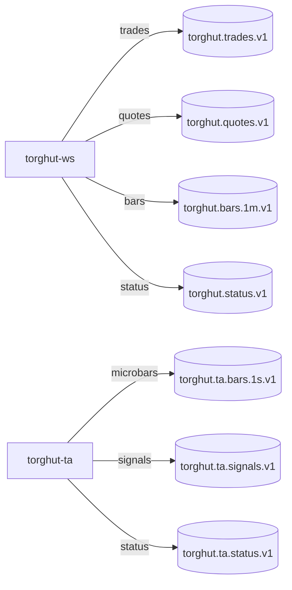

# Component: Kafka Topics and Retention

## Status
- Version: `v1`
- Last updated: **2026-02-08**
- Source of truth (config): `argocd/applications/torghut/**`

## Purpose
Define Kafka topic semantics, retention/cleanup policies, partitioning expectations, and the operational rationale for
the current Torghut topics.

## Non-goals
- Replacing Strimzi/Kafka operational documentation.
- Defining every KafkaTopic CR in this repository (some may be managed elsewhere); this doc defines the contract.

## Terminology
- **Keyed ordering:** Kafka preserves order per partition; using `key=symbol` gives per-symbol ordering guarantees.
- **Retention:** Time-based deletion policy for log segments.
- **Compaction:** Retains latest key values; useful for status/heartbeats (optionally).

## Current topics (contract)
See `docs/torghut/topics-and-schemas.md` for the consolidated table. v1 assumptions:
- Ingest topics are keyed by `symbol`.
- TA output topics are keyed by `symbol` and are “derived” (recomputable from ingest history).

## Retention and cleanup policy (recommended defaults)
| Topic class | Cleanup | Retention goal | Rationale |
| --- | --- | --- | --- |
| Trades/Quotes/Bars | `delete` | 7-30 days | replay window for TA, debugging, and short backtests |
| TA outputs | `delete` | ~14 days | TA can be recomputed; ClickHouse is authoritative for longer-lived queries |
| Status | `compact,delete` (optional) | 7 days | keep recent health history; compaction optionally keeps last status |

## Configuration examples (repo pointers)
Kafka user for WS forwarder:
- `argocd/applications/kafka/torghut-ws-kafkauser.yaml`

Forwarder chooses topics via env vars:
- `argocd/applications/torghut/ws/configmap.yaml` (`TOPIC_TRADES`, `TOPIC_QUOTES`, `TOPIC_BARS_1M`, `TOPIC_STATUS`)

Flink TA chooses topics via env vars:
- `argocd/applications/torghut/ta/configmap.yaml` (`TA_TRADES_TOPIC`, `TA_QUOTES_TOPIC`, `TA_BARS1M_TOPIC`, `TA_MICROBARS_TOPIC`, `TA_SIGNALS_TOPIC`)

## Partitioning, ordering, and scaling guidance
- **Ingest topics:** partitions ≥ number of “hot” symbols, but balanced against small-cluster overhead. Preserve ordering per symbol with `key=symbol`.
- **TA output topics:** partitions can be smaller (often 1) if ClickHouse sinks are the primary consumer, but raise partitions if:
  - Flink parallelism increases, or
  - Additional consumers (besides ClickHouse sink / tooling) are added.

## Failure modes and recovery
| Failure | Symptoms | Detection signals | Recovery |
| --- | --- | --- | --- |
| Retention too short | TA replay impossible; gaps in indicators | consumer hits `OFFSET_OUT_OF_RANGE` during replay | Increase retention; document replay window; prefer ClickHouse backfill where possible |
| Over-partitioning | broker CPU/memory pressure | broker metrics; controller logs | reduce partitions for low volume topics; consolidate |
| Under-partitioning | consumer lag on hot symbols | Flink lag metrics; consumer lag | increase partitions; ensure keying keeps per-symbol ordering |

## Security considerations
- Kafka auth uses SASL/SCRAM credentials stored in Kubernetes Secrets; never embed them in topic configs.
- Minimize ACLs: allow forwarder to write only specific topics; Flink reads from ingest and writes to TA topics.

## Decisions (ADRs)
### ADR-03-1: Derived TA topics are replayable and may be deleted
- **Decision:** Treat TA Kafka topics as derived and retention-limited; ClickHouse is the authoritative query store.
- **Rationale:** Controls disk usage; encourages replay-by-design.
- **Consequences:** Backfills require replay pipelines; operational procedures must exist for replay.
