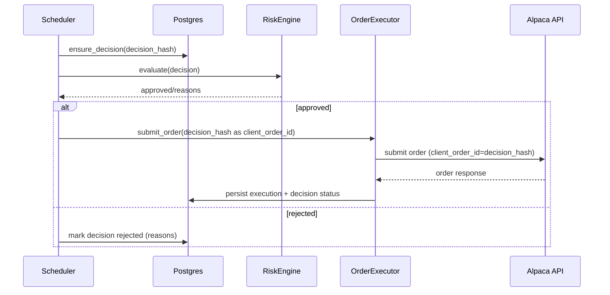

# Component: Order Execution and Idempotency

## Status

- Version: `v1`
- Last updated: **2026-02-08**
- Source of truth (config): `argocd/applications/torghut/**`
- Implementation status: `Completed (strict)` (verified with code + tests + runtime/config on 2026-02-21)

## Purpose

Document the order submission flow and idempotency strategy so retries, restarts, and partial failures do not cause
duplicate orders.

## Non-goals

- Supporting every broker order type in v1.
- Optimizing for microsecond submission latency (correctness + idempotency comes first).

## Terminology

- **Idempotency key:** Stable identifier that makes repeated submissions safe.
- **Decision hash:** Hash of decision inputs that should be unique per “logical intent”.
- **Client order id:** Broker-side optional id used to de-duplicate order submissions.

## Current implementation (pointers)

- Order executor: `services/torghut/app/trading/execution.py` (`OrderExecutor`)
- Decision hashing: `services/torghut/app/trading/models.py` (`decision_hash`)
- Knative env defaults: `argocd/applications/torghut/knative-service.yaml`

## Flow

## Idempotency strategy (v1)

### Decision-level idempotency

`services/torghut/app/trading/execution.py` uses:

- `decision_hash(decision)` persisted as `trade_decisions.decision_hash` (unique index)
- `client_order_id = decision_hash` for broker-level dedup where supported

### Execution-level idempotency

Before submitting:

- Check whether an `Execution` row exists for the decision (`execution_exists`).

## Failure modes, detection, recovery

| Failure                   | Symptoms                               | Detection                                             | Recovery                                                                             |
| ------------------------- | -------------------------------------- | ----------------------------------------------------- | ------------------------------------------------------------------------------------ |
| Duplicate orders          | multiple broker orders for same intent | executions table contains duplicates; broker activity | immediately disable trading; tighten uniqueness constraints; rely on client_order_id |
| Partial commit            | order submitted but DB write fails     | broker shows order; DB missing execution              | reconciliation must backfill from broker state; see `v1/component-reconciliation.md` |
| Hash collision (unlikely) | wrong dedup behavior                   | audit mismatch                                        | use strong hash; include key fields (symbol, event_ts, params); add tests            |

## Security considerations

- Treat idempotency keys as audit identifiers; do not log them with sensitive payloads.
- Ensure live trading flags are still required; idempotency must not become a bypass mechanism.

## Decisions (ADRs)

### ADR-12-1: Use decision hash as primary idempotency key

- **Decision:** Use `decision_hash` for uniqueness and `client_order_id`.
- **Rationale:** Aligns DB dedup with broker dedup; makes retries safe.
- **Consequences:** Decision hashing must be stable across versions; changes require versioning or migration strategy.
