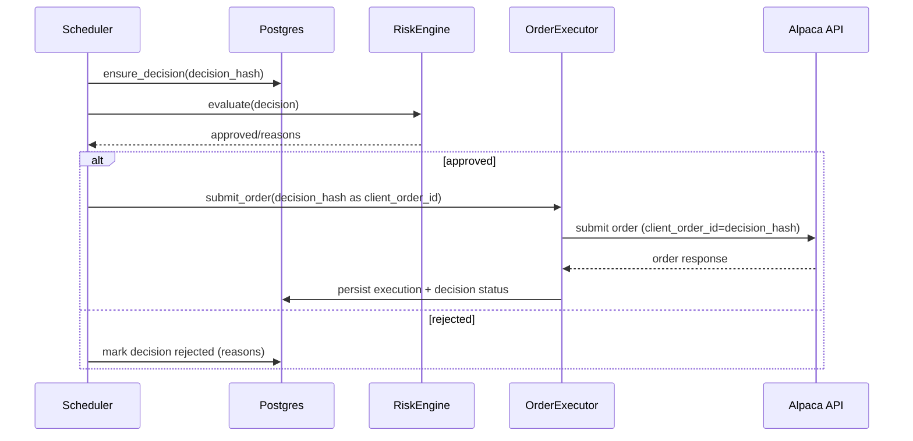

# Component: Order Execution and Idempotency

## Status

- Version: `v1`
- Last updated: **2026-02-08**
- Source of truth (config): `argocd/applications/torghut/**`
- Implementation status: `Implemented` (verified with code + tests + runtime/config on 2026-02-21)

## Source Implementation Audit (2026-07-04)

- Source baseline inspected: `6473f3ee7 ci(arc): fit ten lab runners per node (#11877)`.
- Implementation status: **Implemented, but no longer matches the old single-file `execution.py` description.** The core idempotency contract exists through account-scoped `TradeDecision.decision_hash`, `Execution.client_order_id`, executor lookup before submit, broker/simulation adapter support, and readiness checks for the account-scoped client-order index.
- Current source evidence:
  - `services/torghut/app/trading/execution/order_executor_core_methods.py::ensure_decision` computes `decision_hash(decision, account_label=...)`, reuses an existing `TradeDecision` by `(decision_hash, alpaca_account_label)`, and handles `IntegrityError` by re-reading the existing row.
  - `services/torghut/app/trading/execution/order_executor_core_methods.py::_fetch_execution` first checks exact `trade_decision_id`, then falls back to `(Execution.client_order_id == decision_hash, alpaca_account_label == account_label)`. The code explicitly says it must never match by account label alone.
  - `services/torghut/app/trading/execution/order_executor_core_methods.py::submit_order` returns early when an execution already exists, checks broker-side existing orders, prepares the order, applies retry policy, raises on conflicting open orders, resolves sell inventory, submits, and syncs the submitted execution.
  - `services/torghut/app/trading/execution/order_executor_core_support.py::_execution_request_from_decision` sets `client_order_id=decision_row.decision_hash`; `_submission_extra_params` passes that client id to adapters.
  - `services/torghut/app/trading/execution_adapters/adapter_types.py` implements `AlpacaExecutionAdapter`, `SimulationExecutionAdapter`, and `SessionRoutingExecutionAdapter`; the simulation adapter stores `idempotency_key=client_order_id`.
  - `services/torghut/app/api/readiness_helpers/refresh_universe_state_for_readiness.py` checks for the required unique index on `(alpaca_account_label, client_order_id)` and flags the legacy single-account `executions.client_order_id` index as stale.
- What is implemented from the design:
  - decision-level idempotency;
  - broker/simulation `client_order_id` propagation;
  - execution row dedup before submission;
  - conflict/open-order protection before submit;
  - account-scoped multi-account isolation for idempotency.
- What changed from the design:
  - `OrderExecutor` is now split under `services/torghut/app/trading/execution/**`, not a standalone `services/torghut/app/trading/execution.py` module;
  - the adapter layer is explicit and route-aware, with Alpaca, simulation, Lean, and session-routing paths;
  - idempotency now includes multi-account account label scoping, which the old v1 text did not cover.
- Remaining gaps / operator caveats:
  - The old sequence diagram is still useful for intent, but it omits current route selection, sell-inventory reservation, order-feed linkage/repair, Lean shadow paths, and readiness index checks.
  - Do not rely on any legacy single-column `client_order_id` uniqueness claim; current readiness expects account-scoped uniqueness.

## Purpose

Document the order submission flow and idempotency strategy so retries, restarts, and partial failures do not cause
duplicate orders.

## Non-goals

- Supporting every broker order type in v1.
- Optimizing for microsecond submission latency (correctness + idempotency comes first).

## Terminology

- **Idempotency key:** Stable identifier that makes repeated submissions safe.
- **Decision hash:** Hash of decision inputs that should be unique per “logical intent”.
- **Client order id:** Broker-side optional id used to de-duplicate order submissions.

## Current implementation (pointers)

- Executor core: `services/torghut/app/trading/execution/order_executor_core_methods.py`
- Executor request/idempotency support: `services/torghut/app/trading/execution/order_executor_core_support.py`
- Execution runtime status/gate: `services/torghut/app/trading/execution_runtime.py`
- Execution adapters: `services/torghut/app/trading/execution_adapters/adapter_types.py`, `services/torghut/app/trading/execution_adapters/lean_adapter.py`
- Order policy helpers: `services/torghut/app/trading/execution_policy/order_rules.py`
- Trading records: `services/torghut/app/models/entities/trading_records.py`
- Readiness index checks: `services/torghut/app/api/readiness_helpers/refresh_universe_state_for_readiness.py`
- Knative env defaults: `argocd/applications/torghut/knative-service.yaml`

## Flow

```mermaid
sequenceDiagram
  participant S as Scheduler
  participant DB as Postgres
  participant R as RiskEngine
  participant E as OrderExecutor
  participant A as Alpaca API

  S->>DB: ensure_decision(decision_hash)
  S->>R: evaluate(decision)
  R-->>S: approved/reasons
  alt approved
    S->>E: submit_order(decision_hash as client_order_id)
    E->>A: submit order (client_order_id=decision_hash)
    A-->>E: order response
    E->>DB: persist execution + decision status
  else rejected
    S->>DB: mark decision rejected (reasons)
  end
```

## Idempotency strategy (v1)

### Decision-level idempotency

Current execution code uses:

- `services/torghut/app/trading/execution/order_executor_core_methods.py::ensure_decision` to persist/reuse `trade_decisions.decision_hash` scoped by `alpaca_account_label`;
- `services/torghut/app/trading/execution/order_executor_core_support.py::_execution_request_from_decision` to set `client_order_id=decision_row.decision_hash`;
- `services/torghut/app/trading/execution/order_executor_core_methods.py::_fetch_execution` to deduplicate by exact decision link first, then by account-scoped `(client_order_id, alpaca_account_label)`;
- `services/torghut/app/trading/execution_adapters/**` to propagate the idempotency key through Alpaca, simulation, Lean, or session-routing adapters.

### Execution-level idempotency

Before submitting:

- Check whether an `Execution` row exists for the decision (`execution_exists`).

## Failure modes, detection, recovery

| Failure                   | Symptoms                               | Detection                                             | Recovery                                                                             |
| ------------------------- | -------------------------------------- | ----------------------------------------------------- | ------------------------------------------------------------------------------------ |
| Duplicate orders          | multiple broker orders for same intent | executions table contains duplicates; broker activity | immediately disable trading; tighten uniqueness constraints; rely on client_order_id |
| Partial commit            | order submitted but DB write fails     | broker shows order; DB missing execution              | reconciliation must backfill from broker state; see `v1/component-reconciliation.md` |
| Hash collision (unlikely) | wrong dedup behavior                   | audit mismatch                                        | use strong hash; include key fields (symbol, event_ts, params); add tests            |

## Security considerations

- Treat idempotency keys as audit identifiers; do not log them with sensitive payloads.
- Ensure live trading flags are still required; idempotency must not become a bypass mechanism.

## Decisions (ADRs)

### ADR-12-1: Use decision hash as primary idempotency key

- **Decision:** Use `decision_hash` for uniqueness and `client_order_id`.
- **Rationale:** Aligns DB dedup with broker dedup; makes retries safe.
- **Consequences:** Decision hashing must be stable across versions; changes require versioning or migration strategy.
