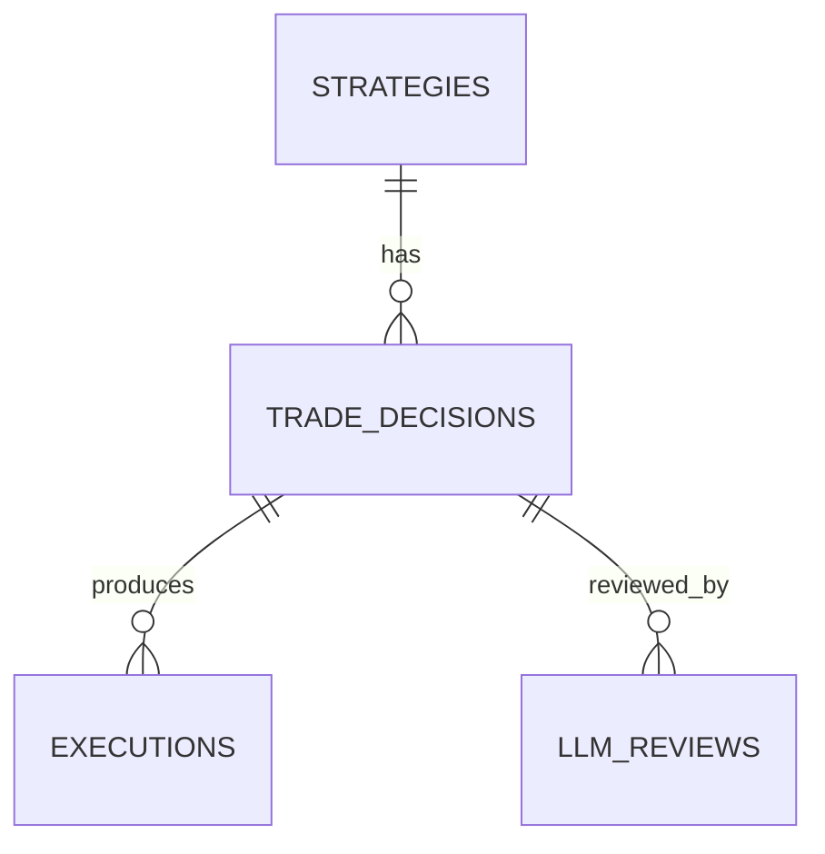

# Component: Postgres Schema and Migrations (Trading + Audit)

## Status
- Version: `v1`
- Last updated: **2026-02-08**
- Source of truth (config): `argocd/applications/torghut/**`

## Purpose
Define the Postgres schema responsibilities for trading/audit state, the migration workflow, and the “JSON + UUID”
operational pitfall observed in production (psycopg JSON serialization).

## Non-goals
- Storing the TA time-series in Postgres (ClickHouse is the TA store).
- Running ad-hoc production migrations outside GitOps change control.

## Terminology
- **CNPG:** CloudNativePG operator (manages the Postgres cluster).
- **Alembic:** Migration tool used by the Torghut service (`services/torghut/migrations/`).
- **JSONB:** Postgres JSON type used for flexible audit payloads.

## Current cluster and app config (pointers)
- CNPG Cluster: `argocd/applications/torghut/postgres-cluster.yaml`
- Knative service env: `argocd/applications/torghut/knative-service.yaml` (`DB_DSN`)
- Service config normalization: `services/torghut/app/config.py` (`db_dsn_for_sqlalchemy()`)
- Models: `services/torghut/app/models/entities.py`
- Shared JSON type: `services/torghut/app/models/base.py` (`JSONType`)
- Migrations: `services/torghut/migrations/`

## Schema responsibilities (v1)
Postgres stores:
- Strategy definitions and enablement (`strategies`)
- Trade decisions (planned/executed) (`trade_decisions`)
- Executions and raw order payloads (`executions`)
- LLM review inputs/outputs + verdicts (`llm_decision_reviews`)
- Cursor/progress markers (`trade_cursor`)

## Migration workflow (v1)
### Local
- Run the service migrations via Alembic in `services/torghut/` (see `services/torghut/README.md`).
- Prefer explicit revision messages and review SQL diff.

### Production
- Migrations must be executed via an approved operational workflow (GitOps + runbook), not by “kubectl exec random pod”.
- CNPG creates application credentials in `torghut-db-app` secret (see comment in `argocd/applications/torghut/postgres-cluster.yaml`).

## Known failure mode: psycopg JSON serialization of UUID
### What happens
If application code attempts to persist a JSONB column containing a `uuid.UUID` object (not a string), psycopg can fail
serialization and the service may crash or reject requests.

Hot spots:
- `decision_json`, `input_json`, `response_json` columns (see `services/torghut/app/models/entities.py`).

### Detection
- Knative revision fails with stack trace containing `TypeError: Object of type UUID is not JSON serializable`
  or a psycopg JSON adaptation error.

### Prevention (design contract)
- Treat all JSONB payloads as **JSON-serializable** at the boundary:
  - Use Pydantic `model_dump(mode="json")` for request/decision objects (already used in `services/torghut/app/trading/scheduler.py`).
  - When constructing JSON manually, coerce UUIDs to strings.
  - Prefer `fastapi.encoders.jsonable_encoder` for response payloads (`services/torghut/app/main.py`).

### Recovery
- Roll back to last known-good revision if a serialization regression is deployed.
- Hotfix by coercing UUIDs before persistence (do not disable JSON audit logging as a “fix”).

## Security considerations
- Keep DB credentials in Kubernetes Secrets (`torghut-db-app`), referenced from `DB_DSN` in `argocd/applications/torghut/knative-service.yaml`.
- Avoid logging full DSNs; ensure logs redact credentials.
- Ensure audit tables are append-only where possible; avoid destructive “cleanup jobs” without explicit governance.

## Decisions (ADRs)
### ADR-09-1: JSONB used for audit payloads with strict serialization boundary
- **Decision:** Keep JSONB columns for audit payloads, but enforce JSON-serializable types at write time.
- **Rationale:** Audit trails are valuable and evolving; rigid schema for every field would slow iteration.
- **Consequences:** Strong runtime validation needed; UUID and Decimal coercion must be consistent and tested.

