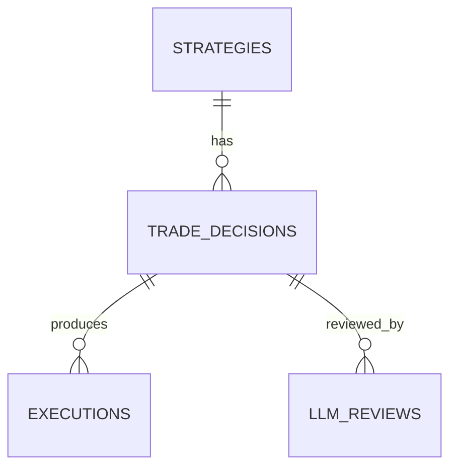

# Component: Postgres Schema and Migrations (Trading + Audit)

## Status

- Version: `v1`
- Last updated: **2026-02-08**
- Source of truth (config): `argocd/applications/torghut/**`
- Implementation status: `Implemented` (verified with code + tests + runtime/config on 2026-02-21)

## Source Implementation Audit (2026-07-04)

- Source baseline inspected: `6473f3ee7 ci(arc): fit ten lab runners per node (#11877)`.
- Implementation status: **Implemented and significantly expanded beyond v1.** Postgres remains the trading/audit/control-plane relational store, with CNPG GitOps, Alembic migrations, app and simulation databases, vector extension setup, order-feed audit tables, TigerBeetle refs, whitepaper/autoresearch objects, options indexes, and Hyperliquid runtime tables.
- Current source evidence:
  - `argocd/applications/torghut/postgres-cluster.yaml` defines the CNPG `torghut-db` cluster, `torghut` database, `torghut_app` owner, 50Gi Rook-Ceph storage, 14-day object-store backup retention, monitoring, and reflected credentials.
  - `argocd/applications/torghut/db-migrations-job.yaml` runs Alembic `upgrade heads`, waits for the app DB and admin DB, creates/repairs the `torghut_sim_default` simulation database, enables `vector`, grants privileges, and normalizes ownership.
  - `services/torghut/migrations/versions/**` currently contains migrations `0001` through `0057`, covering initial trading schema, LLM reviews, autonomy ledger, order feed events/source windows, TCA, Lean, multi-account isolation, whitepaper workflow, options lane, simulation context, evidence epochs, TigerBeetle refs, Hyperliquid runtime, and generic multifactor machine.
  - `services/torghut/app/models/entities/trading_records.py` defines current `Strategy`, `TradeDecision`, `Execution`, `OrderFeedSourceWindow`, `ExecutionOrderEvent`, order-feed cursors, and TigerBeetle reference/reconciliation records.
  - Tests include `services/torghut/tests/test_check_migration_graph.py`, migration-specific tests such as `test_runtime_ledger_status_index_migration.py`, `test_options_catalog_active_underlying_index_migration.py`, and Hyperliquid migration tests under `services/torghut/tests/hyperliquid_execution/**`.
- What is implemented from the design:
  - CNPG-managed Postgres cluster;
  - Alembic migration workflow under GitOps;
  - trading strategy, decision, and execution records;
  - JSON audit payload storage through ORM models;
  - production migration job instead of ad-hoc pod exec;
  - credentials via Kubernetes secrets generated by CNPG.
- What changed from the design:
  - Models are split into `services/torghut/app/models/entities/**`, not a single `entities.py` authority;
  - migrations have grown far beyond the v1 trading tables and now include whitepaper, simulation, options, order-feed, TigerBeetle, and Hyperliquid runtime concerns;
  - the migration job also manages the simulation database and vector extension, which the original v1 doc did not cover.
- Remaining gaps / operator caveats:
  - The v1 schema list is now incomplete. Use current ORM modules and Alembic heads before making schema claims.
  - JSON serialization warnings remain valid in principle, but current write paths need to be checked module-by-module because payloads now span trading, proof, whitepaper, simulation, and Hyperliquid domains.

## Purpose

Define the Postgres schema responsibilities for trading/audit state, the migration workflow, and the “JSON + UUID”
operational pitfall observed in production (psycopg JSON serialization).

## Non-goals

- Storing the TA time-series in Postgres (ClickHouse is the TA store).
- Running ad-hoc production migrations outside GitOps change control.

## Terminology

- **CNPG:** CloudNativePG operator (manages the Postgres cluster).
- **Alembic:** Migration tool used by the Torghut service (`services/torghut/migrations/`).
- **JSONB:** Postgres JSON type used for flexible audit payloads.

## Current cluster and app config (pointers)

- CNPG Cluster: `argocd/applications/torghut/postgres-cluster.yaml`
- Migration job: `argocd/applications/torghut/db-migrations-job.yaml`
- Knative service env: `argocd/applications/torghut/knative-service.yaml` (`DB_DSN`, simulation DB secret-derived env)
- Settings model: `services/torghut/app/config/settings.py`
- Models package: `services/torghut/app/models/entities/**`
- Trading records: `services/torghut/app/models/entities/trading_records.py`
- Shared SQLAlchemy base/types: `services/torghut/app/models/base.py`
- Migrations: `services/torghut/migrations/versions/**`
- Migration graph tests: `services/torghut/tests/test_check_migration_graph.py` and migration-specific tests under `services/torghut/tests/**`

## Schema responsibilities (v1)

Postgres stores:

- Strategy definitions and enablement (`strategies`)
- Trade decisions (planned/executed) (`trade_decisions`)
- Executions and raw order payloads (`executions`)
- LLM review inputs/outputs + verdicts (`llm_decision_reviews`)
- Cursor/progress markers (`trade_cursor`)

```mermaid
erDiagram
  STRATEGIES ||--o{ TRADE_DECISIONS : has
  TRADE_DECISIONS ||--o{ EXECUTIONS : produces
  TRADE_DECISIONS ||--o{ LLM_REVIEWS : reviewed_by
```

## Migration workflow (v1)

### Local

- Run the service migrations via Alembic in `services/torghut/` (see `services/torghut/README.md`).
- Prefer explicit revision messages and review SQL diff.

### Production

- Migrations must be executed via an approved operational workflow (GitOps + runbook), not by “kubectl exec random pod”.
- CNPG creates application credentials in `torghut-db-app` secret (see comment in `argocd/applications/torghut/postgres-cluster.yaml`).

## Known failure mode: psycopg JSON serialization of UUID

### What happens

If application code attempts to persist a JSONB column containing a `uuid.UUID` object (not a string), psycopg can fail
serialization and the service may crash or reject requests.

Hot spots:

- `decision_json`, `input_json`, `response_json` columns (see `services/torghut/app/models/entities.py`).

### Detection

- Knative revision fails with stack trace containing `TypeError: Object of type UUID is not JSON serializable`
  or a psycopg JSON adaptation error.

### Prevention (design contract)

- Treat all JSONB payloads as **JSON-serializable** at the boundary:
  - Use Pydantic `model_dump(mode="json")` for request/decision objects; current decision persistence paths include `services/torghut/app/trading/execution/order_executor_core_methods.py` and scheduler pipeline modules.
  - When constructing JSON manually, coerce UUIDs to strings.
  - Prefer `fastapi.encoders.jsonable_encoder` for response payloads (`services/torghut/app/main.py`).

### Recovery

- Roll back to last known-good revision if a serialization regression is deployed.
- Hotfix by coercing UUIDs before persistence (do not disable JSON audit logging as a “fix”).

## Security considerations

- Keep DB credentials in Kubernetes Secrets (`torghut-db-app`), referenced from `DB_DSN` in `argocd/applications/torghut/knative-service.yaml`.
- Avoid logging full DSNs; ensure logs redact credentials.
- Ensure audit tables are append-only where possible; avoid destructive “cleanup jobs” without explicit governance.

## Decisions (ADRs)

### ADR-09-1: JSONB used for audit payloads with strict serialization boundary

- **Decision:** Keep JSONB columns for audit payloads, but enforce JSON-serializable types at write time.
- **Rationale:** Audit trails are valuable and evolving; rigid schema for every field would slow iteration.
- **Consequences:** Strong runtime validation needed; UUID and Decimal coercion must be consistent and tested.
