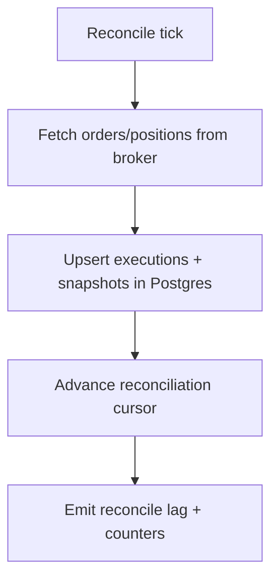

# Component: Reconciliation (Broker ↔ DB)

## Status

- Version: `v1`
- Last updated: **2026-02-08**
- Source of truth (config): `argocd/applications/torghut/**`

## Purpose

Define how Torghut reconciles broker state (orders, positions) with local Postgres audit records so incidents (timeouts,
partial failures, restarts) do not lose track of executed trades.

## Non-goals

- Real-time portfolio accounting (v1 is periodic reconciliation suitable for paper trading).
- Multi-broker reconciliation in the same loop (see `v1/multi-venue-and-broker-abstraction.md`).

## Terminology

- **Reconcile tick:** Periodic job to sync broker orders/positions to the DB.
- **Source of truth:** Broker for executed order state; DB for decision intent + audit.

## Current implementation (pointers)

- Reconciliation module: `services/torghut/app/trading/reconcile.py`
- Snapshot helpers: `services/torghut/app/snapshots.py`
- Scheduler integration: `services/torghut/app/trading/scheduler.py`
- Knative reconcile interval: `argocd/applications/torghut/knative-service.yaml` (`TRADING_RECONCILE_MS`)

## Reconciliation flow

## Correctness goals (v1)

- Ensure each broker order id (`alpaca_order_id`) appears in Postgres `executions` table exactly once.
- Detect “submitted but not recorded” cases and backfill.
- Track reconcile lag and failures as a first-class SLO.

## Failure modes, detection, recovery

| Failure                  | Symptoms                    | Detection signals                        | Recovery                                                                   |
| ------------------------ | --------------------------- | ---------------------------------------- | -------------------------------------------------------------------------- |
| Broker API timeout       | reconcile falls behind      | reconcile lag metric; logs show timeouts | retry with backoff; do not block trading loop forever; alert if persistent |
| DB constraint errors     | reconcile crashes           | logs show constraint violations          | fix schema; replay reconcile after patch                                   |
| Inconsistent order state | executions stuck in pending | stale status in DB vs broker             | reconcile should overwrite with broker state; investigate idempotency keys |

## Security considerations

- Reconciliation touches sensitive account state; restrict who can call reconcile endpoints.
- Avoid logging full broker responses; store raw payloads only if necessary and ensure governance.

## Decisions (ADRs)

### ADR-13-1: Broker is the source of truth for executed state

- **Decision:** Reconcile overwrites local execution status from broker state.
- **Rationale:** Local writes can fail; broker records are authoritative.
- **Consequences:** Must handle broker API outages gracefully; use cached last-known state.
