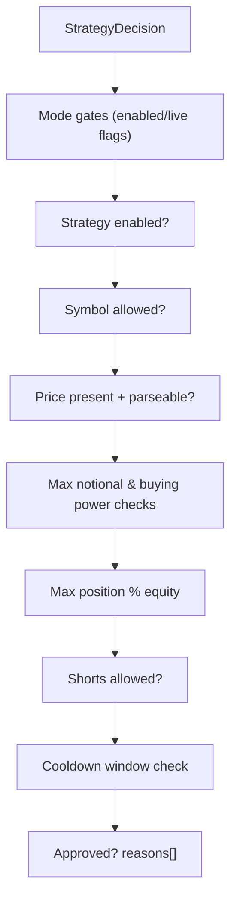

# Component: Risk Engine (Deterministic Policy)

## Status
- Version: `v1`
- Last updated: **2026-02-08**
- Source of truth (config): `argocd/applications/torghut/**`

## Purpose
Specify the deterministic risk engine that gates all order executions, including configuration, policy decisions, and
auditability requirements. The risk engine is the final authority for trading safety.

## Non-goals
- Machine-learned risk scoring as a primary gate (AI is advisory only).
- Portfolio optimization (v1 is policy-based constraints, not optimization).

## Terminology
- **Approved / rejected:** Risk engine verdict for a proposed decision.
- **Reason code:** Stable string describing why a decision was rejected (must be auditable).
- **Cooldown:** Time-based guard preventing repeated trading in the same symbol.

## Current code and config (pointers)
- Risk engine implementation: `services/torghut/app/trading/risk.py` (`RiskEngine.evaluate`)
- Trading settings: `services/torghut/app/config.py` (env-backed settings)
- Knative env values (live gates): `argocd/applications/torghut/knative-service.yaml`
- Strategy-specific limits: `services/torghut/app/models/entities.py` (`Strategy.max_*`)

## Policy evaluation flow

## Core gates (v1)
Based on `services/torghut/app/trading/risk.py`:
- Trading enabled: `TRADING_ENABLED` must be true.
- Live trading gated: `TRADING_MODE=live` requires `TRADING_LIVE_ENABLED=true`.
- Strategy enabled: `strategy.enabled` must be true.
- Universe allowlist: if provided, `decision.symbol` must be allowed.
- Price required: decision must include a usable price (`price`, `limit_price`, or `stop_price`).
- Max notional per trade: bounded by strategy or global env limit.
- Buying power: notional must not exceed account buying power.
- Max position % equity: projected absolute position value bounded.
- Shorts control: disallow increasing shorts unless explicitly enabled.
- Cooldown: prevent frequent repeat decisions for the same symbol.

## Configuration
### Strategy-level controls (from strategy catalog)
Strategy configs are loaded from `argocd/applications/torghut/strategy-configmap.yaml` and persisted to Postgres.

Relevant fields:
- `max_notional_per_trade`
- `max_position_pct_equity`
- `enabled`

### Environment-level controls (examples)
Exact env keys live in `services/torghut/app/config.py`. Operationally important gates:
| Env var | Purpose | Safe default |
| --- | --- | --- |
| `TRADING_ENABLED` | master enable | `false` in new envs (paper can be enabled intentionally) |
| `TRADING_MODE` | paper vs live | `paper` |
| `TRADING_LIVE_ENABLED` | hard live gate | `false` |

## Failure modes, detection, recovery
| Failure | Symptoms | Detection | Recovery |
| --- | --- | --- | --- |
| Risk policy too strict | no executions ever occur | decisions all rejected with same reason code | adjust strategy limits; keep deterministic audit trail |
| Risk policy too lax | large exposures possible | unusual notional/position size in audit logs | immediately disable trading (`TRADING_ENABLED=false`); postmortem and tighten gates |
| Missing price | repeated `missing_price` rejections | decision logs show missing price | fix signal ingestion / pricing snapshot logic |

## Security considerations
- Risk engine is the last deterministic layer before broker execution; treat its code as security-sensitive.
- Ensure reason codes are stable and logged; they are critical to audits and incident response.
- Do not allow AI to mutate risk settings at runtime.

## Decisions (ADRs)
### ADR-11-1: Deterministic risk policy is mandatory and final
- **Decision:** No order is submitted without passing deterministic risk checks.
- **Rationale:** Deterministic gates are auditable, testable, and robust against model non-determinism.
- **Consequences:** Some “smart” opportunities may be rejected; safety is prioritized.

