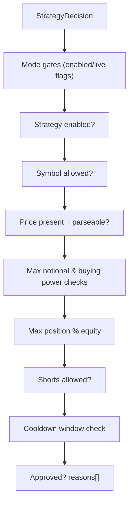

# Component: Risk Engine (Deterministic Policy)

## Status

- Version: `v1`
- Last updated: **2026-02-08**
- Source of truth (config): `argocd/applications/torghut/**`
- Implementation status: `Implemented` (verified with code + tests + runtime/config on 2026-02-21)

## Source Implementation Audit (2026-07-04)

- Source baseline inspected: `6473f3ee7 ci(arc): fit ten lab runners per node (#11877)`.
- Implementation status: **Implemented as deterministic risk gates, but split into full-decision risk and simple-pipeline risk preparation.** The v1 policy exists, but current live/paper execution also depends on submission-council gates and simple-risk caps configured in GitOps.
- Current source evidence:
  - `services/torghut/app/trading/risk.py::RiskEngine.evaluate` enforces trading enablement, crypto enablement/live gates, strategy enabled, symbol allowlist, fragility state, price extraction, max notional, buying power, max position percent, allocator cap, target sizing, shorts, cooldown, and adverse-selection risk.
  - `services/torghut/app/trading/simple_risk.py::prepare_simple_decision` handles the simple pipeline path, including fractional support, close-only adjustment, order notional cap, equity-order cap, symbol notional cap, gross exposure cap, buying-power reserve, and quantity rejection diagnostics.
  - `services/torghut/app/trading/scheduler/pipeline/submission_policy.py` invokes allocator rejection and submission preparation before execution.
  - `argocd/applications/torghut/knative-service.yaml` currently configures bounded simple risk caps such as `TRADING_SIMPLE_MAX_NOTIONAL_PER_ORDER=100`, `TRADING_SIMPLE_MAX_NOTIONAL_PER_SYMBOL=250`, `TRADING_SIMPLE_MAX_ORDER_PCT_EQUITY=0.25`, and `TRADING_SIMPLE_MAX_GROSS_EXPOSURE_PCT_EQUITY=0.05`.
  - Tests: `services/torghut/tests/test_risk_engine.py`, `services/torghut/tests/test_simple_risk.py`, and pipeline tests under `services/torghut/tests/pipeline/**`.
- What is implemented from the design:
  - deterministic final risk authority before execution;
  - explicit reason-code style rejection path;
  - global settings and strategy-level notional/position caps;
  - shorts gating;
  - cooldown handling;
  - buying-power and exposure checks.
- What changed from the design:
  - Settings live under `services/torghut/app/config/settings.py` and field mixins, not `services/torghut/app/config.py`;
  - simple runtime uses additional caps and diagnostics in `simple_risk.py` that are not described in v1;
  - live order eligibility also depends on `submission_council` and execution runtime gates, not only `RiskEngine.evaluate`.
- Remaining gaps / operator caveats:
  - The old doc says the risk engine is “final authority.” In current code it is a required deterministic gate, but final live submission authority is shared with live-submit toggles, submission-council payloads, proof/readiness gates, and routeability/quote constraints.
  - The doc should be read as the deterministic risk-policy component, not the full live-trading safety architecture.

## Purpose

Specify the deterministic risk engine that gates all order executions, including configuration, policy decisions, and
auditability requirements. The risk engine is the final authority for trading safety.

## Non-goals

- Machine-learned risk scoring as a primary gate (AI is advisory only).
- Portfolio optimization (v1 is policy-based constraints, not optimization).

## Terminology

- **Approved / rejected:** Risk engine verdict for a proposed decision.
- **Reason code:** Stable string describing why a decision was rejected (must be auditable).
- **Cooldown:** Time-based guard preventing repeated trading in the same symbol.

## Current code and config (pointers)

- Full risk engine: `services/torghut/app/trading/risk.py`
- Simple pipeline risk preparation: `services/torghut/app/trading/simple_risk.py`
- Settings model: `services/torghut/app/config/settings.py`, `services/torghut/app/config/runtime_risk_fields.py`, `services/torghut/app/config/service_fields.py`
- Submission policy: `services/torghut/app/trading/scheduler/pipeline/submission_policy.py`
- Submission council/live gate: `services/torghut/app/trading/submission_council/__init__.py`
- Trading records: `services/torghut/app/models/entities/trading_records.py`
- Knative env values: `argocd/applications/torghut/knative-service.yaml`

## Policy evaluation flow

```mermaid
flowchart TD
  Decision["StrategyDecision"] --> Mode["Mode gates (enabled/live flags)"]
  Mode --> Strategy["Strategy enabled?"]
  Strategy --> Universe["Symbol allowed?"]
  Universe --> Price["Price present + parseable?"]
  Price --> Notional["Max notional & buying power checks"]
  Notional --> Position["Max position % equity"]
  Position --> Shorts["Shorts allowed?"]
  Shorts --> Cooldown["Cooldown window check"]
  Cooldown --> Verdict["Approved? reasons[]"]
```

## Core gates (v1)

Based on `services/torghut/app/trading/risk.py`:

- Trading enabled: `TRADING_ENABLED` must be true.
- Live trading gated: `TRADING_MODE=live` requires live-submit activation and deterministic risk approval.
- Strategy enabled: `strategy.enabled` must be true.
- Universe allowlist: if provided, `decision.symbol` must be allowed.
- Price required: decision must include a usable price (`price`, `limit_price`, or `stop_price`).
- Max notional per trade: bounded by strategy or global env limit.
- Buying power: notional must not exceed account buying power.
- Max position % equity: projected absolute position value bounded.
- Shorts control: disallow increasing shorts unless explicitly enabled.
- Cooldown: prevent frequent repeat decisions for the same symbol.

## Configuration

### Strategy-level controls (from strategy catalog)

Strategy configs are loaded from `argocd/applications/torghut/strategy-configmap.yaml` and persisted to Postgres.

Relevant fields:

- `max_notional_per_trade`
- `max_position_pct_equity`
- `enabled`

### Environment-level controls (examples)

Exact env keys live in `services/torghut/app/config/settings.py` plus `services/torghut/app/config/*_fields.py`. Operationally important gates:
| Env var | Purpose | Safe default |
| --- | --- | --- |
| `TRADING_ENABLED` | master enable | `false` in new envs (paper can be enabled intentionally) |
| `TRADING_MODE` | paper vs live | `paper` |
| `TRADING_SIMPLE_SUBMIT_ENABLED` / `TRADING_LIVE_SUBMIT_ENABLED` | broker/live submission gates, still subject to submission-council and execution runtime gates | current prod manifest enables them with bounded notional caps |

## Failure modes, detection, recovery

| Failure                | Symptoms                            | Detection                                    | Recovery                                                                            |
| ---------------------- | ----------------------------------- | -------------------------------------------- | ----------------------------------------------------------------------------------- |
| Risk policy too strict | no executions ever occur            | decisions all rejected with same reason code | adjust strategy limits; keep deterministic audit trail                              |
| Risk policy too lax    | large exposures possible            | unusual notional/position size in audit logs | immediately disable trading (`TRADING_ENABLED=false`); postmortem and tighten gates |
| Missing price          | repeated `missing_price` rejections | decision logs show missing price             | fix signal ingestion / pricing snapshot logic                                       |

## Security considerations

- Risk engine is the last deterministic layer before broker execution; treat its code as security-sensitive.
- Ensure reason codes are stable and logged; they are critical to audits and incident response.
- Do not allow AI to mutate risk settings at runtime.

## Decisions (ADRs)

### ADR-11-1: Deterministic risk policy is mandatory and final

- **Decision:** No order is submitted without passing deterministic risk checks.
- **Rationale:** Deterministic gates are auditable, testable, and robust against model non-determinism.
- **Consequences:** Some “smart” opportunities may be rejected; safety is prioritized.
