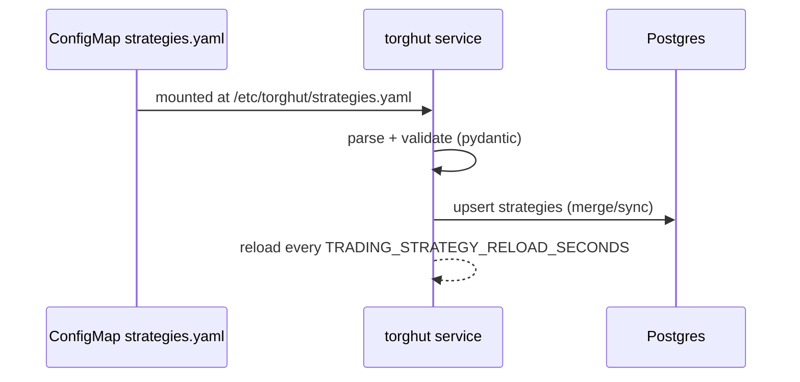

# Component: Strategy Catalog and Hot Reload

## Status

- Version: `v1`
- Last updated: **2026-02-08**
- Source of truth (config): `argocd/applications/torghut/**`
- Implementation status: `Implemented` (verified with code + tests + runtime/config on 2026-02-21)

## Source Implementation Audit (2026-07-04)

- Source baseline inspected: `6473f3ee7 ci(arc): fit ten lab runners per node (#11877)`.
- Implementation status: **Implemented.** The strategy catalog is a declarative mounted ConfigMap parsed by Pydantic, refreshed by digest and interval, and applied to the `strategies` table with `merge` or `sync` semantics.
- Current source evidence:
  - `services/torghut/app/strategies/catalog.py::StrategyConfig` defines the strict declarative schema with `extra="forbid"`, strategy id/type/version, params, priority, universe symbols, max notional, and max position percent.
  - `services/torghut/app/strategies/catalog.py::StrategyCatalog.from_settings` builds the catalog from `settings.trading_strategy_config_path`, `trading_strategy_config_mode`, and `trading_strategy_reload_seconds`.
  - `StrategyCatalog.refresh` rate-limits reloads, computes a SHA-256 digest, skips unchanged payloads, parses YAML/JSON, applies the catalog, commits, and stores the last digest.
  - `_apply_catalog` validates duplicate names, upserts `Strategy` rows, persists catalog metadata in the description, maps strategy type to universe type, and disables missing strategies in `sync` mode.
  - `argocd/applications/torghut/strategy-configmap.yaml` currently mounts many strategy entries, including enabled paper sleeves and disabled research sleeves.
  - Tests: `services/torghut/tests/test_strategy_catalog.py`, `services/torghut/tests/test_strategy_specs.py`, `services/torghut/tests/test_strategy_seed.py`, and strategy-factory validation tests.
- What is implemented from the design:
  - declarative strategy YAML;
  - no arbitrary runtime code loading;
  - `merge`/`sync` behavior;
  - hot reload interval and digest skip;
  - DB persistence into `Strategy` rows;
  - validation for duplicate names and invalid payloads.
- What changed from the design:
  - The current catalog carries more governance metadata than v1 described: `strategy_id`, `strategy_type`, `version`, `priority`, metadata marker payloads, and research/paper promotion context in descriptions/params.
  - The active ConfigMap includes paper and research sleeves; enabled in the catalog does not automatically mean live-capital promotion.
- Remaining gaps / operator caveats:
  - Hot reload applies config safely, but strategy promotion still depends on runtime proof/readiness gates. Do not interpret catalog presence as production profitability approval.

## Purpose

Describe the declarative strategy catalog, how it is mounted into the trading service, how it syncs into Postgres,
and how hot reload behaves under failure.

## Non-goals

- Allowing runtime code injection (strategies are configuration, not arbitrary scripts).
- Building a full “strategy marketplace” UI in v1.

## Terminology

- **Catalog file:** YAML/JSON file listing strategies and their limits.
- **Mode `sync`:** Disable strategies removed from the file.
- **Mode `merge`:** Only upsert listed strategies; do not disable missing.

## Current implementation + manifests (pointers)

- Catalog loader: `services/torghut/app/strategies/catalog.py` (`StrategyCatalog.refresh`)
- Knative volume mount: `argocd/applications/torghut/knative-service.yaml`
- Catalog ConfigMap: `argocd/applications/torghut/strategy-configmap.yaml`

## Data flow

## Configuration

From `argocd/applications/torghut/knative-service.yaml`:
| Env var | Purpose | Current |
| --- | --- | --- |
| `TRADING_STRATEGY_CONFIG_PATH` | path to catalog | `/etc/torghut/strategies.yaml` |
| `TRADING_STRATEGY_CONFIG_MODE` | `merge`/`sync` | `sync` |
| `TRADING_STRATEGY_RELOAD_SECONDS` | reload interval | `10` |

## Failure modes, detection, recovery

| Failure           | Symptoms                 | Detection                                | Recovery                                                    |
| ----------------- | ------------------------ | ---------------------------------------- | ----------------------------------------------------------- |
| Invalid YAML/JSON | strategy changes ignored | logs warn `Strategy catalog load failed` | fix ConfigMap content; re-sync Argo; confirm digest changes |
| Duplicate names   | catalog apply fails      | logs show duplicate strategy name error  | de-duplicate entries; re-sync                               |
| DB unavailable    | catalog not applied      | logs show DB errors                      | restore Postgres; catalog will reapply on next refresh      |

## Security considerations

- Strategy catalog is configuration and must be code-reviewed like production policy (it changes trading behavior).
- Do not store secrets in the catalog.
- Treat catalog as part of model risk controls (limits live here).

## Decisions (ADRs)

### ADR-14-1: Strategies are declarative config, not executable code

- **Decision:** Strategies are expressed as validated configs persisted to DB; no arbitrary code loading.
- **Rationale:** Prevents code injection and keeps oncall operations predictable.
- **Consequences:** Complex strategies require productized strategy primitives, not custom scripts.
