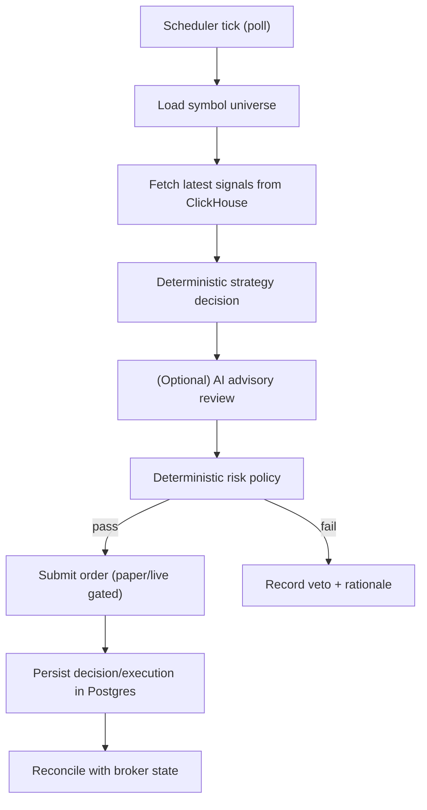

# Component: Trading Loop (Torghut Knative Service)

## Status
- Version: `v1`
- Last updated: **2026-02-08**
- Source of truth (config): `argocd/applications/torghut/**`

## Purpose
Describe the trading loop design, including schedule, signal ingestion from ClickHouse, decision lifecycle, and the
core safety gates that ensure paper-by-default trading.

## Non-goals
- Building a high-frequency trading engine (this is a periodic decision loop).
- Allowing AI to submit orders directly (AI is advisory only).

## Terminology
- **Decision:** A proposed action (buy/sell/hold) with parameters and rationale.
- **Execution:** A submitted order with reconciliation state.
- **Universe:** Set of symbols to trade; in v1 it is often static or derived from Jangar symbols API.

## Current configuration and code (pointers)
- Knative Service: `argocd/applications/torghut/knative-service.yaml`
- Strategy config: `argocd/applications/torghut/strategy-configmap.yaml`
- Trading scheduler: `services/torghut/app/trading/scheduler.py`
- Decision model: `services/torghut/app/trading/models.py`
- Signal ingestion: `services/torghut/app/trading/ingest.py`
- Risk checks: `services/torghut/app/trading/risk.py`
- Execution: `services/torghut/app/trading/execution.py`
- Reconciliation: `services/torghut/app/trading/reconcile.py`

## Trading loop flow

## Configuration (env var contract)
From `argocd/applications/torghut/knative-service.yaml`:
| Env var | Purpose | Safe default / current |
| --- | --- | --- |
| `TRADING_ENABLED` | Enables loop | `true` (but still paper by default) |
| `TRADING_MODE` | `paper` / `live` | `paper` |
| `TRADING_LIVE_ENABLED` | explicit live gate | `false` |
| `TRADING_SIGNAL_SOURCE` | signal backend | `clickhouse` |
| `TRADING_SIGNAL_TABLE` | ClickHouse table | `torghut.ta_signals` |
| `TRADING_SIGNAL_SCHEMA` | Signals schema selector (`auto`/`envelope`/`flat`) | `auto` |
| `TRADING_SIGNAL_BATCH_SIZE` | Signals query batch size | `500` |
| `TRADING_SIGNAL_LOOKBACK_MINUTES` | query window | `15` |
| `TRADING_PRICE_TABLE` | Price table (microbars) | `torghut.ta_microbars` |
| `TRADING_PRICE_LOOKBACK_MINUTES` | Price lookback window | `5` |
| `TRADING_POLL_MS` | tick interval | `5000` |
| `TRADING_RECONCILE_MS` | reconcile interval | `15000` |
| `TRADING_STRATEGY_CONFIG_PATH` | strategy config | `/etc/torghut/strategies.yaml` |
| `TRADING_STRATEGY_RELOAD_SECONDS` | hot reload | `10` |
| `TRADING_UNIVERSE_SOURCE` | universe selector | `static` |
| `TRADING_STATIC_SYMBOLS` | universe list | `CRWD,MU,NVDA` |
| `TRADING_DEFAULT_QTY` | Default order quantity (if strategy doesn’t specify) | `1` |
| `TRADING_MAX_NOTIONAL_PER_TRADE` | Risk: notional cap per trade | unset |
| `TRADING_MAX_POSITION_PCT_EQUITY` | Risk: cap position size as % equity | unset |
| `TRADING_COOLDOWN_SECONDS` | Risk: cooldown between decisions | `0` |
| `TRADING_ALLOW_SHORTS` | Risk: allow short selling | `false` |
| `TA_CLICKHOUSE_URL` | ClickHouse HTTP base URL (dependency checks + queries) | `http://torghut-clickhouse.torghut.svc.cluster.local:8123` |
| `TA_CLICKHOUSE_USERNAME` | ClickHouse user | `torghut` |
| `TA_CLICKHOUSE_PASSWORD` | ClickHouse password | Secret |
| `TA_CLICKHOUSE_CONN_TIMEOUT_SECONDS` | ClickHouse connect timeout | `10` |
| `JANGAR_SYMBOLS_URL` | Optional universe source (when `TRADING_UNIVERSE_SOURCE=jangar`) | `http://jangar.jangar.svc.cluster.local/api/torghut/symbols` |

Notes:
- The service supports additional trading controls (qty defaults, cooldown, allow-shorts, notional and position caps, signal schema selection).
  See `services/torghut/app/config.py` for the full env surface area.
- The Knative manifest currently also sets `CLICKHOUSE_*`, but the trading dependency checks use `TA_CLICKHOUSE_*`.

## Safety gates (v1)
### Gate 1: Explicit enablement
- Trading loop must be enabled explicitly (`TRADING_ENABLED=true`).
- Live trading requires a *second explicit* flag: `TRADING_LIVE_ENABLED=true`.

### Gate 2: Deterministic risk policy
Risk engine enforces:
- max notional per trade,
- max position size as % of equity,
- cooldowns and duplicate decision suppression (idempotency),
- symbol allowlist (universe).

### Gate 3: Execution idempotency
Orders must be idempotent across retries (see `v1/component-order-execution-and-idempotency.md`).

## Failure modes, detection, recovery
| Failure | Symptoms | Detection | Recovery |
| --- | --- | --- | --- |
| ClickHouse stale | no new signals; trading loop idle | `/trading/status` lag; ClickHouse `max(event_ts)` | fix TA pipeline/ClickHouse; see `v1/operations-ta-replay-and-recovery.md` |
| Postgres write failures | decisions not persisted | service logs; Knative errors | verify `DB_DSN`; CNPG health; retry |
| UUID-in-JSON crash | Knative revision fails | logs show UUID serialization error | coerce JSON; see `v1/component-postgres-schema-and-migrations.md` |

## Security considerations
- Keep trading endpoints cluster-local unless explicitly needed.
- Use least-privilege Alpaca keys; do not allow live keys in environments without explicit approval.
- Audit logs must be immutable enough for incident review; avoid “cleanup” jobs without governance.

## Decisions (ADRs)
### ADR-10-1: ClickHouse-first trading inputs
- **Decision:** Read signals from ClickHouse for both UI and trading.
- **Rationale:** Single store for signals reduces mismatch between visualization and trading decisions.
- **Consequences:** ClickHouse availability/disk become part of the trading SLO.
