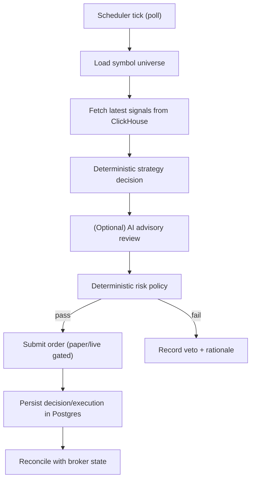

# Component: Trading Loop (Torghut Knative Service)

## Status

- Version: `v1`
- Last updated: **2026-02-08**
- Source of truth (config): `argocd/applications/torghut/**`
- Implementation status: `Implemented` (verified with code + tests + runtime/config on 2026-02-21)

## Source Implementation Audit (2026-07-04)

- Source baseline inspected: `6473f3ee7 ci(arc): fit ten lab runners per node (#11877)`.
- Implementation status: **Implemented, but materially refactored from this v1 document.** The periodic trading loop exists, but not as the old monolithic `services/torghut/app/trading/scheduler.py` flow. Current runtime is split across `SimpleTradingPipeline`, shared pipeline mixins, source-collection helpers, paper-route materialization, submission policy, and execution/adapters.
- Current source evidence:
  - `services/torghut/app/trading/scheduler/simple_pipeline.py` defines `SimpleTradingPipeline`, composed from paper-route, source-collection, proof-floor, quote-sizing, direct-submission, and base pipeline mixins.
  - `services/torghut/app/trading/scheduler/simple_pipeline.py::SimpleTradingPipeline.run_once` labels mature rejected-signal outcomes, loads strategies, captures runtime-window account snapshots, warms session context, bounds paper-route signal scope, fetches signals, and processes the batch.
  - `services/torghut/app/trading/scheduler/pipeline/run_cycle.py::TradingPipelineRunCycleMixin.run_once` keeps the generic dependency-driven run cycle for ingestor/decision/risk/executor/reconciler style operation.
  - `services/torghut/app/trading/scheduler/pipeline/submission_policy.py` gates decision submission with allocator rejection, notional extraction, market snapshots, and submission preparation.
  - `argocd/applications/torghut/knative-service.yaml` currently sets `TRADING_ENABLED=true`, `TRADING_MODE=live`, `TRADING_PIPELINE_MODE=simple`, `TRADING_SIMPLE_SUBMIT_ENABLED=true`, `TRADING_LIVE_SUBMIT_ENABLED=true`, a live-submit activation expiry, and bounded simple risk caps.
  - Pipeline behavior is covered by the `services/torghut/tests/pipeline/test_trading_pipeline_*.py` suite.
- What is implemented from the design:
  - periodic service-owned trading loop;
  - strategy load/refresh before decision processing;
  - ClickHouse/signal-backed decision batches;
  - deterministic gates before submission;
  - decision/execution persistence through `TradeDecision` and `Execution` ORM rows;
  - paper-route and runtime-window proof plumbing around the loop.
- What changed from the design:
  - old paths `services/torghut/app/trading/scheduler.py`, `execution.py`, `reconcile.py`, and `services/torghut/app/config.py` are stale for current runtime authority;
  - live-submit authority is no longer just `TRADING_SIMPLE_SUBMIT_ENABLED`; it also flows through execution runtime/status and the submission-council gate;
  - risk and submission preparation are distributed between `RiskEngine`, `simple_risk.py`, submission policy mixins, and execution policy/adapters.
- Remaining gaps / operator caveats:
  - The v1 diagram remains directionally useful, but it is too linear for the current source. Current runtime has paper-route materialization, proof-floor receipt logic, source-collection target plans, runtime ledger context, and live-submission gate payloads that are not shown in the original diagram.
  - Treat this doc as implemented-at-the-core-loop level, not as an exhaustive current execution architecture.

## Purpose

Describe the trading loop design, including schedule, signal ingestion from ClickHouse, decision lifecycle, and the
core safety gates around the current live-mode deployment posture.

## Non-goals

- Building a high-frequency trading engine (this is a periodic decision loop).
- Allowing AI to submit orders directly (AI is advisory only).

## Terminology

- **Decision:** A proposed action (buy/sell/hold) with parameters and rationale.
- **Execution:** A submitted order with reconciliation state.
- **Universe:** Set of symbols to trade; in v1 it is often static or derived from Jangar symbols API.

## Current configuration and code (pointers)

- Knative Service: `argocd/applications/torghut/knative-service.yaml`
- Strategy config: `argocd/applications/torghut/strategy-configmap.yaml`
- Current simple pipeline: `services/torghut/app/trading/scheduler/simple_pipeline.py`
- Generic pipeline run-cycle mixin: `services/torghut/app/trading/scheduler/pipeline/run_cycle.py`
- Runtime pipeline factory: `services/torghut/app/trading/scheduler/runtime_pipeline_factory.py`
- Submission policy: `services/torghut/app/trading/scheduler/pipeline/submission_policy.py`
- Source collection and target-plan helpers: `services/torghut/app/trading/scheduler/source_collection/**`, `services/torghut/app/trading/scheduler/target_plan_helpers/**`
- Risk checks: `services/torghut/app/trading/risk.py`, `services/torghut/app/trading/simple_risk.py`
- Execution runtime/adapters: `services/torghut/app/trading/execution_runtime.py`, `services/torghut/app/trading/execution/**`, `services/torghut/app/trading/execution_adapters/**`
- Trading ORM records: `services/torghut/app/models/entities/trading_records.py`

## Trading loop flow

```mermaid
flowchart TD
  Tick["Scheduler tick (poll)"] --> Universe["Load symbol universe"]
  Universe --> Signals["Fetch latest signals from ClickHouse"]
  Signals --> Decide["Deterministic strategy decision"]
  Decide --> Review["(Optional) AI advisory review"]
  Review --> Risk["Deterministic risk policy"]
  Risk -->|pass| Exec["Submit order (paper/live gated)"]
  Risk -->|fail| Record["Record veto + rationale"]
  Exec --> Persist["Persist decision/execution in Postgres"]
  Persist --> Reconcile["Reconcile with broker state"]
```

## Configuration (env var contract)

From `argocd/applications/torghut/knative-service.yaml`:
| Env var | Purpose | Safe default / current |
| --- | --- | --- |
| `TRADING_ENABLED` | Enables loop | `true` |
| `TRADING_MODE` | `paper` / `live` | `live` in the current manifest |
| `TRADING_SIMPLE_SUBMIT_ENABLED` | broker submission gate | `true` in the current manifest |
| `TRADING_LIVE_SUBMIT_ENABLED` | live broker submission gate | `true` in the current manifest |
| `TRADING_LIVE_SUBMIT_ACTIVATION_EXPIRES_AT` | time-bounds live-submit activation | set in the current manifest |
| `TRADING_SIGNAL_SOURCE` | signal backend | `clickhouse` |
| `TRADING_SIGNAL_TABLE` | ClickHouse table | `torghut.ta_signals` |
| `TRADING_SIGNAL_SCHEMA` | Signals schema selector (`auto`/`envelope`/`flat`) | `auto` |
| `TRADING_SIGNAL_BATCH_SIZE` | Signals query batch size | `500` |
| `TRADING_SIGNAL_LOOKBACK_MINUTES` | query window | `15` |
| `TRADING_PRICE_TABLE` | Price table (microbars) | `torghut.ta_microbars` |
| `TRADING_PRICE_LOOKBACK_MINUTES` | Price lookback window | `5` |
| `TRADING_POLL_MS` | tick interval | `5000` |
| `TRADING_RECONCILE_MS` | reconcile interval | `15000` |
| `TRADING_STRATEGY_CONFIG_PATH` | strategy config | `/etc/torghut/strategies.yaml` |
| `TRADING_STRATEGY_RELOAD_SECONDS` | hot reload | `10` |
| `TRADING_UNIVERSE_SOURCE` | universe selector | `static` |
| `TRADING_STATIC_SYMBOLS` | universe list | `CRWD,MU,NVDA` |
| `TRADING_DEFAULT_QTY` | Default order quantity (if strategy doesn’t specify) | `1` |
| `TRADING_MAX_NOTIONAL_PER_TRADE` | Risk: notional cap per trade | unset |
| `TRADING_MAX_POSITION_PCT_EQUITY` | Risk: cap position size as % equity | unset |
| `TRADING_COOLDOWN_SECONDS` | Risk: cooldown between decisions | `0` |
| `TRADING_ALLOW_SHORTS` | Risk: allow short selling | `false` |
| `TA_CLICKHOUSE_URL` | ClickHouse HTTP base URL (dependency checks + queries) | `http://torghut-clickhouse.torghut.svc.cluster.local:8123` |
| `TA_CLICKHOUSE_USERNAME` | ClickHouse user | `torghut` |
| `TA_CLICKHOUSE_PASSWORD` | ClickHouse password | Secret |
| `TA_CLICKHOUSE_CONN_TIMEOUT_SECONDS` | ClickHouse connect timeout | `10` |
| `JANGAR_SYMBOLS_URL` | Optional universe source (when `TRADING_UNIVERSE_SOURCE=jangar`) | `http://jangar.jangar.svc.cluster.local/api/torghut/symbols` |

Notes:

- The service supports additional trading controls (qty defaults, cooldown, allow-shorts, notional and position caps, signal schema selection).
  See `services/torghut/app/config/settings.py` and `services/torghut/app/config/*_fields.py` for the current env/settings surface area.
- The Knative manifest currently also sets `CLICKHOUSE_*`, but the trading dependency checks use `TA_CLICKHOUSE_*`.

## Safety gates (v1)

### Gate 1: Explicit enablement

- Trading loop must be enabled explicitly (`TRADING_ENABLED=true`).
- Live broker submission also requires `TRADING_SIMPLE_SUBMIT_ENABLED=true` plus a valid live-submit activation.

### Gate 2: Deterministic risk policy

Risk engine enforces:

- max notional per trade,
- max position size as % of equity,
- cooldowns and duplicate decision suppression (idempotency),
- symbol allowlist (universe).

### Gate 3: Execution idempotency

Orders must be idempotent across retries (see `v1/component-order-execution-and-idempotency.md`).

### Rollout/verification (paper-first + live-gate posture)

- GitOps precondition for production:
  - `TRADING_MODE=paper`
  - `TRADING_ACCOUNTS_JSON` account entries in paper mode
  - `LLM_FAIL_OPEN_LIVE_APPROVED=false`
  - `TRADING_KILL_SWITCH_ENABLED=true`
  - `TRADING_EMERGENCY_STOP_ENABLED=true`
- Verification:
  - `/trading/status` reports `trading_mode=paper` and no live execution path is active.
  - confirm new `/trading/executions` records are paper-labeled.

## Failure modes, detection, recovery

| Failure                 | Symptoms                          | Detection                                         | Recovery                                                                  |
| ----------------------- | --------------------------------- | ------------------------------------------------- | ------------------------------------------------------------------------- |
| ClickHouse stale        | no new signals; trading loop idle | `/trading/status` lag; ClickHouse `max(event_ts)` | fix TA pipeline/ClickHouse; see `v1/operations-ta-replay-and-recovery.md` |
| Postgres write failures | decisions not persisted           | service logs; Knative errors                      | verify `DB_DSN`; CNPG health; retry                                       |
| UUID-in-JSON crash      | Knative revision fails            | logs show UUID serialization error                | coerce JSON; see `v1/component-postgres-schema-and-migrations.md`         |

## Security considerations

- Keep trading endpoints cluster-local unless explicitly needed.
- Use least-privilege Alpaca keys; do not allow live keys in environments without explicit approval.
- Audit logs must be immutable enough for incident review; avoid “cleanup” jobs without governance.

## Decisions (ADRs)

### ADR-10-1: ClickHouse-first trading inputs

- **Decision:** Read signals from ClickHouse for both UI and trading.
- **Rationale:** Single store for signals reduces mismatch between visualization and trading decisions.
- **Consequences:** ClickHouse availability/disk become part of the trading SLO.
