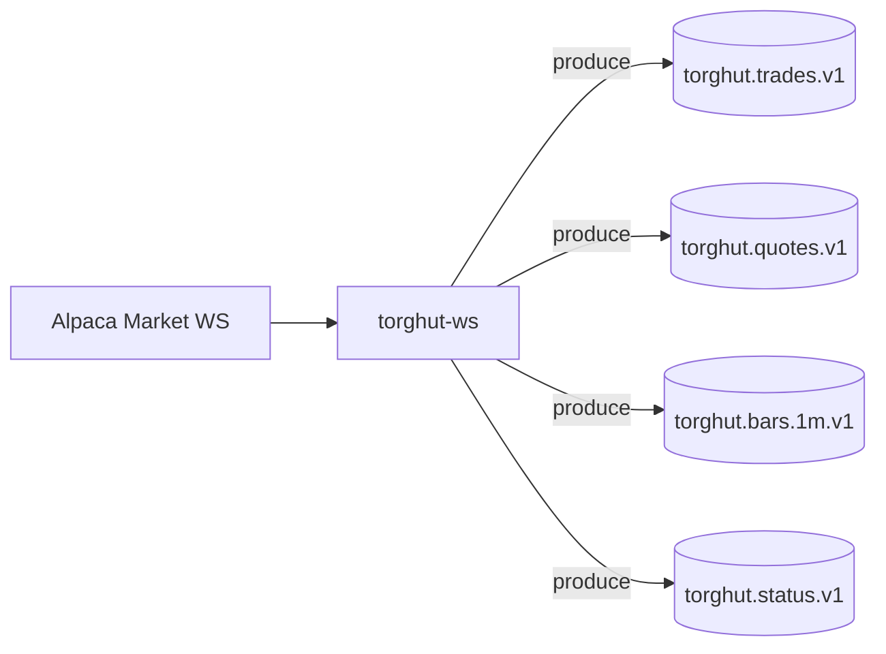

# Component: WS Forwarder (Alpaca → Kafka)

## Status

- Version: `v1`
- Last updated: **2026-02-08**
- Source of truth (config): `argocd/applications/torghut/**`
- Implementation status: `Completed (strict)` (verified with code + tests + runtime/config on 2026-02-21)

## Purpose

Specify the WS forwarder’s responsibilities, configuration contract, readiness semantics, and operational behavior
in a way that matches production manifests and known failure modes.

## Non-goals

- Implementing a second parallel forwarder for multi-venue (see `v1/multi-venue-and-broker-abstraction.md`).
- Guaranteeing exactly-once ingestion end-to-end (forwarder is best-effort + idempotent-ish; Flink can dedup/reconcile).

## Terminology

- **Connection limit (Alpaca)**: Alpaca returns `406` when a second WS connection is opened for the same account.
- **Shard**: Forwarder can logically shard symbol subscriptions; production is currently `SHARD_COUNT=1`.
- **Dedup TTL**: Time window for suppressing duplicate messages locally before publishing.

## Responsibilities

1. Establish a _single_ active WS connection per Alpaca account/feed.
2. Periodically fetch the symbol universe from Jangar (`JANGAR_SYMBOLS_URL`) and update subscriptions.
3. Normalize + envelope messages and publish to Kafka topics with keys that preserve per-symbol ordering.
4. Emit health/readiness based on upstream and downstream connectivity (Alpaca auth, Kafka publish).

## Code and manifests (pointers)

- Implementation: `services/dorvud/websockets/src/main/kotlin/ai/proompteng/dorvud/ws/ForwarderApp.kt`
- Health endpoints: `services/dorvud/websockets/src/main/kotlin/ai/proompteng/dorvud/ws/HealthServer.kt`
- Prod deployment: `argocd/applications/torghut/ws/deployment.yaml`
- Prod config: `argocd/applications/torghut/ws/configmap.yaml`

## Data flow

## Configuration

### Kubernetes configuration references

- Deployment: `argocd/applications/torghut/ws/deployment.yaml`
- ConfigMap: `argocd/applications/torghut/ws/configmap.yaml`

### Env var table (current)

| Env var                                   | Purpose                   | Default / current value                                      |
| ----------------------------------------- | ------------------------- | ------------------------------------------------------------ |
| `ALPACA_STREAM_URL`                       | WS URL                    | `wss://stream.data.alpaca.markets`                           |
| `ALPACA_FEED`                             | Alpaca feed               | `iex`                                                        |
| `JANGAR_SYMBOLS_URL`                      | Universe source           | `http://jangar.jangar.svc.cluster.local/api/torghut/symbols` |
| `SYMBOLS_POLL_INTERVAL_MS`                | Universe refresh          | `30000`                                                      |
| `SUBSCRIBE_BATCH_SIZE`                    | Subscription batch sizing | `200`                                                        |
| `SHARD_COUNT` / `SHARD_INDEX`             | Sharding                  | `1` / `0`                                                    |
| `DEDUP_TTL_SEC`                           | Dedup window              | `5`                                                          |
| `KAFKA_BOOTSTRAP`                         | Brokers                   | `kafka-kafka-bootstrap.kafka:9092`                           |
| `KAFKA_SECURITY_PROTOCOL`                 | Security                  | `SASL_PLAINTEXT`                                             |
| `KAFKA_SASL_USER` / `KAFKA_SASL_PASSWORD` | Auth                      | `torghut-ws` / Secret                                        |
| `TOPIC_TRADES`                            | Trades topic              | `torghut.trades.v1`                                          |
| `TOPIC_QUOTES`                            | Quotes topic              | `torghut.quotes.v1`                                          |
| `TOPIC_BARS_1M`                           | Bars topic                | `torghut.bars.1m.v1`                                         |
| `TOPIC_STATUS`                            | Status topic              | `torghut.status.v1`                                          |

### Safe defaults

- `replicas: 1` in `argocd/applications/torghut/ws/deployment.yaml` to respect Alpaca connection limits.
- Read-only root filesystem + dropped Linux capabilities.

## Readiness and liveness semantics

- `GET /healthz` (liveness): process is running.
- `GET /readyz` (readiness): forwarder is able to make progress (Alpaca authenticated + Kafka publish path OK).

### Known failure mode: readiness 503 while liveness OK

This occurs when:

- Alpaca auth fails (401/403), or connection limit is hit (406), or
- Kafka publish fails due to auth/ACL/broker issues.

Readiness failing is _intentional_: it removes the pod from service endpoints and signals operator action is required.

## Failure modes, signals, recovery

| Failure                       | Symptoms                        | Detection signals                               | Recovery                                                                  |
| ----------------------------- | ------------------------------- | ----------------------------------------------- | ------------------------------------------------------------------------- |
| Alpaca 406 connection limit   | `/readyz` 503; logs show 406    | logs; status topic not `healthy`                | Ensure single replica; restart forwarder (`scale to 0 then 1`)            |
| Alpaca 401/403                | `/readyz` 503; subscribe fails  | logs; metrics for auth failures                 | Rotate credentials (SealedSecret) and restart                             |
| Kafka SASL errors             | `/readyz` 503; produce failures | logs contain SASL/ACL errors; broker errors     | Fix KafkaUser secret/ACL; restart forwarder                               |
| Universe fetch (Jangar) fails | symbol list stale               | logs show fetch errors; no subscription updates | Temporarily switch to static symbol list (if supported) or restore Jangar |

## Observability

### Metrics (expected)

- WS reconnect count, reconnect backoff, active subscription count
- Kafka produce success/fail counters
- Per-topic publish latency histogram (bounded labels only)

### Logs

- Ensure logs include: `feed`, `symbol`, `channel`, `seq`, and relevant error classification (auth vs kafka vs parse).

## Security considerations

- Secrets: `ALPACA_*` and `KAFKA_SASL_PASSWORD` are always from Kubernetes Secrets (never in ConfigMap).
- Upstream trust boundary: Alpaca messages are untrusted input; validate JSON and enforce schema envelopes.
- Minimize blast radius: single replica, least-privilege KafkaUser (topic-scoped ACLs).

## Decisions (ADRs)

### ADR-02-1: Readiness reflects “can make progress” not “process alive”

- **Decision:** `readyz` fails when Kafka or Alpaca path is broken, even if `/healthz` passes.
- **Rationale:** Avoid silent data loss; make broken ingestion obvious to Kubernetes and oncall.
- **Consequences:** During transient upstream blips, service may flap readiness; tune reconnect/backoff and alerts accordingly.
