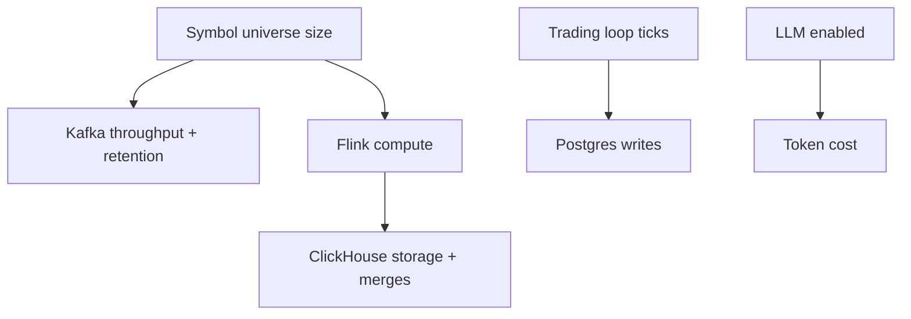

# Cost Model and Budgets

## Status

- Version: `v1`
- Last updated: **2026-02-08**
- Source of truth (config): `argocd/applications/torghut/**`

## Purpose

Provide a cost-aware design and operational budgeting framework for Torghut, covering:

- compute (Flink, WS forwarder, Knative service),
- storage (ClickHouse PVCs, Postgres PVCs, checkpoint bucket),
- Kafka retention footprint,
- and AI advisory costs (tokens/requests).

## Non-goals

- Exact dollar forecasting (costs depend on infra pricing and workload).
- Optimizing for cost at the expense of safety or correctness.

## Terminology

- **Budget cap:** Explicit limit for a cost center (e.g., AI tokens/day).
- **Cost driver:** Component characteristic that increases cost (retention, partitions, disk, replicas).

## Major cost drivers (v1)

## Concrete capacity anchors (current manifests)

- ClickHouse PVC: 20Gi per replica (`argocd/applications/torghut/clickhouse/clickhouse-cluster.yaml`).
- Postgres PVC: 5Gi (`argocd/applications/torghut/postgres-cluster.yaml`).
- Flink TMs: 4 replicas, 4Gi memory each (`argocd/applications/torghut/ta/flinkdeployment.yaml`).

## Budget knobs (recommended v1)

### Storage

- Reduce retention via TTLs (reviewed change) or drop old partitions in emergencies.
- Keep ClickHouse disk free headroom; disk-full incidents are more costly than adding storage.

### Kafka

- Retention is the primary storage knob (see `v1/component-kafka-topics-and-retention.md`).
- Partition counts increase overhead; scale only when needed.

### AI

Use explicit caps:

- Code default is `LLM_ENABLED=false` (see `services/torghut/app/config.py`).
- In production (paper), AI may be enabled in shadow mode to measure value safely:
  - `LLM_ENABLED=true`, `LLM_SHADOW_MODE=true`, `LLM_FAIL_MODE=pass_through` (see `argocd/applications/torghut/knative-service.yaml`).
- `LLM_MAX_TOKENS` and request timeouts.
- Circuit breaker to prevent runaway retries.

## Failure modes and recovery

| Failure         | Symptoms                       | Recovery                                                 |
| --------------- | ------------------------------ | -------------------------------------------------------- |
| AI cost spike   | token usage grows unexpectedly | disable AI; cap tokens; shorten prompts                  |
| Storage runaway | ClickHouse disks fill          | pause TA writes; reclaim disk; reduce TTL or add storage |

## Security considerations

- Cost telemetry must not include secrets.
- AI cost control is also a safety control (limits provider abuse).

## Decisions (ADRs)

### ADR-47-1: Safety incidents are treated as “costly” and avoided

- **Decision:** Prefer spending modestly on disk headroom and observability to avoid TA outages and operational churn.
- **Rationale:** Repeated incidents are more expensive than baseline capacity.
- **Consequences:** Budgets must include headroom for growth and merges.
