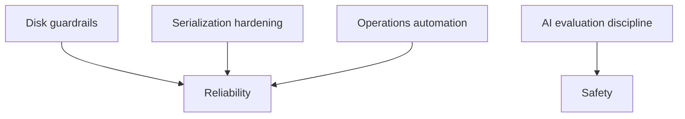

# Current State and Gap Analysis (2026-02-13)

## Status

- Version: `v1`
- Last updated: **2026-02-13**
- Source of truth (config): `argocd/applications/torghut/**`

## Purpose

Capture the “as deployed” Torghut state as of **2026-02-13**, highlight known gaps vs the v1 design goals, and provide
a prioritized backlog that an engineer can safely implement.

## Non-goals

- A complete project plan with dates.
- Replacing issues/roadmap management.

## Terminology

- **Gap:** Missing control or capability needed for reliability/safety/operability.
- **Mitigation:** Near-term step to reduce risk without major redesign.

## Current deployed state (source of truth)

The deployed manifests live under `argocd/applications/torghut/**`:

- `torghut-ws` Deployment (single replica; readiness `/readyz`): `argocd/applications/torghut/ws/deployment.yaml`
- `torghut-ta` FlinkDeployment (ClickHouse JDBC sink, S3 checkpoints): `argocd/applications/torghut/ta/flinkdeployment.yaml`
- ClickHouse (2 replicas, 20Gi PVC each, Keeper-backed): `argocd/applications/torghut/clickhouse/clickhouse-cluster.yaml`
- Postgres (CNPG, 5Gi PVC): `argocd/applications/torghut/postgres-cluster.yaml`
- Trading service (Knative, maxScale=1, paper-by-default + live gate): `argocd/applications/torghut/knative-service.yaml`
- Strategy catalog configmap mounted into service: `argocd/applications/torghut/strategy-configmap.yaml`

## Operational incidents observed (facts)

Documented in existing ops notes:

- TA job failed due to ClickHouse issues and JDBC write failures: `docs/torghut/ops-2026-01-01-ta-recovery.md`
- `torghut-ws` readiness stuck 503 while liveness OK during Alpaca auth/connection-limit issues: `docs/torghut/ops-2026-01-01-ta-recovery.md`
- ClickHouse volumes can fill; disk pressure can break TA writes (20Gi PVCs) and must be guarded.

## Gap analysis

### Gaps (prioritized)

| Area                           | Current state                                                                                                                         | Gap / risk                                                           | Suggested next step                                                                                       |
| ------------------------------ | ------------------------------------------------------------------------------------------------------------------------------------- | -------------------------------------------------------------------- | --------------------------------------------------------------------------------------------------------- |
| ClickHouse disk guardrails     | explicit ClickHouse free-disk / readonly alerts are deployed; pause TA runbook documented                                             | residual risk is capacity limits and response automation             | tighten PVC sizing and runbook-documented pause/resume drills                                             |
| TA replay workflow             | implemented (doc + replay runner script)                                                                                              | residual risk is escalation automation and destructive mode coverage | harden mode-2 rollback checks and add scripted assertions                                                 |
| UUID-in-JSON hardening         | regression tests and `model_dump(mode=\"json\")`/coercion boundaries are in use                                                       | regressions can still slip in when adding new write paths            | enforce boundary helpers on all new persistence paths                                                     |
| WS readiness diagnostics       | implemented: `/readyz` returns `ready`, `error_class`, and `gates` for Alpaca/Kafka causes; alerting/matrics on gate failure deployed | residual risk is escalation automation and repeat-failure patterns   | tighten readiness incident playbooks and dashboard correlation for sustained 401/403/406 events           |
| AI governance                  | AI exists but must remain safe                                                                                                        | drift/cost risks                                                     | enforce shadow-first evaluation; add budget caps; keep adjustments disabled by default                    |
| AgentRuns handoff / automation | ad-hoc human operational procedures                                                                                                   | slow + inconsistent recovery; hard to audit                          | standardize handoff pack + automate read-only diagnostics; gate actuation (see `v1/agentruns-handoff.md`) |

## “Do next” implementation backlog (safe, incremental)

1. Hardening for TA replay in destructive mode + structured replay assertion report format.
2. Produce an AgentRuns-friendly “Torghut health report” run (read-only) and a gated actuation runbook runner (see `v1/agentruns-handoff.md`).

## Progress updates (post-2026-02-08)

- **2026-02-13:** WS readiness diagnostics are implemented:
  `services/dorvud/websockets/src/main/kotlin/ai/proompteng/dorvud/ws/HealthServer.kt`,
  `services/dorvud/websockets/src/main/kotlin/ai/proompteng/dorvud/ws/ReadinessDiagnostics.kt`,
  `services/dorvud/websockets/src/main/kotlin/ai/proompteng/dorvud/ws/ForwarderMetrics.kt`,
  `argocd/applications/observability/graf-mimir-rules.yaml`.
- **2026-02-13:** ClickHouse free disk + replica readonly alerting, and the TA pause runbook, are implemented in deployed config:
  `argocd/applications/observability/graf-mimir-rules.yaml`,
  `docs/torghut/design-system/v1/alerting-slos-and-oncall.md`,
  `docs/torghut/design-system/v1/operations-pause-ta-writes.md`.
- **2026-02-13:** UUID-in-JSON persistence hardening is implemented with regression checks in
  `services/torghut/tests/test_json_serialization_boundary.py`.
- **2026-02-13:** Non-destructive TA replay workflow now has a rollout script:
  `services/torghut/scripts/ta_replay_runner.py` (default plan output, optional apply with confirmation token).
- **2026-02-10:** Read-only Torghut health report AgentRun executed successfully:
  `AgentRun/torghut-health-report-v1-20260210-2` in namespace `agents`.
- **2026-02-10:** Gated actuation runner documented and templated (GitOps-first) in
  `docs/torghut/design-system/v1/operations-actuation-runner.md`.

## Security considerations

- Keep live trading gated; audit any changes to `TRADING_LIVE_ENABLED`.
- Do not store secrets in docs; operational procedures must reference secret _names_ only.

## Decisions (ADRs)

### ADR-50-1: Gap analysis is date-stamped and updateable

- **Decision:** This document is time-stamped (`2026-02-08`) and should be replaced/extended by a new dated analysis when the system changes materially.
- **Rationale:** Prevents stale assumptions from lingering.
- **Consequences:** Requires periodic refresh as production evolves.
