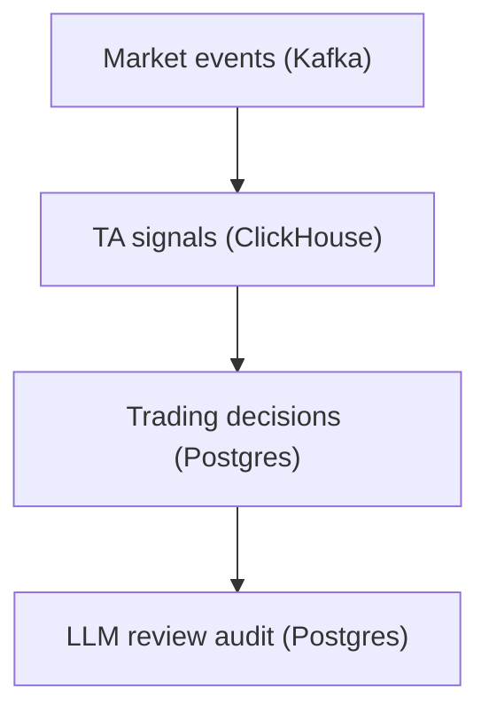

# Data Governance and Retention

## Status

- Version: `v1`
- Last updated: **2026-02-08**
- Source of truth (config): `argocd/applications/torghut/**`

## Purpose

Define data governance rules for Torghut across:

- Kafka (streaming retention),
- ClickHouse (TTL-based retention),
- Postgres (audit retention),
- and AI review data (prompt/response storage),
  ensuring safe defaults and operational clarity.

## Non-goals

- Organization-wide data governance policy.
- Long-term archival design for years of tick data.

## Terminology

- **Retention:** How long data is kept before deletion.
- **Derived data:** Data that can be recomputed (e.g., TA signals).
- **Audit data:** Data required to explain decisions and executions.

## Data classes (v1)

### Kafka

- Retention is a replay window; topics are not a long-term archive.
- See `docs/torghut/topics-and-schemas.md`.

### ClickHouse

- Retains derived TA outputs with TTL:
  - `ta_microbars` TTL 30 days
  - `ta_signals` TTL 14 days
  - Source: `services/dorvud/technical-analysis-flink/src/main/resources/ta-schema.sql`

### Postgres

- Retains trading decisions, executions, and reviews for auditability.
- Schema: `services/torghut/app/models/entities.py`

## Retention policy (recommended v1)

| Store        | Data            | Retention       | Notes                                             |
| ------------ | --------------- | --------------- | ------------------------------------------------- |
| Kafka        | ingest events   | 7-30 days       | enough for replay + debugging                     |
| ClickHouse   | derived signals | 14-30 days      | derived; limited retention to control disk        |
| Postgres     | audit trail     | longer-lived    | must support incident review and compliance needs |
| Logs/metrics | operational     | platform policy | keep bounded cardinality                          |

## Failure modes and recovery

| Failure                      | Symptoms          | Detection                   | Recovery                                             |
| ---------------------------- | ----------------- | --------------------------- | ---------------------------------------------------- |
| Retention too long in CH     | disks fill        | disk alerts; merges backlog | reduce TTL (reviewed); add disk; pause TA writes     |
| Retention too short in Kafka | replay impossible | missing offsets/segments    | increase retention; rely on CH/PG for longer windows |

## Security considerations

- Data minimization: do not store secrets or sensitive account identifiers in logs/prompts.
- Access controls: restrict who can query audit tables and ClickHouse.
- AI data: treat prompts/outputs as sensitive; store only what is needed and redact where possible.

## Decisions (ADRs)

### ADR-43-1: Derived TA data is retention-limited; audit data is preserved

- **Decision:** Retain TA data for a limited window; retain audit data longer.
- **Rationale:** Controls storage cost while keeping decision accountability.
- **Consequences:** Long-term analytics may require separate archival systems in future.
