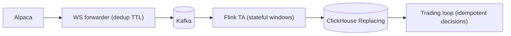

# Data Quality and Dedup Contracts

## Status

- Version: `v1`
- Last updated: **2026-02-08**
- Source of truth (config): `argocd/applications/torghut/**`

## Purpose

Define the data-quality and deduplication contracts across ingestion, compute, and storage, including how duplicates
are detected and how consumers should behave under at-least-once delivery.

## Non-goals

- Perfect dedup across all stages without storing additional state (v1 is pragmatic).
- Defining a universal schema for every vendor feed.

## Terminology

- **Seq:** Sequence number used to detect out-of-order or duplicate events (where present).
- **Dedup window:** Time window in which duplicates are suppressed by the forwarder.
- **At-least-once:** Events may be duplicated; consumers must tolerate.

## Current contracts (v1)

See `docs/torghut/topics-and-schemas.md` for envelope details.

### Forwarder dedup (best-effort)

- Local TTL-based dedup is configured via:
  - `argocd/applications/torghut/ws/configmap.yaml` (`DEDUP_TTL_SEC`, `DEDUP_MAX_ENTRIES`)
- Dedup is not perfect across restarts; downstream must be robust.

### ClickHouse dedup (storage-friendly)

- Tables use `ReplicatedReplacingMergeTree(..., ingest_ts)` (see `ta-schema.sql`).
- This supports “last write wins” semantics when duplicates arrive.

### Trading dedup

- Decisions are deduped by `decision_hash` (unique) and broker `client_order_id` (see `v1/component-order-execution-and-idempotency.md`).

## Data quality signals (recommended)

| Signal           | Meaning                    | Where detected                                 |
| ---------------- | -------------------------- | ---------------------------------------------- |
| stale symbol     | no events for symbol       | WS forwarder + TA status + ClickHouse          |
| seq regression   | seq decreases for symbol   | WS forwarder metrics or Flink validation       |
| burst duplicates | high duplicate suppression | WS forwarder dedup counters                    |
| lag increase     | pipeline slowing           | Flink watermarks; ClickHouse freshness queries |

## Failure modes and recovery

| Failure                       | Symptoms                           | Detection                                       | Recovery                                                        |
| ----------------------------- | ---------------------------------- | ----------------------------------------------- | --------------------------------------------------------------- |
| Duplicate storm               | ClickHouse merges spike; CPU rises | ClickHouse metrics; WS dedup counters           | tune forwarder dedup; inspect upstream; consider throttling     |
| Out-of-order beyond tolerance | window outputs wrong               | mismatch in indicators; watermark lag anomalies | increase `TA_MAX_OUT_OF_ORDER_MS`; investigate Kafka partitions |

## Security considerations

- Treat upstream data as untrusted; validate input envelopes and guard against parsing/memory attacks.
- Avoid logging full payloads at high volume.

## Decisions (ADRs)

### ADR-18-1: System is at-least-once with explicit dedup layers

- **Decision:** Accept at-least-once delivery but provide dedup at forwarder, storage, and trading boundaries.
- **Rationale:** Exactly-once end-to-end is expensive and fragile given ClickHouse sink semantics.
- **Consequences:** Consumers must be written with idempotency in mind.
