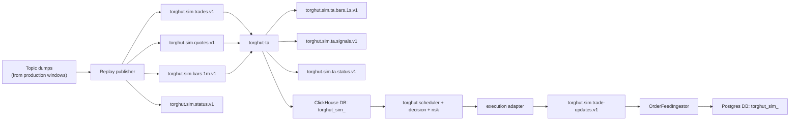

# Historical Dataset Simulation

## Status

- Version: `v1`
- Last updated: **2026-02-27**
- Source of truth (config): `argocd/applications/torghut/**`

## Purpose

Define a production-ready simulation mode that replays historical data through Torghut's existing streaming contracts,
keeps TA + decision/risk/order pipeline behavior unchanged, and isolates simulation storage from production data.

## Primary requirement

Simulation input is produced from real topic history:

1. Dump bounded windows from existing production topics.
2. Replay that dump into simulation topics that keep the same contracts.
3. Run TA + Torghut against simulation topics and isolated storage.

No direct production-topic consumption is allowed during simulation runtime.

## Non-goals

- Changing existing topic schema contracts.
- Allowing simulation data to share production ClickHouse/Postgres datasets.
- Introducing simulation-specific branches in scheduler/risk/decision logic.

## Code-derived constraints (must honor)

- TA topic names are runtime-configurable via `TA_*_TOPIC`, but ClickHouse inserts are fixed table names (`ta_microbars`,
  `ta_signals`) in the selected database:
  - `services/dorvud/technical-analysis-flink/src/main/kotlin/ai/proompteng/dorvud/ta/flink/FlinkTaConfig.kt`
  - `services/dorvud/technical-analysis-flink/src/main/kotlin/ai/proompteng/dorvud/ta/flink/FlinkTechnicalAnalysisJob.kt`
- Torghut signal reads are table-configurable via `TRADING_SIGNAL_TABLE` / `TRADING_PRICE_TABLE`:
  - `services/torghut/app/config.py`
  - `services/torghut/app/trading/ingest.py`
- Order-feed ingestion can consume multiple topics, with `TRADING_ORDER_FEED_TOPIC_V2` taking precedence if set; simulation
  must clear or isolate that value:
  - `services/torghut/app/config.py`
  - `services/torghut/app/trading/order_feed.py`
- Trading runtime rejects non-`jangar` universe source when trading is enabled; script must preserve a valid source config
  or explicitly run a decision-only mode:
  - `services/torghut/app/config.py`
  - `services/torghut/app/trading/universe.py`
- Execution lineage already persists route/fallback/correlation/idempotency/audit metadata and order events:
  - `services/torghut/app/snapshots.py`
  - `services/torghut/app/models/entities.py`
  - `services/torghut/app/trading/tca.py`

## Architecture



## Topic contract mapping

| Role | Production topic | Simulation topic |
| --- | --- | --- |
| Trades ingest | `torghut.trades.v1` | `torghut.sim.trades.v1` |
| Quotes ingest | `torghut.quotes.v1` | `torghut.sim.quotes.v1` |
| Bars ingest | `torghut.bars.1m.v1` | `torghut.sim.bars.1m.v1` |
| Forwarder status | `torghut.status.v1` | `torghut.sim.status.v1` |
| TA microbars | `torghut.ta.bars.1s.v1` | `torghut.sim.ta.bars.1s.v1` |
| TA signals | `torghut.ta.signals.v1` | `torghut.sim.ta.signals.v1` |
| TA status | `torghut.ta.status.v1` | `torghut.sim.ta.status.v1` |
| Order updates | `torghut.trade-updates.v1` | `torghut.sim.trade-updates.v1` |

Contract rules:

- Preserve keying by `symbol`.
- Preserve envelope/payload shapes from `docs/torghut/topics-and-schemas.md`.
- Keep simulation consumer groups isolated (`*-sim-<run_id>`).

## Isolation requirements (hard)

### 1) Kafka isolation

- Use simulation topic names only.
- Use run-specific consumer groups for replay and TA.
- Never consume production `trade-updates` while simulation is running.

### 2) ClickHouse isolation

- TA writes to fixed table names (`ta_microbars`, `ta_signals`), so isolation must be done by database.
- Set `TA_CLICKHOUSE_URL` to a simulation database (example: `.../torghut_sim_<run_id>`).
- Set Torghut reads to that same database:
  - `TRADING_SIGNAL_TABLE=torghut_sim_<run_id>.ta_signals`
  - `TRADING_PRICE_TABLE=torghut_sim_<run_id>.ta_microbars`

### 3) Torghut Postgres isolation

- Use a dedicated simulation DB (recommended: `torghut_sim_<run_id>`) via `DB_DSN`.
- Run migrations against the simulation DB before starting runtime.
- Do not write simulation `trade_decisions`, `executions`, `execution_order_events`, or
  `execution_tca_metrics` into the production DB.

## Metadata lineage requirements

For every simulated order, lineage must connect:

- source dump record (`source topic/partition/offset`, `dataset_event_id`)
- TA signal (`symbol`, `event_ts`, `seq`)
- decision (`trade_decisions.id`, `decision_hash`)
- execution request/response (`executions.*route*`, correlation/idempotency/audit)
- order state transitions (`execution_order_events`)
- TCA metrics (`execution_tca_metrics`)

Required `simulation_context` payload (persist in decision JSON + execution audit JSON + order-event raw payload):

```json
{
  "simulation_run_id": "sim-20260227-01",
  "dataset_id": "torghut-trades-2025q4",
  "dataset_event_id": "evt-12345",
  "source_topic": "torghut.trades.v1",
  "source_partition": 2,
  "source_offset": 9130042,
  "replay_topic": "torghut.sim.trades.v1",
  "signal_event_ts": "2025-12-03T18:32:10.045Z",
  "signal_seq": 123456
}
```

## Single-script starter requirements

A single CLI script is required as the canonical start entrypoint.

Proposed command:

```bash
uv run python services/torghut/scripts/start_historical_simulation.py --run-id <run_id> --dataset-manifest <path>
```

The script must implement the full startup workflow:

1. Validate prerequisites.
- `kubectl` access.
- Kafka + ClickHouse + Postgres endpoints reachable.
- Required topics/config/credentials present.

2. Create and validate isolation targets.
- Ensure simulation topics exist.
- Ensure ClickHouse simulation DB exists (or create it).
- Ensure Postgres simulation DB exists and run migrations.

3. Dump production topic window.
- Bounded by explicit start/end timestamps or offsets.
- Capture metadata needed for deterministic replay and lineage (`topic`, `partition`, `offset`, key, timestamp).

4. Replay dump into simulation topics.
- Preserve per-symbol ordering.
- Allow pacing mode (`event_time`, `accelerated`, `max_throughput`).

5. Configure TA for simulation.
- Patch `torghut-ta-config` with simulation topics/group and simulation ClickHouse DB URL.
- Suspend/resume TA with restart nonce bump.

6. Configure Torghut for simulation.
- Set simulation signal/price tables.
- Point order feed to simulation trade-updates topic only.
- Force safe mode: `TRADING_MODE=paper`, `TRADING_LIVE_ENABLED=false`.
- Set execution fallback policy to avoid accidental live mutation routes.

7. Verify health and contamination guards.
- TA running and producing simulation signals.
- Torghut consuming only simulation topics/tables.
- Production DB/table write counters unchanged during simulation window.

8. Emit run manifest.
- Output a single JSON artifact with run id, all topic/db names, group ids, dump window, and checksum/hashes.

Script operational contract:

- `plan` mode and `apply` mode.
- Explicit confirmation phrase required for `apply`.
- Idempotent when re-run with same `run_id`.
- `teardown` mode to stop simulation and restore prior config.

## Operational workflow

1. Prepare run (`plan`): compute all simulation resource names from `run_id`.
2. Execute starter script (`apply`): dump, replay, configure, restart, verify.
3. Run simulation window and collect metrics.
4. Export final report + evidence bundle.
5. Run `teardown` to restore default runtime config.

## KPIs

- `signal_to_decision_ms`
- `decision_to_submit_ms`
- `submit_to_first_fill_ms`
- `realized_shortfall_bps`
- `divergence_bps`
- fill ratio, cancel ratio, fallback ratio

All KPIs must be scoped by `simulation_run_id` and symbol.

## Failure modes and mitigations

| Failure | Signal | Mitigation |
| --- | --- | --- |
| Replay contract drift | parse/decode failures in TA or order feed | validate dump records against schema before replay |
| Storage contamination | simulation rows appear in production DB/tables | hard block startup when isolation targets are not set |
| Hidden production topic consumption | order-feed events from live topics during sim | require explicit topic whitelist and clear `TRADING_ORDER_FEED_TOPIC_V2` |
| Replay outruns compute | TA lag/checkpoint failures | pacing throttles + backpressure limits |
| Live mutation risk | unexpected broker order activity | enforce `paper` mode and no live fallback routes |

## Acceptance criteria

- Simulation starts from one script command (`plan`/`apply` split supported).
- Input comes from production-topic dump and replay, not live topic reads.
- ClickHouse and Postgres are isolated per run and verified before start.
- Torghut runtime path is unchanged except environment/config selection.
- End-to-end lineage exists for every simulated order and supports KPI report reconstruction.
