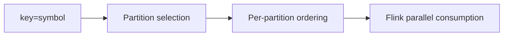

# Kafka Scaling, Partitioning, and Ordering

## Status

- Version: `v1`
- Last updated: **2026-02-08**
- Source of truth (config): `argocd/applications/torghut/**`

## Purpose

Describe how Kafka partitioning and ordering affect Torghut correctness and scaling, and define safe expansion
guidelines that do not break per-symbol ordering assumptions.

## Non-goals

- Kafka cluster administration guide (Strimzi operations live elsewhere).
- Supporting arbitrary re-keying without new topic versions.

## Terminology

- **Partition:** Kafka unit of parallelism and ordering.
- **Key:** Field used to route a message to a partition.
- **Consumer group:** Set of consumers sharing partition assignments.

## Contract (v1)

Messages are keyed by `symbol` (see `docs/torghut/topics-and-schemas.md`), so:

- ordering is preserved per symbol,
- scaling is achieved by increasing partitions and Flink parallelism accordingly.

## Scaling guidelines (v1)

- If symbol universe grows and lag increases:
  1. increase partitions on ingest topics,
  2. increase forwarder throughput (within single-connection constraint),
  3. increase Flink parallelism and task slots.

**Do not** change keys without:

- a new topic version, or
- an explicit migration plan.

## Failure modes and recovery

| Failure         | Symptoms                  | Detection                         | Recovery                                                                      |
| --------------- | ------------------------- | --------------------------------- | ----------------------------------------------------------------------------- |
| Hot partition   | lag for subset of symbols | consumer lag by partition         | increase partitions; distribute keys more evenly (requires key design change) |
| Ordering broken | indicators inconsistent   | seq regressions; window anomalies | verify keying; rollback changes; reprocess                                    |

## Security considerations

- Partition counts and retention affect cost and blast radius; treat changes as operational risk.

## Decisions (ADRs)

### ADR-32-1: Symbol keying is a stable invariant

- **Decision:** `symbol` remains the Kafka message key for ingest and TA topics in v1.
- **Rationale:** Aligns ordering with the core unit of computation and risk.
- **Consequences:** Some symbols may dominate traffic; monitor skew and plan partitioning accordingly.
