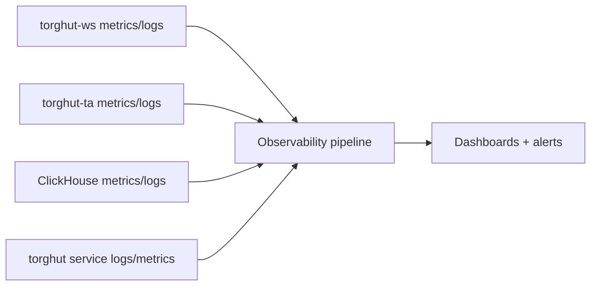

# Observability: Metrics, Logs, Traces

## Status
- Version: `v1`
- Last updated: **2026-02-08**
- Source of truth (config): `argocd/applications/torghut/**`

## Purpose
Define an observability strategy that supports:
- rapid diagnosis of ingestion/TA/storage/trading failures,
- actionable alerting without high cardinality,
- and correlation across components.

## Non-goals
- A full observability platform guide for the entire repo.
- Storing all payloads in logs.

## Terminology
- **SLO:** Reliability target with error budget.
- **High-cardinality labels:** Labels that explode series count (e.g., order_id); must be avoided.
- **Golden signals:** latency, traffic, errors, saturation.

## Current deployed observability components (pointers)
- Alloy (logs/metrics pipeline) manifests: `argocd/applications/torghut/alloy-deployment.yaml`, `argocd/applications/torghut/alloy-configmap.yaml`
- WS forwarder metrics port: `argocd/applications/torghut/ws/deployment.yaml` (`ports: 9090 metrics`)
- Flink Prometheus reporter: `argocd/applications/torghut/ta/flinkdeployment.yaml` (port `9249`)

## Telemetry model

## Metrics (recommended per component)
### WS forwarder
- `ws_connect_success_total`, `ws_connect_error_total` (by error_class)
- `kafka_produce_success_total`, `kafka_produce_error_total` (by topic)
- `subscriptions_active` (gauge)
- `readyz_status` (0/1), `healthz_status` (0/1)

### Flink TA
- checkpoint duration, checkpoint age
- watermark lag, event-time progress
- sink insert error counters (ClickHouse)

### ClickHouse
- disk free bytes, merge backlog, replica readonly

### Trading service
- decisions_total (by strategy, verdict)
- executions_total (by status)
- reconcile_lag_seconds
- llm_review_total (by verdict + error class; no prompt text in labels)

## Logs (guidelines)
- Structured logs with stable fields: `component`, `symbol` (bounded), `strategy`, `error_class`.
- Avoid logging:
  - secrets,
  - full DSNs,
  - full LLM prompts/responses in production (store in DB if necessary under governance).

## Traces (where useful)
Traces are most valuable around:
- decision → risk evaluation → order submit,
- reconcile operations.

Use bounded attributes; do not add order ids as span attributes unless sampled.

## Failure modes and recovery
| Failure | Symptoms | Observability action | Recovery |
| --- | --- | --- | --- |
| WS readiness 503 | ingestion stops | alert on `readyz_status==0` + no Kafka produce | run `v1/22` runbook |
| Flink job FAILED | signals stale | alert on job state + clickhouse freshness | run `v1/21` runbook |
| ClickHouse disk pressure | inserts fail | alert on disk free bytes | run `v1/08` guardrails |

## Security considerations
- Observability is part of the attack surface (logs may contain sensitive info); enforce retention and access controls.
- Do not export secrets or credential material to logs or metrics.

## Decisions (ADRs)
### ADR-19-1: Prefer low-cardinality, operator-actionable telemetry
- **Decision:** Metrics labels are bounded; logs are structured and sampled when needed.
- **Rationale:** Prevents observability systems from becoming unstable during incidents.
- **Consequences:** Some investigations require querying logs by content, not metrics labels.

