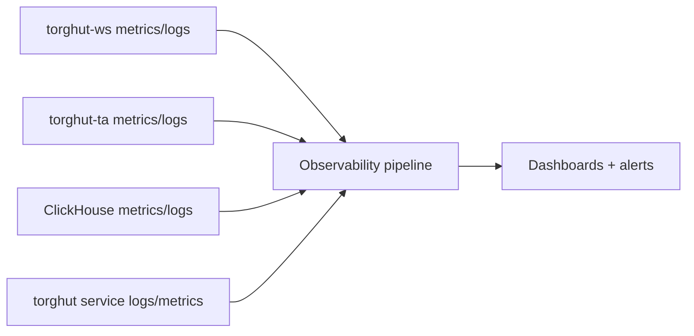

# Observability: Metrics, Logs, Traces

## Status

- Version: `v1`
- Last updated: **2026-03-12**
- Source of truth (config): `argocd/applications/torghut/**`

## Purpose

Define an observability strategy that supports:

- rapid diagnosis of ingestion/TA/storage/trading failures,
- actionable alerting without high cardinality,
- and correlation across components.

## Non-goals

- A full observability platform guide for the entire repo.
- Storing all payloads in logs.

## Terminology

- **SLO:** Reliability target with error budget.
- **High-cardinality labels:** Labels that explode series count (e.g., order_id); must be avoided.
- **Golden signals:** latency, traffic, errors, saturation.

## Current deployed observability components (pointers)

- Alloy (logs/metrics pipeline) manifests: `argocd/applications/torghut/alloy-deployment.yaml`, `argocd/applications/torghut/alloy-configmap.yaml`
- WS forwarder metrics port: `argocd/applications/torghut/ws/deployment.yaml` (`ports: 9090 metrics`)
- Flink Prometheus reporter: `argocd/applications/torghut/ta/flinkdeployment.yaml` (port `9249`)

## Telemetry model

```mermaid
flowchart LR
  WS["torghut-ws metrics/logs"] --> Obs["Observability pipeline"]
  Flink["torghut-ta metrics/logs"] --> Obs
  CH["ClickHouse metrics/logs"] --> Obs
  Svc["torghut service logs/metrics"] --> Obs
  Obs --> Dash["Dashboards + alerts"]
```

## Metrics (recommended per component)

### WS forwarder

- `torghut_ws_ws_connect_success_total`, `torghut_ws_ws_connect_errors_total` (by error_class)
- `torghut_ws_kafka_produce_success_total`, `torghut_ws_kafka_produce_errors_total` (by topic)
- `torghut_ws_readyz_error_class` (gauge by error_class; 1 for the current readiness failure class, else 0)
- `torghut_ws_readyz_gate_status` (gauge by gate; 1 when gate is healthy, else 0)
- `torghut_ws_desired_symbols_fetch_degraded` (gauge; 1 when symbols fetch falls back to cache)
- `torghut_ws_readyz_status` (0/1)

### Flink TA

- checkpoint duration, checkpoint age
- watermark lag, event-time progress
- sink insert error counters (ClickHouse)

### ClickHouse

- disk free bytes, merge backlog, replica readonly

### Trading service

- decisions_total (by strategy, verdict)
- executions_total (by status)
- reconcile_lag_seconds
- llm_review_total (by verdict + error class; no prompt text in labels)
- `torghut_trading_feature_quality_reject_reason_total{reason}`
- `torghut_trading_feature_quality_cursor_commit_blocked_total{reason}`
- `torghut_trading_signal_batch_order_violation_total`
- `torghut_trading_qty_resolution_total{stage,outcome,reason}`
- `torghut_trading_sell_inventory_context_total{stage,context}`
- `torghut_trading_execution_local_reject_total{code,reason}`
- `torghut_trading_execution_submit_attempt_total{adapter,side,asset_class}`
- `torghut_trading_execution_submit_result_total{status,adapter}`
- `torghut_trading_execution_validation_mismatch_total`
- `torghut_trading_simulation_position_state_total{state}`

### Trading funnel contract

- Signals fetched and feature-quality rejects must be distinguishable. `non_monotonic_progression` increments both `torghut_trading_feature_quality_reject_reason_total` and `torghut_trading_signal_batch_order_violation_total`.
- Decision generation and execution progression must be inspectable as a funnel:
  - `torghut_trading_decisions_total`
  - `torghut_trading_execution_submit_attempt_total`
  - `torghut_trading_execution_submit_result_total`
  - `torghut_trading_orders_submitted_total`
  - `torghut_trading_orders_rejected_total`
- Quantity normalization must be visible per stage. `decision`, `pipeline`, and `execution` should all emit `torghut_trading_qty_resolution_total`.

### Replay/runtime preflight contract

- `runtime-verify.json` is the source of truth for historical simulation runtime gates.
- Required fields for replay diagnosis:
  - `schema_registry.ready` and `schema_registry.reason`
  - `analysis_images.ready` and `analysis_images.reason`
  - `ta_runtime.upgrade_mode`
  - `ta_runtime.restore_state_reason`
  - `runtime_state`
  - `environment_state`

## Logs (guidelines)

- Structured logs with stable fields: `component`, `symbol` (bounded), `strategy`, `error_class`.
- Feature-quality hard failures must include: `component`, `account_label`, `reason_codes`, `rows_total`, `cursor_at`, `cursor_symbol`, `cursor_seq`.
- Quantity normalization and rejection logs must include: `stage`, `symbol`, `action`, `requested_qty`, `resolved_qty`, `qty_step`, `fractional_allowed`, `position_qty_context`, `reason`.
- Pre-submit local rejects must include the canonical `quantity_resolution` payload so operators can compare decision and execution semantics without reconstructing position state manually.
- Replay/runtime preflight logs should emit explicit classes such as `schema_registry_not_ready`, `schema_subject_missing`, `restore_state_missing`, and `analysis_image_stale`.
- Avoid logging:
  - secrets,
  - full DSNs,
  - full LLM prompts/responses in production (store in DB if necessary under governance).

## Dashboards

- `Torghut Execution Recovery` in Grafana now covers:
  - clean vs reject ratio
  - trading funnel progression
  - quantity resolution outcomes
  - sell inventory context
  - local reject and contract-violation counters
- Operators should treat the dashboard as the first stop for:
  - ingest ordering failures
  - decision normalization drift
  - execution local rejects
  - decision-to-submit gaps

## Alerting hooks

- Page on any increase in `torghut_trading_signal_batch_order_violation_total`.
- Page on any increase in `torghut_trading_execution_validation_mismatch_total`.
- Ticket/page when submit attempts occur without accepted orders, depending on market-session severity.
- Ticket when local execution reject rate rises above the configured threshold.
- Ticket when decisions are growing but submit attempts remain zero.

## Traces (where useful)

Traces are most valuable around:

- decision → risk evaluation → order submit,
- reconcile operations.

Use bounded attributes; do not add order ids as span attributes unless sampled.

## Failure modes and recovery

| Failure                  | Symptoms        | Observability action                           | Recovery               |
| ------------------------ | --------------- | ---------------------------------------------- | ---------------------- |
| WS readiness 503         | ingestion stops | alert on `torghut_ws_readyz_status==0` + no Kafka produce | run `v1/22` runbook    |
| Flink job FAILED         | signals stale   | alert on job state + clickhouse freshness      | run `v1/21` runbook    |
| ClickHouse disk pressure | inserts fail    | alert on disk free bytes                       | run `v1/08` guardrails |
| Signal batch ordering fault | feature-quality rejects with `non_monotonic_progression` | page on `torghut_trading_signal_batch_order_violation_total` | halt promotion; inspect ingest ordering and cursor state |
| Decision/execution contract mismatch | local rejects despite valid decisions | page on `torghut_trading_execution_validation_mismatch_total` | inspect quantity resolution across decision/pipeline/execution |
| Replay preflight incomplete | runtime verify not ready | inspect `runtime-verify.json` for schema/image/restore reason | correct preflight class before replay |

## Security considerations

- Observability is part of the attack surface (logs may contain sensitive info); enforce retention and access controls.
- Do not export secrets or credential material to logs or metrics.

## Decisions (ADRs)

### ADR-19-1: Prefer low-cardinality, operator-actionable telemetry

- **Decision:** Metrics labels are bounded; logs are structured and sampled when needed.
- **Rationale:** Prevents observability systems from becoming unstable during incidents.
- **Consequences:** Some investigations require querying logs by content, not metrics labels.
