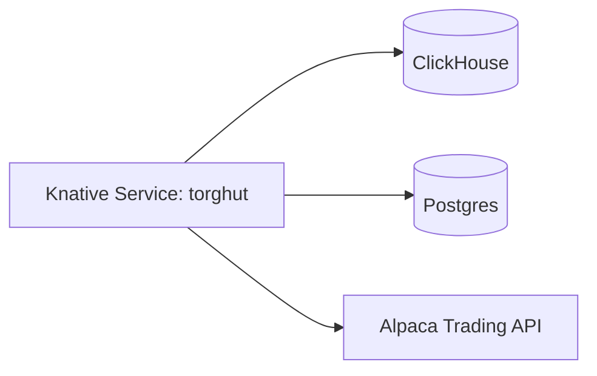

# Operations: Knative Revision Failures (Torghut Service)

## Status
- Version: `v1`
- Last updated: **2026-02-08**
- Source of truth (config): `argocd/applications/torghut/**`

## Purpose
Provide oncall procedures for diagnosing and recovering from Knative revision failures in the Torghut trading service,
including the known UUID→JSON serialization crash mode.

## Non-goals
- General Knative platform troubleshooting beyond the Torghut service.

## Terminology
- **Revision:** Immutable version of a Knative Service.
- **Ready condition:** Knative readiness for routing traffic.

## Current deployed service (pointer)
- `argocd/applications/torghut/knative-service.yaml`

## Quick architecture reminder

## Inputs
- Namespace: `torghut`
- Service: `ksvc/torghut` (source-of-truth manifest: `argocd/applications/torghut/knative-service.yaml`)

## Preconditions (safety)
- If the service is partially working but dependencies are degraded or signals are stale, pause trading first:
  set `TRADING_ENABLED=false` in `argocd/applications/torghut/knative-service.yaml` and Argo sync.

## Procedure A: Revision Not Ready (general)
1) Inspect Knative conditions:
   - `kubectl -n torghut describe ksvc torghut`
2) Identify the newest failing revision pod and inspect logs:
   - `kubectl -n torghut get pods -l serving.knative.dev/service=torghut --sort-by=.metadata.creationTimestamp`
   - `kubectl -n torghut logs -l serving.knative.dev/service=torghut --tail=200`
3) Triage common root causes:
   - missing secrets (DB_DSN, ClickHouse password),
   - unreachable dependencies (ClickHouse/Postgres),
   - application crash on startup (Python exception, import error, migration failure).

## Procedure B: UUID JSON serialization crash (known failure mode)
### Symptoms (log signatures)
- Revision crashloops.
- Logs contain errors like:
  - `Object of type UUID is not JSON serializable`
  - psycopg JSON adaptation errors

### Root cause model (v1)
- A JSONB column write includes a Python `uuid.UUID` object instead of a string.
- Hot spots include `decision_json`, `input_json`, `response_json` (see `services/torghut/app/models/entities.py`).

### Recovery steps (GitOps-first)
1) Roll back to last known good image digest:
   - Edit `argocd/applications/torghut/knative-service.yaml` and set the image back to a previously known-good digest
     from git history (search `image: registry.../torghut@sha256:` in that file’s history).
2) Re-sync ArgoCD and wait for `ksvc/torghut` to become Ready.
3) Hotfix the root cause by ensuring UUID coercion at the serialization boundary:
   - use `model_dump(mode="json")` consistently,
   - use `jsonable_encoder` for responses (`services/torghut/app/main.py`),
   - avoid writing raw UUID into JSONB payloads.
4) Re-deploy via GitOps and confirm revision Ready.

### Verification
- `kubectl -n torghut get ksvc torghut`
- If reachable inside cluster, `GET /healthz` returns 200 and `GET /trading/health` returns 200 when trading is enabled.

## Procedure C: Dependency failures (ClickHouse/Postgres)
### Steps
1) Confirm Postgres is healthy:
   - CNPG cluster is defined in `argocd/applications/torghut/postgres-cluster.yaml` (name: `torghut-db`).
   - `kubectl -n torghut get cluster.postgresql.cnpg.io torghut-db`
2) Confirm ClickHouse is reachable:
   - The trading service dependency check uses `TA_CLICKHOUSE_URL` (not `CLICKHOUSE_HOST`).
   - In `argocd/applications/torghut/knative-service.yaml`, ensure `TA_CLICKHOUSE_URL` points at the ClickHouse HTTP
     service (`http://torghut-clickhouse.torghut.svc.cluster.local:8123`).
3) If dependencies are down (or TA freshness is uncertain), pause trading:
   - Set `TRADING_ENABLED=false` in `argocd/applications/torghut/knative-service.yaml`, Argo sync, then re-evaluate.

## Security considerations
- Do not print secrets in logs when diagnosing env.
- Keep service visibility cluster-local unless explicitly required.

## Decisions (ADRs)
### ADR-24-1: Crashloop root causes are handled via GitOps rollback first
- **Decision:** First recovery action is typically to roll back the image digest and restore service availability.
- **Rationale:** Fastest path to stabilize while preparing a safe fix.
- **Consequences:** Requires discipline to not “kubectl edit” production state outside GitOps.
