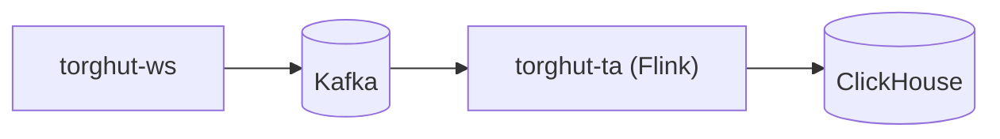

# Operations: TA Replay and Recovery

## Status

- Version: `v1`
- Last updated: **2026-02-08**
- Source of truth (config): `argocd/applications/torghut/**`

## Purpose

Provide oncall operational procedures for recovering TA outputs when:

- the Flink TA job fails,
- ClickHouse becomes unavailable/out-of-disk/replicas read-only,
- or replay/backfill is required.

## Non-goals

- A full Flink SRE guide (focus is Torghut-specific recovery).
- Long-term historical backfills beyond configured Kafka retention.

## Terminology

- **Replay:** Recompute TA outputs from Kafka ingest topics.
- **Backfill window:** Period covered by Kafka retention.
- **Last-state restore:** Flink upgrade mode that restores from latest checkpoint.

## Inputs (as deployed)

- Namespace: `torghut`
- Flink job: `FlinkDeployment/torghut-ta` (`argocd/applications/torghut/ta/flinkdeployment.yaml`)
- TA config: `ConfigMap/torghut-ta-config` (`argocd/applications/torghut/ta/configmap.yaml`)
- ClickHouse: `svc/torghut-clickhouse:8123` (auth via `Secret/torghut-clickhouse-auth`)
- Checkpoints/savepoints: MinIO/S3 path from `state.checkpoints.dir` + `state.savepoints.dir` in `argocd/applications/torghut/ta/flinkdeployment.yaml`
- Kafka topics (current names): `TA_TRADES_TOPIC`, `TA_QUOTES_TOPIC`, `TA_BARS1M_TOPIC`, `TA_MICROBARS_TOPIC`, `TA_SIGNALS_TOPIC` in `argocd/applications/torghut/ta/configmap.yaml`
- Delivery guarantee: `TA_KAFKA_DELIVERY_GUARANTEE` is set in `argocd/applications/torghut/ta/flinkdeployment.yaml` (currently `EXACTLY_ONCE`).

## Quick architecture reminder



## Preconditions (before doing anything)

1. Confirm whether the incident is caused by:
   - ClickHouse disk pressure,
   - ClickHouse replicas read-only / keeper metadata,
   - Kafka auth/broker issues,
   - or Flink checkpoint storage issues (MinIO/S3).
2. Confirm whether trading should be paused:
   - If signals are stale or uncertain, disable trading (`TRADING_ENABLED=false`) via GitOps.
   - Do not change `TRADING_MODE` defaults; keep `TRADING_LIVE_ENABLED=false`.
3. Confirm current TA consumer group and replay intent:
   - `TA_GROUP_ID` is set in `argocd/applications/torghut/ta/configmap.yaml`.
   - Replays should use a new group id (consumer-group isolation) unless you intend to advance the steady-state offsets.
4. Decide whether the procedure is GitOps-first or emergency-only:
   - GitOps-first should be the default. Emergency-only `kubectl patch` should be followed by GitOps reconciliation.
5. Record the required confirmation points in your ticket/incident:
   - `REPLAY_ID` (unique id used in group id + backups), example `2026-02-09T0315Z-INC1234`
   - `PREV_TA_GROUP_ID` (current steady-state group id)
   - `PREV_TA_AUTO_OFFSET_RESET` (current steady-state offset reset policy)
   - Replay start/end window is within Kafka retention and ClickHouse TTL (see below)
   - Confirmation that replay window is feasible (Kafka retention vs ClickHouse TTL)
   - Explicit approval if destructive Mode 2 is required

## Replay window constraints (summary)

Replay is limited by both Kafka retention (inputs) and ClickHouse TTL (outputs):

- **Kafka retention is the hard limit** for replay/backfill. If events have aged out, TA cannot replay them.
- v1 ingest retention is expected to be **7–30 days**; confirm broker settings for each topic before proceeding.
- **ClickHouse TTL limits how long replayed results persist.** If replayed data is older than the TTL, merges may delete
  it shortly after replay (v1 defaults: `ta_microbars` 30 days, `ta_signals` 14 days).
  See:
- `docs/torghut/design-system/v1/component-kafka-topics-and-retention.md`
- `docs/torghut/design-system/v1/component-clickhouse-capacity-ttl-and-disk-guardrails.md`

## Procedure A: Flink TA job FAILED due to ClickHouse disk full

This is a known production failure mode.

### Symptoms

- `kubectl get flinkdeployment -n torghut torghut-ta` shows `FAILED`.
- Flink logs show JDBC insert exceptions, possibly with “No space left on device”.

### Steps

1. Check ClickHouse disk:
   - Inspect PVC usage and ClickHouse disk metrics.
   - Quick PVC view:
     - `kubectl -n torghut get pvc | rg -n 'chi-|chk-' || true`
   - If you have ClickHouse access, identify largest partitions (example query):
     - `SELECT partition, sum(bytes_on_disk) AS bytes FROM system.parts WHERE database='torghut' AND active GROUP BY partition ORDER BY bytes DESC FORMAT JSONEachRow;`
2. Stop write pressure:
   - Preferred (GitOps-first): set `spec.job.state: suspended` in `argocd/applications/torghut/ta/flinkdeployment.yaml`, then Argo sync.
   - Emergency-only: `kubectl -n torghut patch flinkdeployment torghut-ta --type=merge -p '{"spec":{"job":{"state":"suspended"}}}'`
3. Reclaim disk:
   - Drop old partitions (fastest), or reduce retention TTL via reviewed DDL change.
4. Restart TA:
   - GitOps-first: bump a `spec.restartNonce` integer in `argocd/applications/torghut/ta/flinkdeployment.yaml` and Argo sync.
   - Emergency-only: `kubectl -n torghut patch flinkdeployment torghut-ta --type=merge -p '{"spec":{"restartNonce":<bump>}}'`
5. Verify:
   - ClickHouse `max(event_ts)` advances in `torghut.ta_signals`.

## Procedure B: ClickHouse replicas read-only (keeper metadata loss)

See also `docs/torghut/ops-2026-01-01-ta-recovery.md` and `v1/operations-clickhouse-replica-and-keeper.md`.

### Steps (high level)

1. Validate replica state in ClickHouse (`system.replicas`).
2. Restore replicas:
   - `SYSTEM RESTORE REPLICA torghut.ta_signals`
   - `SYSTEM RESTORE REPLICA torghut.ta_microbars`
3. Restart TA job after ClickHouse is healthy.

## TA replay workflow (canonical)

The single, canonical TA replay/backfill workflow is defined alongside the concrete manifests so oncall and automation
have one authoritative source:

- `argocd/applications/torghut/README.md` → **“TA replay workflow (canonical)”**

Follow that runbook for:

- the required unique `TA_GROUP_ID` and how to set it,
- replay window constraints (Kafka retention vs ClickHouse TTL),
- explicit safety prerequisites and confirmation steps,
- non-destructive vs destructive modes,
- and rollback/recovery if replay fails.

Required replay isolation inputs (do not skip):

- `REPLAY_ID` (unique id); set `TA_GROUP_ID: "torghut-ta-replay-<REPLAY_ID>"`.
- `TA_AUTO_OFFSET_RESET: "earliest"` for replay/backfill.
- Preserve `PREV_TA_GROUP_ID` for rollback.
- Preserve `PREV_TA_AUTO_OFFSET_RESET` for rollback.

## Automation (AgentRuns)

AgentRuns should treat these procedures as two classes of automation:

1. Read-only: collect state (`FlinkDeployment` status, logs, ClickHouse freshness, Kafka connectivity) and produce a single
   “TA pipeline health” report.
2. Actuation (gated): open a PR updating `argocd/applications/torghut/ta/**` (suspend/resume, new `TA_GROUP_ID`,
   restart nonce, image rollback), then trigger an Argo sync if your environment supports it.

## Rollback / recovery if replay fails

- If a replay causes regressions or excessive lag, revert GitOps changes:
  - restore the previous `TA_GROUP_ID` in `argocd/applications/torghut/ta/configmap.yaml`,
  - restore previous `TA_AUTO_OFFSET_RESET` if it was changed,
  - restore the previous image digest in `argocd/applications/torghut/ta/flinkdeployment.yaml`,
  - bump `spec.restartNonce` and set `spec.job.state: running`,
  - and Argo sync.
- If destructive Mode 2 was used (topics/state deleted), restore MinIO checkpoint/savepoint backups, then restart.
- If ClickHouse data was deleted, rollback may require restoring from backups (see `v1/disaster-recovery-and-backups.md`).

## Standardized helper (non-destructive mode)

Before manual replay execution, run:

```bash
python3 services/torghut/scripts/ta_replay_runner.py --replay-id <REPLAY_ID> --mode plan
```

The helper prints:

- current TA replay state read from running cluster config,
- planned `TA_GROUP_ID` and `TA_AUTO_OFFSET_RESET`,
- exact sequence for non-destructive replay mode.

Execute the planned sequence with explicit human confirmation:

```bash
python3 services/torghut/scripts/ta_replay_runner.py \
  --replay-id <REPLAY_ID> \
  --mode apply \
  --confirm REPLAY_TA_CANARY
```

`--mode apply` performs the non-destructive steps only:

- set `TA_GROUP_ID` and `TA_AUTO_OFFSET_RESET`,
- suspend `FlinkDeployment/torghut-ta` if running,
- resume with `restartNonce + 1`.

## Verification checklist

- `kubectl get flinkdeployment -n torghut torghut-ta` is `RUNNING/STABLE`
- ClickHouse queries:
  - `SELECT max(event_ts) FROM torghut.ta_signals WHERE symbol='NVDA';` advances
- Jangar visuals:
  - `/api/torghut/ta/latest?symbol=NVDA` returns fresh data (per `docs/torghut/ops-2026-01-01-ta-recovery.md`)

## Security considerations

- Avoid running ad-hoc SQL from random pods; use approved operational access paths.
- Do not paste secrets into commands or tickets.

## Decisions (ADRs)

### ADR-21-1: Replay uses consumer-group isolation

- **Decision:** Use a dedicated `TA_GROUP_ID` for replay/backfill when needed.
- **Rationale:** Avoids corrupting steady-state consumer offsets.
- **Consequences:** Must manage and document group IDs; old groups may be garbage collected eventually.
