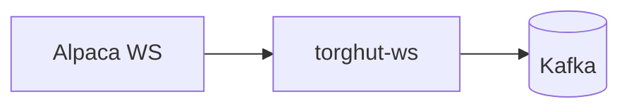

# Operations: WS Connection Limit and Auth

## Status
- Version: `v1`
- Last updated: **2026-02-08**
- Source of truth (config): `argocd/applications/torghut/**`

## Purpose
Provide oncall procedures for the `torghut-ws` forwarder when:
- Alpaca WS connection limit errors (406) occur,
- auth fails (401/403),
- readiness sticks at 503 while liveness remains OK.

## Non-goals
- Alpaca account management policies.

## Terminology
- **Readiness:** `/readyz` indicates “can make progress” (upstream+downstream OK).
- **Liveness:** `/healthz` indicates “process alive”.

## As deployed (production)
- Kubernetes resource: `Deployment/torghut-ws` (namespace `torghut`)
- Probes:
  - Liveness: `GET /healthz` on port `8080`
  - Readiness: `GET /readyz` on port `8080`
- Config:
  - `argocd/applications/torghut/ws/configmap.yaml`
  - `argocd/applications/torghut/ws/deployment.yaml`

## Readiness model (what `/readyz` actually means)
Forwarder readiness is a hard gate on “can make progress”:
1) Alpaca WS session must be authenticated and subscribed (`authOk && subscribedOk`).
2) Kafka must be reachable (metadata calls for all configured topics succeed).
3) If trade-updates streaming is enabled, that stream must also be healthy.

### Readiness response body (machine-parseable)
When the forwarder is **not** Ready, `GET /readyz` returns `503` with a JSON body that includes a stable
`error_class` for automation and oncall triage (no raw upstream/Kafka error strings):
- `alpaca_406_second_connection`
- `alpaca_auth`
- `kafka_auth`
- `kafka_metadata`
- `kafka_produce`
- `unknown`

The response also includes boolean readiness gates (`gates.alpaca_ws`, `gates.kafka`, `gates.trade_updates`) to
help distinguish upstream vs downstream causes.

Implementation pointers:
- Readiness endpoint: `services/dorvud/websockets/src/main/kotlin/ai/proompteng/dorvud/ws/HealthServer.kt`
- Readiness gates: `services/dorvud/websockets/src/main/kotlin/ai/proompteng/dorvud/ws/ForwarderApp.kt`
- Config contract: `services/dorvud/websockets/src/main/kotlin/ai/proompteng/dorvud/ws/ForwarderConfig.kt`

## Quick architecture reminder

## Known production symptom: readiness stuck 503
Documented in `docs/torghut/ops-2026-01-01-ta-recovery.md`:
- `/readyz` returned 503 due to Alpaca 401/406 errors; restart was required.

## Procedure A: Alpaca 406 connection limit
### Symptoms
- Logs mention 406.
- Readiness fails (503).

### Steps
1) Ensure only one replica is running:
   - `argocd/applications/torghut/ws/deployment.yaml` should keep `replicas: 1`.
2) Confirm the forwarder is the cause (not Kafka):
   - `kubectl -n torghut logs deployment/torghut-ws --tail=200`
3) Force-close lingering connections by restart.
   - GitOps-first: bump `kubectl.kubernetes.io/restartedAt` in `argocd/applications/torghut/ws/deployment.yaml`, then Argo sync.
   - Emergency-only: `kubectl -n torghut rollout restart deployment/torghut-ws` (expect Argo drift until reconciled).
3) Verify:
   - Pod becomes Ready, and status topic resumes.

## Procedure B: Alpaca 401/403 auth failures
### Steps
1) Confirm logs show 401/403.
2) Rotate credentials through GitOps (SealedSecrets) and sync Argo:
   - Do **not** paste secrets into docs or tickets.
3) Restart `torghut-ws` to pick up new secrets.
4) Verify readiness.

## Procedure C: Kafka produce failures (SASL/ACL)
### Symptoms
- Readiness fails; logs show SASL/authorization errors.

### Steps
1) Confirm KafkaUser secret exists in torghut namespace (`Secret/torghut-ws`):
   - `kubectl -n torghut get secret torghut-ws`
2) Confirm Kafka bootstrap is correct (as deployed):
   - `KAFKA_BOOTSTRAP=kafka-kafka-bootstrap.kafka:9092` in `argocd/applications/torghut/ws/configmap.yaml`
3) After fixing auth/ACL, restart `torghut-ws` (GitOps-first; emergency restart allowed with drift warning).

## Verification checklist
- `kubectl get pods -n torghut -l app=torghut-ws` shows `READY 1/1`
- `GET /healthz` returns 200
- `GET /readyz` returns 200

## Automation (AgentRuns)
For AgentRuns automation, split into:
1) Read-only diagnostics: collect `kubectl describe`, `kubectl logs`, probe status, and classify the failure (406 vs 401/403 vs Kafka).
2) Actuation (gated): create a PR that bumps the restart annotation in `argocd/applications/torghut/ws/deployment.yaml`
   and (optionally) trigger an Argo sync if your AgentRuns environment has Argo credentials.

## Rollback
- If a restart causes regressions, revert the GitOps change that triggered the rollout (annotation bump) and Argo sync.
- If credentials were rotated incorrectly, revert the SealedSecret change in `argocd/applications/torghut/sealed-secrets.yaml` and Argo sync.

## Security considerations
- Keep single replica to avoid violating broker/venue rules.
- Secrets rotation must be done via sealed secrets; never via plaintext manifests.

## Decisions (ADRs)
### ADR-22-1: Restart is the standard operational fix for 406 and stuck readiness
- **Decision:** The primary remediation for 406 connection-limit and stuck readiness is a controlled restart.
- **Rationale:** It deterministically closes stale sockets and rebuilds subscriptions.
- **Consequences:** There is a short ingestion gap; Kafka retention covers it.
