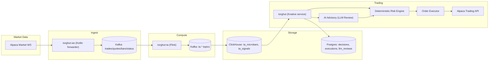

# Torghut Trading System - v1 Overview

## Status

- Version: `v1`
- Last updated: **2026-02-08**
- Source of truth for _current_ config: `argocd/applications/torghut/**`

## Purpose

Provide a single, production-oriented overview of the Torghut trading system design, including safety and operational
assumptions, with links to the deeper component documents in this folder.

For a single merged “handoff-ready” design doc (including automation-ready procedures and AgentRuns handoff), use:

- `v1/torghut-autonomous-trading-system.md`

## Non-goals

- Replacing the GitOps manifests as the source of truth.
- Specifying venue/broker-specific details beyond Alpaca (see `v1/multi-venue-and-broker-abstraction.md`).
- Enabling AI to place orders directly or bypass deterministic risk policy.

## Terminology

- **WS forwarder**: Kotlin service that maintains the Alpaca market-data WebSocket connection and publishes events to Kafka.
- **TA job**: Flink job computing technical analysis signals (microbars + indicators) from Kafka inputs.
- **Signal source**: Authoritative storage used by trading loop (currently ClickHouse).
- **Trading loop**: Periodic evaluation cycle inside the Torghut Knative service that reads signals and proposes/executes trades.
- **Risk gate**: Deterministic policy checks that must pass before any order submission.
- **AI advisory layer**: LLM-based reviewer that can veto/adjust within explicit, bounded policy.

## System at a glance

## Production safety defaults (must remain true)

The deployment currently enforces safe defaults via `argocd/applications/torghut/knative-service.yaml`:

- `TRADING_MODE=paper`
- `TRADING_LIVE_ENABLED=false`
- AI review is advisory; deterministic risk controls remain final authority.

## Operational reality (known failure modes)

These are explicitly designed for in the v1 docs:

- ClickHouse volumes can fill (`argocd/applications/torghut/clickhouse/clickhouse-cluster.yaml` uses 20Gi PVCs). When disk is full,
  Flink’s JDBC sink can fail on inserts and the TA pipeline can go `FAILED`. See `v1/component-clickhouse-capacity-ttl-and-disk-guardrails.md`
  and `v1/operations-ta-replay-and-recovery.md`.
- The Torghut Knative service can fail on JSON serialization of `uuid.UUID` when persisting JSON fields via psycopg/SQLAlchemy,
  especially if UUIDs slip into JSON payloads uncoerced. See `v1/component-postgres-schema-and-migrations.md` and
  `v1/operations-knative-revision-failures.md`.
- `torghut-ws` readiness can be stuck returning `503` even when liveness is OK (typically due to upstream auth/406 connection-limit issues
  or downstream Kafka publish failures). See `v1/component-ws-forwarder.md` and `v1/operations-ws-connection-limit-and-auth.md`.

## Where to start

- Architecture and boundaries: `v1/architecture-and-context.md`
- Production handoff pack (AgentRuns): `v1/agentruns-handoff.md`
- Component deep dives:
  - `v1/component-ws-forwarder.md`
  - `v1/component-flink-ta-job.md`
  - `v1/component-clickhouse-schema-and-views.md`
  - `v1/component-trading-loop.md`
  - `v1/lean-multilane-control-plane-and-rollout-safety.md`
- Operations:
  - `v1/operations-ta-replay-and-recovery.md`
  - `v1/operations-ws-connection-limit-and-auth.md`
  - `v1/operations-clickhouse-replica-and-keeper.md`
  - `v1/operations-knative-revision-failures.md`

## Decisions (ADRs)

### ADR-00-1: ClickHouse as authoritative signal source (v1)

- **Decision:** Trading loop reads signals from ClickHouse (`TRADING_SIGNAL_SOURCE=clickhouse`).
- **Alternatives considered:** Consume TA Kafka topics directly; materialize signals into Postgres.
- **Rationale:** ClickHouse already backs Jangar visualization; a single authoritative store simplifies auditing and replay.
- **Consequences:** ClickHouse availability/disk is a hard dependency for trading; guardrails and disk alerts are mandatory.

### ADR-00-2: AI is advisory and cannot bypass deterministic gates

- **Decision:** LLM review can veto/adjust within bounded schemas, but deterministic policy is final authority.
- **Alternatives considered:** LLM-as-primary decision-maker; “soft” risk scoring.
- **Rationale:** Model outputs are non-deterministic and vulnerable to prompt/data injection; risk gates must remain explicit.
- **Consequences:** Some profitable opportunities may be missed; safety and auditability are prioritized.

## Configuration examples (pointers)

- GitOps entry point: `argocd/applications/torghut/kustomization.yaml`
- WS forwarder: `argocd/applications/torghut/ws/deployment.yaml`, `argocd/applications/torghut/ws/configmap.yaml`
- TA Flink job: `argocd/applications/torghut/ta/flinkdeployment.yaml`, `argocd/applications/torghut/ta/configmap.yaml`
- Trading service: `argocd/applications/torghut/knative-service.yaml`
- Strategy catalog: `argocd/applications/torghut/strategy-configmap.yaml`

## Security considerations (safe defaults)

- No secrets belong in Git; use Kubernetes Secrets / SealedSecrets (`argocd/applications/torghut/sealed-secrets.yaml`).
- Restrict network access via RBAC + (where applicable) network policies; assume Kafka and DB endpoints are internal-only.
- Prefer cluster-local visibility for the Knative service (`networking.knative.dev/visibility: cluster-local`).
