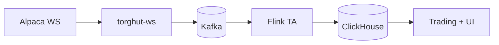

# Performance and Low-Latency Notes

## Status
- Version: `v1`
- Last updated: **2026-02-08**
- Source of truth (config): `argocd/applications/torghut/**`

## Purpose
Capture performance considerations and low-latency tradeoffs for Torghut, consistent with the current architecture and
operational reality.

## Non-goals
- High-frequency trading design.
- Optimizing latency by weakening deterministic safety.

## Terminology
- **Freshness:** How recent the latest signal is.
- **Tail latency:** p95/p99 latency; typically dominates user experience and safety.

## Existing reference
- `docs/torghut/low-latency-notes.md`

## Latency budget (conceptual)

## Key knobs (current config pointers)
### Forwarder producer batching
- `argocd/applications/torghut/ws/configmap.yaml`:
  - `KAFKA_LINGER_MS`
  - `KAFKA_BATCH_SIZE`

### Flink event-time tolerance
- `argocd/applications/torghut/ta/configmap.yaml`:
  - `TA_MAX_OUT_OF_ORDER_MS`
  - `TA_CHECKPOINT_INTERVAL_MS`

### ClickHouse query efficiency
- Schema ORDER BY matches query filters (`symbol`, `event_ts`, `seq`): `services/dorvud/technical-analysis-flink/src/main/resources/ta-schema.sql`

## Failure modes and recovery
| Failure | Symptoms | Detection | Recovery |
| --- | --- | --- | --- |
| Increased lag | stale signals | watermark lag + ClickHouse freshness | check WS readiness; checkpoint health; ClickHouse disk |
| “Fast but wrong” tuning | dropped late events | indicator anomalies | increase out-of-order tolerance; validate windows |

## Security considerations
- Avoid “latency hacks” that bypass audit or risk gates.
- Keep metrics bounded; symbol cardinality is acceptable but avoid per-order id labels.

## Decisions (ADRs)
### ADR-48-1: Freshness targets are bounded by correctness and stability
- **Decision:** Prioritize correctness + stability; accept slightly higher latency rather than dropping events.
- **Rationale:** Wrong signals are more dangerous than slow signals.
- **Consequences:** Latency targets must be realistic and tied to incident response.

