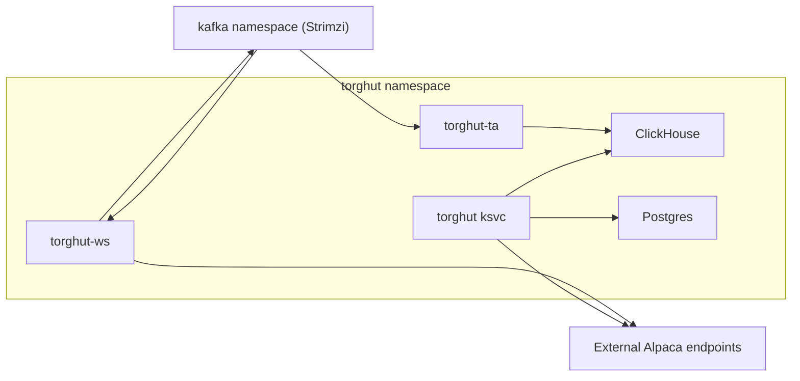

# Security: Network and RBAC

## Status

- Version: `v1`
- Last updated: **2026-03-01**
- Source of truth (config): `argocd/applications/torghut/**`

## Purpose

Define network boundaries and RBAC expectations for Torghut workloads, aligned with the existing manifests and
documented network policy patterns.

## Non-goals

- Designing a full cluster-wide zero-trust architecture.
- Replacing existing platform-level policy enforcement.

## Terminology

- **RBAC:** Kubernetes role-based access control.
- **NetworkPolicy:** Kubernetes policy restricting pod ingress/egress.
- **Least privilege:** Grant only the permissions a component needs.

## Current repo references

- Torghut ServiceAccount/RBAC: `argocd/applications/torghut/serviceaccount.yaml`, `argocd/applications/torghut/role.yaml`, `argocd/applications/torghut/rolebinding.yaml`
- NetworkPolicies: `argocd/applications/torghut/networkpolicy-*.yaml`
- Existing examples: `docs/torghut/network-and-rbac.md`

## Trust boundaries

## RBAC principles (v1)

- Workloads should not need cluster-admin.
- Most workloads should need only:
  - read Pods/logs for diagnostics (`get`),
  - access only required namespace services and DNS.

## Network principles (v1)

- Keep ClickHouse and Postgres internal to the cluster network.
- Restrict Kafka access to only the required ports/namespaces.
- Allow egress to Alpaca endpoints only from forwarder and trading service.
- Keep Alloy scrape ingress on runtime metrics ports (`ws/9090`, `ta/9249`) constrained to Alloy endpoints.

## Failure modes and recovery

| Failure                  | Symptoms                            | Detection                     | Recovery                                            |
| ------------------------ | ----------------------------------- | ----------------------------- | --------------------------------------------------- |
| NetworkPolicy too strict | forwarder cannot reach Alpaca       | readiness 503; connect errors | adjust egress rules (reviewed change)               |
| RBAC privilege too broad | permission denied, startup failures | logs show denied permission   | fix Role/RoleBinding to include only required verbs |

## Security considerations

- Treat network policy changes as security-sensitive.
- Ensure observability egress is allowed for metrics/logs export but remains least-privilege.

## Rollout checks (P9 security loop)

Apply and validate in a controlled order:

1. Capture pre-checks before editing manifests.
   - `kubectl -n torghut get serviceaccount torghut-runtime`
   - `kubectl -n torghut get role,rolebinding torghut-runtime -o yaml`
   - `kubectl -n torghut get netpol -o jsonpath='{.items[*].metadata.name}{\"\\n\"}'`

2. After GitOps sync, run runtime checks for policy/RBAC behavior.
   - `kubectl -n torghut auth can-i get pods --as=system:serviceaccount:torghut:torghut-runtime`
   - `kubectl -n torghut auth can-i get pods/log --as=system:serviceaccount:torghut:torghut-runtime`
   - `kubectl -n torghut auth can-i create pods --as=system:serviceaccount:torghut:torghut-runtime` (must be denied)
   - `kubectl -n torghut auth can-i list pods --as=system:serviceaccount:torghut:torghut-runtime` (must be denied)
   - `kubectl -n torghut get networkpolicy`
   - `kubectl -n torghut rollout status deploy/torghut-ws`
   - `kubectl -n torghut rollout status deploy/torghut-lean-runner`
   - `kubectl -n torghut get pods -l app.kubernetes.io/name=torghut`
   - `kubectl -n torghut get pods -l app=torghut-ws -o custom-columns=NAME:.metadata.name,READY:.status.conditions[?(@.type==\"Ready\")].status`
   - `kubectl -n torghut get pods -l serving.knative.dev/service=torghut`

3. Confirm dependent service health paths after rollout.
   - `kubectl -n torghut get pods -l app.kubernetes.io/name=torghut -o custom-columns=NAME:.metadata.name,READY:.status.conditions[?(@.type==\"Ready\")].status`
   - `/healthz` on the Knative service

4. If a check fails, restore the previous manifest set in ArgoCD and re-apply after fixing policy scope.

## Decisions (ADRs)

### ADR-27-1: Cluster-local trading service

- **Decision:** Keep `torghut` Knative service cluster-local by default.
- **Rationale:** Reduces exposure of trading APIs.
- **Consequences:** External access requires explicit gateway/proxy design and security review.
