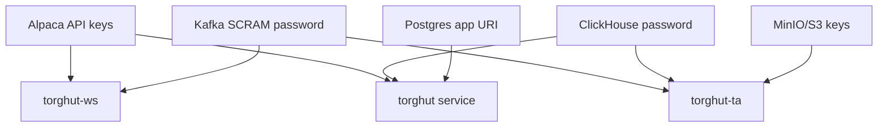

# Security: Secrets Rotation

## Status
- Version: `v1`
- Last updated: **2026-02-08**
- Source of truth (config): `argocd/applications/torghut/**`

## Purpose
Define how Torghut rotates sensitive credentials (Alpaca, Kafka SCRAM, ClickHouse auth, Postgres app creds, MinIO/S3
keys) without exposing secret material in Git, docs, or logs.

## Non-goals
- Teaching SealedSecrets or CNPG internals in depth.
- Manual “kubectl apply secret yaml” as the normal workflow (GitOps is the default).

## Terminology
- **SealedSecret:** Encrypted secret manifest committed to Git, decrypted by controller in-cluster.
- **CNPG app secret:** Secret generated by CNPG containing app URI/user/password (e.g., `torghut-db-app`).
- **Rotation window:** Period where both old and new creds may be valid while workloads roll.

## Secret inventory (v1)

## Repo pointers (where secrets are referenced, not stored)
- Torghut sealed secrets: `argocd/applications/torghut/sealed-secrets.yaml`
- ClickHouse auth secret reference: `argocd/applications/torghut/clickhouse/clickhouse-cluster.yaml`
- Knative service secret refs: `argocd/applications/torghut/knative-service.yaml`
- WS forwarder secret refs: `argocd/applications/torghut/ws/deployment.yaml`
- TA job secret refs: `argocd/applications/torghut/ta/flinkdeployment.yaml`
- CNPG note about app secret: `argocd/applications/torghut/postgres-cluster.yaml`

## Rotation procedures (operator)
### Alpaca keys
1) Update the sealed secret that backs `torghut-alpaca` in torghut namespace.
2) Sync ArgoCD.
3) Restart `torghut-ws` and `torghut` service to pick up updated env.
4) Verify `/readyz` on forwarder and `/healthz` on service.

### Kafka SCRAM password (KafkaUser)
1) Rotate via Strimzi KafkaUser in `argocd/applications/kafka/**` (example: `argocd/applications/kafka/torghut-ws-kafkauser.yaml`).
2) Ensure secret reflection into torghut namespace if used.
3) Restart producers/consumers to pick up password.
4) Verify no SASL auth errors.

### ClickHouse password
1) Rotate `torghut-clickhouse-auth` secret through GitOps.
2) Restart TA job and service pods to reload.
3) Verify TA writes and service queries.

### MinIO/S3 keys (Flink checkpoints)
1) Create new MinIO credentials scoped to bucket/path.
2) Update the secret referenced in `argocd/applications/torghut/ta/flinkdeployment.yaml`.
3) Verify checkpoint success.

## Failure modes and recovery
| Failure | Symptoms | Detection | Recovery |
| --- | --- | --- | --- |
| Partial rollout | some pods use old creds | mixed auth errors | roll restart all relevant workloads |
| Wrong secret key name | env var missing | crash on startup | fix manifest references; redeploy |

## Security considerations
- Never commit secret values, base64 blobs, or decrypted material in docs.
- Avoid copying secrets into commands; prefer referencing secret names and operator tooling.

## Decisions (ADRs)
### ADR-26-1: Secrets rotation is always GitOps-driven
- **Decision:** Secrets are rotated via SealedSecrets/CNPG/Strimzi resources and Argo sync.
- **Rationale:** Provides auditability and repeatability.
- **Consequences:** Requires sealed-secrets tooling access for authorized operators.

