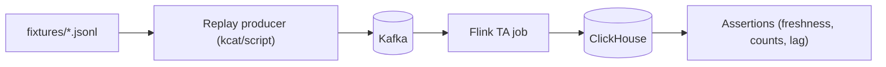

# Test Harness and Fixtures

## Status

- Version: `v1`
- Last updated: **2026-02-08**
- Source of truth (config): `argocd/applications/torghut/**`

## Purpose

Provide a practical, production-oriented test harness plan that enables oncall and engineers to:

- validate WS ingestion,
- replay data,
- measure lag,
- and reproduce failure scenarios safely.

## Non-goals

- A single monolithic test runner that covers all environments.
- Storing huge proprietary datasets in the repo.

## Terminology

- **Fixture:** A small recorded dataset slice used for reproducible tests.
- **Smoke test:** Quick validation of “happy path” connectivity and produce/consume.

## Existing repo references (starting points)

- `docs/torghut/test-harness.md` - existing harness notes and examples.
- `packages/scripts/src/torghut/ws-smoke.ts` - forwarder smoke test (see root `package.json` script `smoke:torghut-ws`).
- `packages/scripts/src/kafka/tail-topic.ts` - topic tailing helper.

## Harness design (v1)

## Fixtures (recommended shape)

Store compact JSONL fixtures outside secrets:

- keyed lines `<symbol>:<json>` for kcat `-K: -l`.
- include `event_ts` and `ingest_ts` fields where available (or derive ingest time at replay time).

## Acceptance checks (operator-friendly)

- p95(now - `event_ts`) < target threshold for active symbols.
- `ta_signals` advances monotonically by `event_ts`.
- No repeated failures in Flink checkpointing.

## Failure drills (production realism)

| Drill                          | What it validates                    | Expected outcome                                   |
| ------------------------------ | ------------------------------------ | -------------------------------------------------- |
| Restart WS forwarder           | Alpaca reconnect + Kafka idempotency | readiness becomes OK; status topic returns healthy |
| Kill Flink TM                  | checkpoint restore                   | job recovers; outputs resume                       |
| Fill ClickHouse disk (staging) | disk guardrails                      | alerts fire; operator can pause TA and recover     |

## Security considerations

- Fixtures must not include secrets, tokens, or broker credentials.
- Treat fixtures as potentially sensitive; do not include full account data.

## Decisions (ADRs)

### ADR-17-1: Keep harness operator-centric and reproducible

- **Decision:** Prioritize simple scripts and fixtures over complex frameworks.
- **Rationale:** Oncall needs repeatable recovery validation under pressure.
- **Consequences:** Some validations remain manual; ensure operational procedures cover them.
